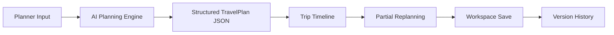
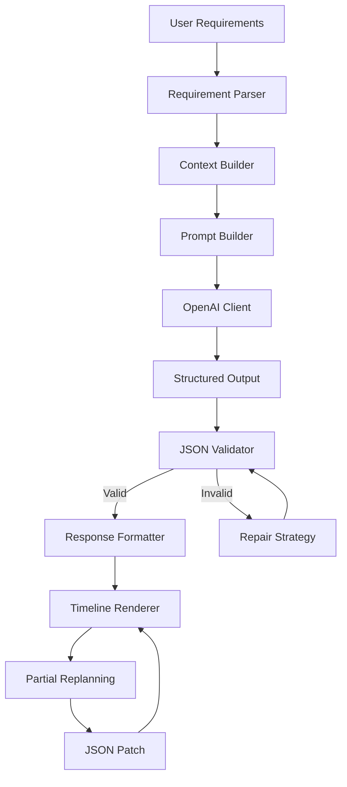
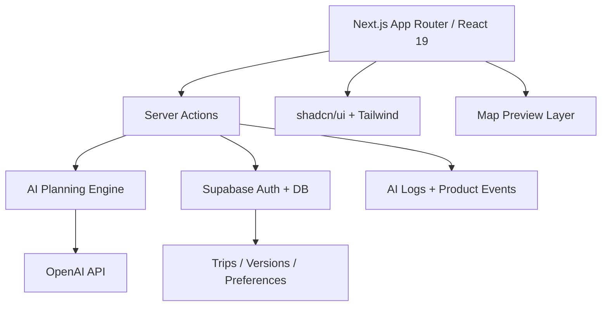

# AI Travel Planner

AI Travel Planner is an AI-native travel planning product that helps first-time independent travelers generate an executable, editable, and budget-aware itinerary in minutes.

The goal is not to produce another travel guide. The goal is to help users make travel decisions: where to go, how to sequence each day, how much it may cost, what tradeoffs exist, and how to adjust the plan when constraints change.

## Product Positioning

| Item              | Description                                                                                                                                                                                                     |
| ----------------- | --------------------------------------------------------------------------------------------------------------------------------------------------------------------------------------------------------------- |
| Product           | AI Travel Planner                                                                                                                                                                                               |
| One-liner         | Generate a practical, editable, budget-aware travel plan for first-time independent travelers.                                                                                                                  |
| Target users      | 22-35 year-old independent travelers visiting an unfamiliar city or country for the first time.                                                                                                                 |
| Core problem      | Travel planning is fragmented across ChatGPT, Google Maps, Xiaohongshu, TripAdvisor, OTA platforms, notes, and spreadsheets. Users collect information but still struggle to organize it into a realistic plan. |
| Product principle | Less chat, more action. The product uses structured input, AI planning, timeline execution, partial replanning, and persistent workspace instead of a generic chatbot.                                          |

## Why This Product

First-time independent travelers do not only need recommendations. They need confidence that a trip can actually work.

Typical planning pain points:

- Information overload from travel guides, social content, maps, and reviews.
- Good recommendations are not automatically good itineraries.
- Route sequencing, opening hours, budget, travel pace, and weather are hard to combine manually.
- ChatGPT can generate ideas, but users still need to copy, verify, edit, map, and save the plan elsewhere.
- Once a user wants to change one day, most tools force them to manually repair the entire plan.

AI Travel Planner addresses the gap between inspiration and execution.

## Product Value

| User Need                                   | Product Response                                                                                 |
| ------------------------------------------- | ------------------------------------------------------------------------------------------------ |
| "I do not know how to write a good prompt." | Structured planner form with smart suggestions and validation.                                   |
| "I want a plan I can actually follow."      | Day-by-day timeline with activity duration, budget, transport, and rationale.                    |
| "I need to change only part of the trip."   | Partial replanning with JSON Patch, diff view, lock, undo, redo, and version history.            |
| "I want to save and continue later."        | Persistent workspace with My Trips, trip detail, version history, and auto-save.                 |
| "I need to trust the AI."                   | Explainable recommendations, structured output validation, repair strategy, and quality logging. |

## MVP Scope

The MVP focuses on the full planning loop:



Implemented product modules:

- Planner Page: guided, structured travel requirement input.
- AI Planning Engine V1: prompt templates, context builder, OpenAI client, structured output, validation, repair, and logging design.
- Trip Timeline: executable itinerary presentation with day cards, activities, budget summary, notes, and explain interactions.
- Partial Replanning: human-in-the-loop modification workflow with JSON Patch, diff strategy, locks, undo/redo, and history.
- Workspace: Supabase-backed persistence design with My Trips, trip detail, version history, and auto-save.
- Product Validation: metrics, event tracking, dashboard, AI evaluation, interviews, usability tests, A/B tests, risks, and roadmap.

## AI Workflow

AI Travel Planner is designed as a planning agent, not a chat interface.



AI responsibilities:

- Understand user intent, constraints, and travel preferences.
- Generate a structured itinerary that can be rendered by the frontend.
- Explain why a recommendation is included.
- Modify only the affected part of a plan instead of regenerating everything.

Program responsibilities:

- Validate inputs and outputs.
- Enforce schema, budget, locks, and versioning.
- Render timeline, workspace, history, and system states.
- Track product metrics and AI quality.

## Technical Architecture

| Area          | Stack                                            |
| ------------- | ------------------------------------------------ |
| Framework     | Next.js 15 App Router                            |
| UI Runtime    | React 19                                         |
| Language      | TypeScript                                       |
| Styling       | Tailwind CSS, CSS variables, shadcn/ui patterns  |
| UI Primitives | Radix UI, Vaul, Lucide React                     |
| Forms         | React Hook Form                                  |
| Validation    | Zod                                              |
| State         | React Query, Zustand                             |
| AI            | OpenAI SDK, Vercel AI SDK                        |
| Backend/Data  | Supabase                                         |
| Deployment    | Vercel                                           |
| Tooling       | ESLint, Prettier, Husky, lint-staged, Commitlint |
| Testing       | Vitest, Testing Library, Playwright              |



## Feature Showcase

| Feature                       | What It Demonstrates                                                     |
| ----------------------------- | ------------------------------------------------------------------------ |
| Structured Planner            | Product thinking: reduce prompt-writing burden for mainstream users.     |
| Smart Suggestions             | Growth and activation thinking: shorten time-to-first-plan.              |
| AI Tips                       | AI UX thinking: guide users before generation to improve output quality. |
| Timeline                      | UX thinking: convert AI output into an executable plan, not text.        |
| AI Explain                    | Trust design: explain recommendation logic without overwhelming users.   |
| Partial Replanning            | AI-native product depth: modify the minimum necessary scope.             |
| Lock / Favorite               | Human-in-the-loop control: protect user intent from unwanted AI changes. |
| Undo / Redo / Version History | Reliability: make AI edits reversible and auditable.                     |
| Workspace                     | Product completeness: users can save, revisit, and continue planning.    |

## Project Structure

```text
app/          Next.js routes, layouts, system states
components/   Shared UI primitives and feedback/layout components
features/     Product feature modules
actions/      Server Actions
agents/       AI agent boundaries
workflows/    Multi-agent workflow orchestration
prompts/      Prompt registry, templates, versions
schemas/      Zod schemas and structured AI outputs
services/     External service adapters
lib/          Shared utilities, env, auth, errors
store/        Zustand UI state
supabase/     Migrations, policies, seed data
tests/        Unit, integration, E2E tests
docs/         Product and engineering documentation
```

See [Project Structure](./docs/project-structure.md) for directory responsibilities.

## Quick Start

Install dependencies:

```bash
pnpm install
```

Copy environment variables:

```bash
cp .env.example .env.local
```

Run the development server:

```bash
pnpm dev
```

Open [http://localhost:3000](http://localhost:3000).

## Available Scripts

| Script              | Purpose                        |
| ------------------- | ------------------------------ |
| `pnpm dev`          | Start local development server |
| `pnpm build`        | Production build               |
| `pnpm start`        | Start production server        |
| `pnpm lint`         | Run ESLint                     |
| `pnpm typecheck`    | Run TypeScript checks          |
| `pnpm format:check` | Check formatting               |
| `pnpm test`         | Run unit/integration tests     |
| `pnpm e2e`          | Run Playwright tests           |

## Documentation

| Document                   | Link                                                                                                   |
| -------------------------- | ------------------------------------------------------------------------------------------------------ |
| User Research              | [docs/ai-travel-planner-user-research.md](./docs/ai-travel-planner-user-research.md)                   |
| PRD                        | [docs/ai-travel-planner-prd.md](./docs/ai-travel-planner-prd.md)                                       |
| IA + AI UX                 | [docs/ai-travel-planner-ia-ai-ux.md](./docs/ai-travel-planner-ia-ai-ux.md)                             |
| AI Workflow                | [docs/ai-travel-planner-ai-workflow.md](./docs/ai-travel-planner-ai-workflow.md)                       |
| Technical Architecture     | [docs/ai-travel-planner-technical-architecture.md](./docs/ai-travel-planner-technical-architecture.md) |
| Partial Replanning         | [docs/ai-travel-planner-partial-replanning.md](./docs/ai-travel-planner-partial-replanning.md)         |
| Persistence Architecture   | [docs/persistence-architecture.md](./docs/persistence-architecture.md)                                 |
| Product Validation         | [docs/ai-travel-planner-product-validation.md](./docs/ai-travel-planner-product-validation.md)         |
| Portfolio Case Study       | [docs/portfolio-case-study.md](./docs/portfolio-case-study.md)                                         |
| Interview Deck Outline     | [docs/interview-presentation.md](./docs/interview-presentation.md)                                     |
| Demo Script                | [docs/demo-script.md](./docs/demo-script.md)                                                           |
| GitHub Issues & Milestones | [docs/github-issues-milestones.md](./docs/github-issues-milestones.md)                                 |
| Interview FAQ + STAR       | [docs/interview-faq-star.md](./docs/interview-faq-star.md)                                             |

## Roadmap

| Stage | Focus                                                                          | Why                                                            |
| ----- | ------------------------------------------------------------------------------ | -------------------------------------------------------------- |
| MVP   | Planner, AI Engine, Timeline, Partial Replanning, Workspace                    | Validate whether users can create and keep an executable plan. |
| V1    | Real map routing, opening hours, weather, export, analytics                    | Improve itinerary reliability and measurable product quality.  |
| V2    | Collaboration, sharing, trip templates, stronger personalization               | Support real group travel behavior and repeat usage.           |
| V3    | Tool calling, MCP, booking handoff, calendar integration, real-time replanning | Move from planning assistant to travel execution agent.        |

## Portfolio Highlights

- Built an end-to-end AI-native travel planning product from competitive analysis, user research, PRD, UX, AI workflow, architecture, MVP development, and validation.
- Designed a structured AI Planning Engine with prompt templates, JSON Schema validation, repair strategy, and versioned outputs.
- Created Partial Replanning so users can modify one day or activity without regenerating the whole trip.
- Translated AI output into an executable Trip Timeline with budget, transport, explainability, and human control.
- Built a persistent Workspace with saved trips, version history, and continuation flows to complete the product loop.

## License

This project is intended as a portfolio and learning project. Add an open-source license before production or public commercial reuse.

## Acknowledgements

This project was designed as a product management and AI product engineering portfolio case, inspired by patterns from modern AI-native tools such as ChatGPT, Perplexity, Cursor, v0, Lovable, Linear, Airbnb, and Google Travel.
