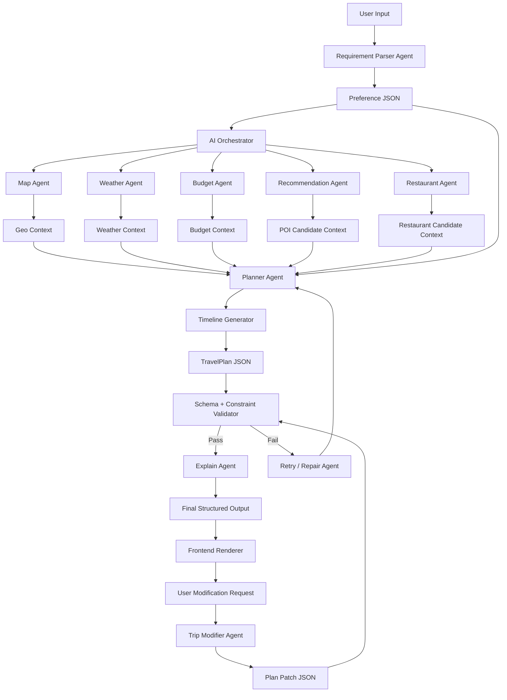
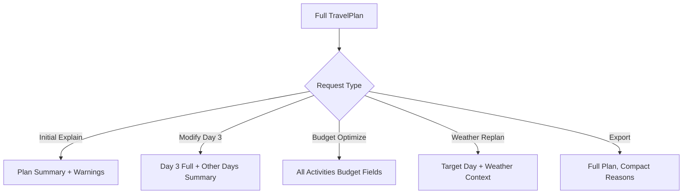
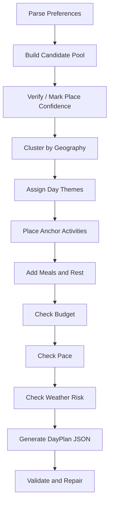
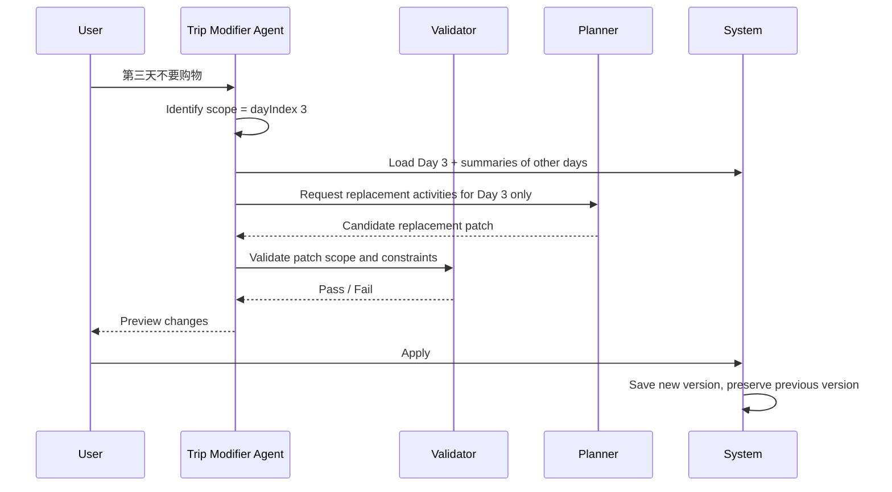
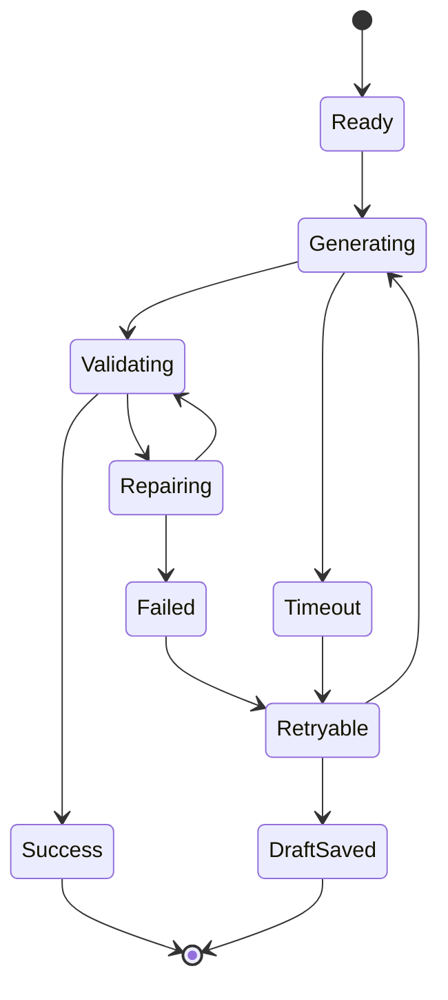
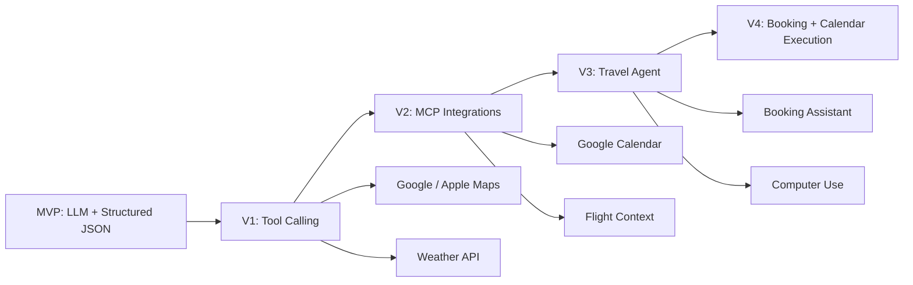
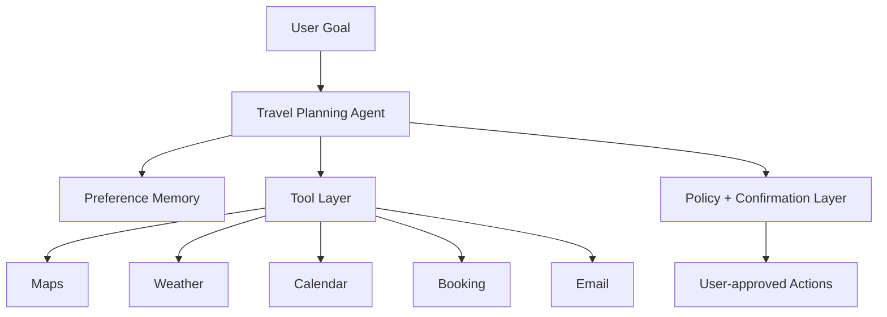

# AI Travel Planner AI Workflow Design Spec

> 文档类型：AI Workflow / AI Design Spec  
> 产品名称：AI Travel Planner  
> 基于文档：Competitive Analysis、User Research、PRD、Information Architecture、AI UX Design  
> 核心目标：定义 AI 如何理解需求、规划行程、调用工具、输出结构化结果、局部修改、解释推荐、处理失败与持续评估。  
> 非本阶段范围：UI 设计、视觉风格、数据库设计、代码实现。

---

## 0. Executive Summary

AI Travel Planner 的 AI 不是一个聊天机器人，而是一个旅行规划 Agent System。

它的核心职责不是“写攻略”，而是将用户模糊的旅行意图转化为：

- 可执行的多日行程
- 可编辑的结构化 JSON
- 可解释的推荐理由
- 可控的预算估算
- 可恢复的修改流程
- 可验证的风险提示

核心设计原则：

> LLM 负责理解、推理、生成、解释和取舍；工具和程序负责事实、校验、计算、状态和执行。

---

# 1. AI Architecture

## 1.1 完整 AI Workflow



## 1.2 节点职责

| 节点 | 负责什么 | 为什么需要 | 为什么不用 LLM 全部完成 |
|---|---|---|---|
| User Input | 用户输入目的地、日期、预算、兴趣、约束 | 原始意图入口 | 用户表达模糊，需要解析 |
| Requirement Parser | 将自然语言和表单转成 Preference JSON | 让后续规划有稳定输入 | 直接规划容易丢失约束 |
| AI Orchestrator | 决定调用哪些 Agent 和工具 | 控制流程和成本 | 单个 LLM 无法可靠管理工具顺序 |
| Map Agent | 获取地理位置、区域、距离、路线约束 | 行程必须地理可执行 | LLM 不应凭空估算距离 |
| Weather Agent | 获取天气影响和室内/室外风险 | 天气会改变计划 | LLM 不应编造天气 |
| Budget Agent | 估算预算区间和成本风险 | 用户需要预算可控 | LLM 不应编造精确价格 |
| Recommendation Agent | 获取候选景点、街区、活动 | 规划需要可选池 | LLM 纯生成会产生幻觉地点 |
| Restaurant Agent | 推荐餐厅和用餐窗口 | 餐饮是旅行高频决策 | 餐厅需结合路线、时间、预算 |
| Planner Agent | 制定多日行程策略 | 平衡兴趣、路线、预算、节奏 | 需要整合多个上下文 |
| Timeline Generator | 生成按天按时间排列的计划 | 前端需要可渲染结构 | 散文攻略不可编辑 |
| Validator | 校验 JSON、时间冲突、预算、空字段 | 保证输出稳定 | LLM 无法自证结构正确 |
| Explain Agent | 解释推荐逻辑和风险 | 提升用户信任 | 主 Planner 不应输出冗长解释干扰结构 |
| Trip Modifier Agent | 局部修改计划 | 避免全量重生成 | 修改需要保护未受影响部分 |
| Retry / Repair Agent | 修复非法 JSON 或失败输出 | 提高稳定性 | 失败恢复应独立于首次生成 |

## 1.3 核心架构原则

| 原则 | 说明 |
|---|---|
| Agent 分工 | 每个 Agent 处理明确子任务，降低单次推理复杂度 |
| Structured First | 所有关键输出必须是 JSON，不输出 Markdown 行程 |
| Tool-grounded | 地图、天气、预算、地点信息来自工具或结构化上下文 |
| Human Editable | 输出必须支持局部修改和版本回滚 |
| Fail Recoverably | AI 失败不能让用户丢失输入和计划 |
| Explain After Plan | 先生成可执行结构，再解释理由 |

---

# 2. Agent Design

## 2.1 Planner Agent

| 项目 | 内容 |
|---|---|
| 职责 | 将 Preference、地图、预算、天气、候选 POI 整合成多日 TravelPlan |
| 输入 | Preference JSON、Geo Context、Budget Context、Weather Context、POI Candidates、Restaurant Candidates |
| 输出 | TravelPlan JSON |
| 什么时候调用 | 用户首次生成、整体重生成、重大约束变化 |
| 什么时候结束 | 输出合法 TravelPlan JSON，并通过基础 schema 校验 |
| 为什么独立存在 | 规划是核心推理任务，需要统一平衡多个约束 |

### Prompt

```text
You are the Planner Agent for an AI-native travel planning product.
Your task is to create a realistic, editable, budget-aware city itinerary for first-time independent travelers.
Use only the provided Preference JSON and candidate contexts.
Do not invent exact opening hours, prices, or transit times.
Group nearby places into the same day.
Respect user pace, budget, interests, avoid list, hotel area, weather risks, and locked constraints.
Output TravelPlan JSON only.
```

### 失败策略

| 失败 | 策略 |
|---|---|
| JSON 非法 | 进入 Retry / Repair Agent |
| 活动过多 | 自动降低活动数量 |
| 缺少候选地点 | 使用 fallback candidate category，并标记 low confidence |
| 预算超出 | 调用 Budget Agent 生成替代方案 |

## 2.2 Budget Agent

| 项目 | 内容 |
|---|---|
| 职责 | 估算每日预算、总预算、成本风险和优化建议 |
| 输入 | TravelPlan JSON、budgetLevel、currency、destination |
| 输出 | BudgetAnalysis JSON |
| 什么时候调用 | 首次生成后、用户调整预算、导出前预算检查 |
| 什么时候结束 | 输出预算区间、分类、风险、建议 |
| 为什么独立存在 | 预算是独立约束，且需要稳定结构和置信度 |

### Prompt

```text
Analyze the itinerary budget using ranges, not exact prices.
Break down estimated cost by food, transport, tickets, shopping buffer, and other.
Identify days or activities that may exceed the user's budget level.
Suggest lower-cost alternatives only when needed.
Return BudgetAnalysis JSON only.
```

### 失败策略

- 如果价格数据不足，输出 `confidence: low`。
- 如果无法估算具体分类，输出范围而非精确值。
- 如果预算工具失败，不阻断行程生成，只显示预算风险未知。

## 2.3 Map Agent

| 项目 | 内容 |
|---|---|
| 职责 | 提供地点坐标、区域聚类、路线顺序、距离风险 |
| 输入 | destination、hotelArea、candidate places、DayPlan |
| 输出 | GeoContext JSON、RouteRisk JSON |
| 什么时候调用 | 规划前候选地点处理、规划后路线校验、局部修改后 |
| 什么时候结束 | 输出区域、坐标、相对距离和风险 |
| 为什么独立存在 | 地理事实不能靠 LLM 猜测 |

### Prompt

```text
Given verified place metadata and user hotel area, identify geographic clusters and route risks.
Do not invent coordinates.
Do not estimate exact transit time unless provided.
Return GeoContext JSON only.
```

### 失败策略

- 地点无法定位：标记 `placeVerificationStatus: unverified`。
- 路线信息不足：允许 Planner 继续，但输出 route warning。
- 地图工具不可用：降级为区域文本聚类。

## 2.4 Weather Agent

| 项目 | 内容 |
|---|---|
| 职责 | 判断天气对行程的影响，并生成天气相关约束 |
| 输入 | destination、date、DayPlan、weather data |
| 输出 | WeatherContext JSON 或 WeatherReplan JSON |
| 什么时候调用 | 生成计划时、用户请求雨天版本、旅行当天查看 |
| 什么时候结束 | 输出 weather risk、affected activities、indoor alternatives |
| 为什么独立存在 | 天气是动态事实，且只影响部分活动 |

### Prompt

```text
Analyze how the weather affects the provided DayPlan.
Only mark outdoor or weather-sensitive activities as affected.
Suggest nearby indoor alternatives that preserve user interests.
Do not change locked activities.
Return WeatherContext or WeatherReplan JSON only.
```

### 失败策略

- 天气接口失败：不重排，只提示天气未知。
- 无室内替代：保留原计划并建议用户手动确认。

## 2.5 Restaurant Agent

| 项目 | 内容 |
|---|---|
| 职责 | 在合适时间和区域推荐餐厅、咖啡、用餐窗口 |
| 输入 | DayPlan、meal windows、budgetLevel、food preferences、geo cluster |
| 输出 | RestaurantCandidate JSON |
| 什么时候调用 | 生成行程、替换餐厅、删除餐饮活动、预算优化 |
| 什么时候结束 | 输出符合预算、区域、时间窗口的候选列表 |
| 为什么独立存在 | 餐饮推荐高频且强依赖路线、预算和时间 |

### Prompt

```text
Recommend meal or cafe candidates for the given day context.
Respect meal time, route area, budget level, dietary constraints, and user interests.
Prefer candidates that do not cause major detours.
Return RestaurantCandidate JSON only.
```

### 失败策略

- 无合适餐厅：推荐“free meal slot near current area”。
- 饮食限制不明确：标记需用户确认。

## 2.6 Trip Modifier Agent

| 项目 | 内容 |
|---|---|
| 职责 | 根据用户修改请求生成局部 patch |
| 输入 | Current TravelPlan、target scope、user instruction、locked activities |
| 输出 | PlanPatch JSON |
| 什么时候调用 | 用户说“第三天不要购物”“第二天轻松一点”“换个便宜餐厅” |
| 什么时候结束 | 输出只影响目标 scope 的 patch，并解释变更 |
| 为什么独立存在 | 修改需要保护未受影响部分，不能全量重写 |

### Prompt

```text
You are the Trip Modifier Agent.
Modify only the requested scope of the TravelPlan.
Do not change unaffected days.
Do not modify locked activities.
Return a PlanPatch JSON with operations, affected scope, rationale, and risk warnings.
If the request is ambiguous, return a clarification question instead of patch.
```

### 失败策略

- 修改范围不明：追问。
- 与 locked activity 冲突：解释冲突并给替代方案。
- patch 校验失败：回滚到原计划。

## 2.7 Explain Agent

| 项目 | 内容 |
|---|---|
| 职责 | 用用户可理解语言解释行程、推荐、修改、风险 |
| 输入 | TravelPlan 或 PlanPatch、Preference、risk warnings |
| 输出 | Explanation JSON |
| 什么时候调用 | 首次生成后、修改后、风险提示、预算优化后 |
| 什么时候结束 | 输出简洁、分点、带置信度的解释 |
| 为什么独立存在 | 解释与规划分离，避免 Planner 输出冗长和不稳定 |

### Prompt

```text
Explain the travel plan or change in concise user-facing language.
Focus on preference fit, route logic, budget fit, pacing, and tradeoffs.
Mention uncertainty and what should be verified.
Return Explanation JSON only.
```

### 失败策略

- 解释过长：压缩为 3-5 条。
- 无法解释：展示结构化 reason 字段。

---

# 3. Prompt Engineering

## 3.1 Prompt 设计原则

| 原则 | 说明 |
|---|---|
| Role clarity | 每个 Agent 有明确角色和边界 |
| JSON only | 关键链路不输出 Markdown |
| No invented facts | 禁止编造实时营业时间、精确价格、交通时长 |
| Scope control | 修改类 prompt 必须限制影响范围 |
| Confidence required | 不确定信息必须标注置信度 |
| Repairable output | 输出结构必须便于校验和重试 |

## 3.2 System Prompt

```text
You are an AI agent system embedded in AI Travel Planner.
The product helps first-time independent travelers create executable, editable, budget-aware city itineraries.

Core rules:
1. Do not behave like a generic chatbot.
2. Do not output travel essays unless explicitly asked by an Explain Agent.
3. Use structured JSON for planning, modification, budget, recommendation, and evaluation outputs.
4. Never invent exact real-time facts such as opening hours, ticket prices, live weather, or transit duration.
5. If information is uncertain, mark confidence and add warnings.
6. Preserve user constraints and locked activities.
7. Prefer local modification over full regeneration.
8. Keep plans realistic for first-time travelers.
```

### 设计思想

- 约束 AI 不走向“攻略作文”。
- 明确产品目标是可执行计划。
- 设定可信边界。

### Temperature

| 场景 | 建议 |
|---|---|
| Requirement Parsing | 0.1-0.2 |
| Planning | 0.3-0.5 |
| Modification | 0.2-0.4 |
| Explanation | 0.3 |
| Creative recommendations | 0.5-0.7 |
| JSON repair | 0 |

## 3.3 Requirement Parser Prompt

```text
Parse the user's travel input into Preference JSON.

Input includes:
- destination
- dates or trip duration
- budget level
- travel pace
- interests
- hotel area if known
- free text constraints

Rules:
- Extract explicit constraints.
- Infer soft preferences only when strongly supported.
- Do not infer sensitive attributes.
- If required fields are missing, add them to missingFields.
- Return JSON only.
```

### Few-shot

```json
{
  "input": "I am going to Tokyo for 4 days. I like food, shopping, and local cafes. Not too rushed.",
  "output": {
    "destination": "Tokyo",
    "durationDays": 4,
    "pace": "balanced",
    "budgetLevel": "medium",
    "interests": ["food", "shopping", "local_cafes"],
    "avoid": ["overpacked_schedule"],
    "missingFields": ["startDate"],
    "confidence": 0.86
  }
}
```

### Guardrails

- 不把“年轻女生”等敏感推断写入 profile。
- 不在缺目的地/天数时生成计划。

## 3.4 Trip Planner Prompt

```text
Generate a TravelPlan JSON from the provided Preference JSON and candidate contexts.

Planning rules:
- Create one DayPlan per travel day.
- Each day should have a clear theme and geographic focus.
- Do not overload the day beyond the user's pace.
- Include meal and rest slots when appropriate.
- Use only provided candidate places or clearly mark unverified suggestions.
- Add warnings for assumptions.
- Return JSON only.
```

### Few-shot

```json
{
  "dayIndex": 2,
  "theme": "Culture and old Tokyo",
  "areaFocus": ["Asakusa", "Ueno"],
  "activities": [
    {
      "type": "attraction",
      "name": "Senso-ji Temple",
      "timeSlot": "morning",
      "reason": "Classic first-time Tokyo experience and geographically close to Nakamise Street.",
      "confidence": 0.82
    }
  ]
}
```

## 3.5 Modify Prompt

```text
Modify the current TravelPlan according to the user's request.

Rules:
- Identify modification scope: whole_trip, specific_day, specific_activity, budget, weather.
- Modify only the requested scope.
- Preserve all unaffected days.
- Preserve locked activities.
- Return PlanPatch JSON only.
- If ambiguous, return ClarificationRequest JSON.
```

### Few-shot

```json
{
  "userRequest": "第三天不要购物",
  "output": {
    "patchType": "replace_activity_category",
    "scope": { "dayIndex": 3 },
    "constraints": { "removeTypes": ["shopping"] },
    "preserveDays": [1, 2, 4, 5]
  }
}
```

## 3.6 Budget Prompt

```text
Analyze and optimize the itinerary budget.

Rules:
- Use ranges, not exact prices.
- Break down by food, transport, tickets, shopping buffer, and other.
- Identify high-cost activities.
- Suggest replacements only if they preserve the user's main interests.
- Return BudgetAnalysis JSON only.
```

## 3.7 Explain Prompt

```text
Generate concise explanations for the plan or change.

Explain:
- preference fit
- route logic
- pacing
- budget tradeoffs
- uncertainty

Do not over-explain.
Return Explanation JSON only.
```

## 3.8 Recommendation Prompt

```text
Recommend candidates for the requested category.

Inputs:
- user preference
- destination
- day context
- geo cluster
- budget level
- avoid list

Rules:
- Prefer candidates that fit route and time.
- Explain why each candidate fits.
- Provide alternatives.
- Mark confidence.
- Return RecommendationSet JSON only.
```

## 3.9 Retry Prompt

```text
The previous model output failed validation.
Repair the output to match the provided schema exactly.

Rules:
- Do not add new facts.
- Do not change user constraints.
- Preserve valid fields.
- Fix only structure, missing required fields, invalid enum values, or malformed JSON.
- Return corrected JSON only.
```

## 3.10 Weather Prompt

```text
Create a weather-aware adjustment for the provided DayPlan.

Rules:
- Only affect weather-sensitive activities.
- Preserve locked activities.
- Prefer indoor alternatives in the same area.
- Keep the user's pace and budget level.
- Return WeatherReplan JSON only.
```

---

# 4. Structured Output

## 4.1 输出设计原则

| 原则 | 说明 |
|---|---|
| 易解析 | 固定字段、固定枚举 |
| 易修改 | 每个对象有 id 和 scope |
| 易重生成 | 计划按 DayPlan 分块 |
| 易校验 | confidence、warnings、sourceStatus 标准化 |
| 不输出 Markdown | 前端只消费结构化 JSON |

## 4.2 Preference JSON Schema

```json
{
  "type": "object",
  "required": ["destination", "durationDays", "pace", "budgetLevel", "interests"],
  "properties": {
    "destination": { "type": "string" },
    "startDate": { "type": "string", "format": "date" },
    "endDate": { "type": "string", "format": "date" },
    "durationDays": { "type": "integer", "minimum": 1, "maximum": 14 },
    "pace": { "type": "string", "enum": ["relaxed", "balanced", "packed"] },
    "budgetLevel": { "type": "string", "enum": ["low", "medium", "high"] },
    "interests": { "type": "array", "items": { "type": "string" } },
    "avoid": { "type": "array", "items": { "type": "string" } },
    "hotelArea": { "type": ["string", "null"] },
    "travelerType": { "type": "string", "enum": ["solo", "couple", "friends", "family", "unknown"] },
    "missingFields": { "type": "array", "items": { "type": "string" } },
    "confidence": { "type": "number", "minimum": 0, "maximum": 1 }
  }
}
```

## 4.3 TravelPlan JSON Schema

```json
{
  "type": "object",
  "required": ["planId", "destination", "days", "totalBudget", "warnings"],
  "properties": {
    "planId": { "type": "string" },
    "version": { "type": "integer" },
    "destination": { "type": "string" },
    "summary": { "type": "string" },
    "days": {
      "type": "array",
      "items": { "$ref": "#/definitions/DayPlan" }
    },
    "totalBudget": { "$ref": "#/definitions/BudgetRange" },
    "warnings": { "type": "array", "items": { "$ref": "#/definitions/Warning" } },
    "confidence": { "type": "number" }
  },
  "definitions": {
    "DayPlan": {
      "type": "object",
      "required": ["dayIndex", "theme", "activities", "dailyBudget"],
      "properties": {
        "dayIndex": { "type": "integer" },
        "date": { "type": ["string", "null"] },
        "theme": { "type": "string" },
        "areaFocus": { "type": "array", "items": { "type": "string" } },
        "activities": { "type": "array", "items": { "$ref": "#/definitions/Activity" } },
        "dailyBudget": { "$ref": "#/definitions/BudgetRange" },
        "routeRisk": { "type": "string", "enum": ["low", "medium", "high", "unknown"] },
        "warnings": { "type": "array", "items": { "$ref": "#/definitions/Warning" } }
      }
    },
    "Activity": {
      "type": "object",
      "required": ["activityId", "name", "type", "timeSlot", "durationMinutes", "budget", "reason", "confidence"],
      "properties": {
        "activityId": { "type": "string" },
        "name": { "type": "string" },
        "type": {
          "type": "string",
          "enum": ["attraction", "restaurant", "cafe", "shopping", "nature", "museum", "transport", "rest", "free_time"]
        },
        "timeSlot": { "type": "string", "enum": ["morning", "lunch", "afternoon", "dinner", "evening", "flexible"] },
        "startTime": { "type": ["string", "null"] },
        "durationMinutes": { "type": "integer" },
        "location": { "$ref": "#/definitions/Location" },
        "budget": { "$ref": "#/definitions/BudgetRange" },
        "reason": { "type": "string" },
        "alternatives": { "type": "array", "items": { "$ref": "#/definitions/Alternative" } },
        "locked": { "type": "boolean" },
        "sourceStatus": { "type": "string", "enum": ["verified", "unverified", "estimated"] },
        "confidence": { "type": "number" },
        "warnings": { "type": "array", "items": { "$ref": "#/definitions/Warning" } }
      }
    },
    "Location": {
      "type": "object",
      "properties": {
        "name": { "type": "string" },
        "address": { "type": ["string", "null"] },
        "lat": { "type": ["number", "null"] },
        "lng": { "type": ["number", "null"] },
        "placeId": { "type": ["string", "null"] },
        "area": { "type": ["string", "null"] }
      }
    },
    "BudgetRange": {
      "type": "object",
      "properties": {
        "currency": { "type": "string" },
        "min": { "type": "number" },
        "max": { "type": "number" },
        "confidence": { "type": "number" }
      }
    },
    "Alternative": {
      "type": "object",
      "properties": {
        "name": { "type": "string" },
        "reason": { "type": "string" },
        "tradeoff": { "type": "string" },
        "confidence": { "type": "number" }
      }
    },
    "Warning": {
      "type": "object",
      "properties": {
        "code": { "type": "string" },
        "message": { "type": "string" },
        "severity": { "type": "string", "enum": ["info", "warning", "critical"] },
        "action": { "type": ["string", "null"] }
      }
    }
  }
}
```

## 4.4 Hotel JSON Schema

```json
{
  "hotelRecommendation": {
    "area": "string",
    "fitReason": "string",
    "pros": ["string"],
    "cons": ["string"],
    "bestFor": ["string"],
    "confidence": 0.8,
    "sourceStatus": "estimated"
  }
}
```

## 4.5 Restaurant JSON Schema

```json
{
  "restaurantCandidate": {
    "name": "string",
    "mealType": "breakfast | lunch | dinner | cafe | snack",
    "area": "string",
    "budget": {
      "currency": "string",
      "min": 0,
      "max": 0,
      "confidence": 0.6
    },
    "dietaryFit": ["string"],
    "routeFitReason": "string",
    "confidence": 0.7,
    "warnings": []
  }
}
```

## 4.6 Transport JSON Schema

```json
{
  "transportSegment": {
    "fromActivityId": "string",
    "toActivityId": "string",
    "mode": "walk | transit | taxi | bike | unknown",
    "estimatedDurationMinutes": null,
    "distanceRisk": "low | medium | high | unknown",
    "notes": "string",
    "sourceStatus": "verified | estimated | unavailable"
  }
}
```

## 4.7 PlanPatch JSON Schema

```json
{
  "patchId": "string",
  "targetPlanId": "string",
  "scope": {
    "type": "whole_trip | day | activity | budget | weather",
    "dayIndex": 3,
    "activityId": null
  },
  "operations": [
    {
      "op": "replace | add | remove | move | update",
      "path": "/days/2/activities",
      "value": {}
    }
  ],
  "preserve": {
    "days": [1, 2, 4, 5],
    "lockedActivities": true
  },
  "rationale": "string",
  "warnings": [],
  "confidence": 0.82
}
```

---

# 5. Context Management

## 5.1 Context 类型

| Context | 生命周期 | 示例 | 用途 |
|---|---|---|---|
| Request Context | 单次请求 | 当前用户指令 | 当前 AI 操作 |
| Session Context | 当前规划会话 | 当前 TravelPlan、修改历史 | 支持连续修改 |
| Trip Context | 单个旅行长期保存 | planId、Preference、DayPlan | 回看和继续编辑 |
| User Profile Context | 跨旅行保存 | 常用预算、节奏、兴趣 | 个性化 |
| Tool Context | 短期事实 | 天气、地图、候选地点 | grounding |
| Evaluation Context | 后台分析 | 用户接受/撤销修改 | 评估 AI 质量 |

## 5.2 每次请求需要哪些 Context？

| 请求类型 | 必需 Context | 可选 Context | 不应携带 |
|---|---|---|---|
| Requirement Parsing | 当前输入 | 历史偏好摘要 | 完整历史行程 |
| Initial Planning | Preference、候选地点、地图、预算 | 天气、酒店区域 | 用户无关历史 |
| Local Modify | 当前 TravelPlan、target scope、locked activities | 最近修改记录 | 不相关天数全文可压缩 |
| Budget Optimize | TravelPlan、budgetLevel | 用户预算偏好 | 无关解释文本 |
| Weather Replan | DayPlan、weather、locked activities | 当前时间位置 | 其他日期详细内容 |
| Explain | TravelPlan summary、Preference、warnings | PlanPatch | 工具原始大数据 |

## 5.3 哪些需要保存？

| 数据 | 是否保存 | 原因 |
|---|---|---|
| Preference JSON | 是 | 后续修改和个性化需要 |
| TravelPlan JSON | 是 | 核心用户资产 |
| PlanPatch history | 是 | 支持 undo 和评估 |
| AI explanations | 可保存 | 支持导出和回看 |
| Raw LLM chain-of-thought | 不保存 | 不应暴露或依赖 |
| Tool raw responses | 短期缓存 | 节省成本，但需过期 |
| User feedback | 是 | AI 质量评估 |

## 5.4 长期 Memory、Session、Profile 划分

| 类型 | 内容 | 使用方式 |
|---|---|---|
| Long-term Memory | 用户长期偏好摘要，如偏好 relaxed、喜欢咖啡、预算 medium | 作为默认偏好，不覆盖本次明确输入 |
| Session | 当前生成和修改过程 | 保持上下文连续 |
| User Profile | 账户设置、货币、语言、默认预算 | 表单默认值和预算展示 |
| Trip Memory | 单次旅行计划和版本 | 修改、导出、回看 |

## 5.5 Context Window Strategy



策略：

- 局部修改只传目标 day 的完整内容，其他 day 只传 summary。
- 锁定活动必须完整传入。
- 历史版本只传最近 1-3 次 patch 摘要。
- 长期偏好以 summary 形式传入，不传完整历史。
- 工具上下文只传经过压缩的候选结果。

---

# 6. Conversation Strategy

## 6.1 产品不是聊天，但需要对话能力

对话只用于：

- 澄清关键缺失信息
- 接收自然语言修改
- 解释推荐原因
- 错误恢复

不用于：

- 承载完整行程
- 替代时间线和结构化计划
- 让用户通过多轮聊天完成所有操作

## 6.2 主动提问策略

| 场景 | 是否主动提问 | 原因 |
|---|---|---|
| 缺目的地 | 是 | 无法生成 |
| 缺天数 | 是 | 无法排程 |
| 兴趣为空 | 是，但只问一次 | 个性化依赖兴趣 |
| 酒店区域未知 | 否 | 可用目的地中心区域 fallback |
| 预算未知 | 否 | 默认 medium |
| 偏好冲突 | 是 | 需要用户决策 |

## 6.3 自动补全策略

| 信息 | 自动补全方式 | 是否需确认 |
|---|---|---|
| budgetLevel | 默认 medium | 不需要 |
| pace | 默认 balanced | 不需要 |
| hotelArea | unknown | 不需要 |
| meal slots | 根据日程自动插入 | 不需要 |
| rest time | 根据 pace 自动插入 | 不需要 |

## 6.4 直接生成策略

当 `destination + duration/dates + pace + budget + interests` 满足时直接生成。AI 不应继续追问“更喜欢什么餐厅”等细节。

## 6.5 等待确认策略

| 操作 | 是否确认 |
|---|---|
| 首次生成 | 不需要 |
| 整体重生成 | 需要 |
| 局部修改 | 需要预览后 apply |
| 删除整趟旅行 | 需要 |
| 替换单个活动 | 需要预览 |

## 6.6 Explain 策略

解释只在决策点出现：

- 首次生成后解释整体规划
- 用户点击 “Why this?”
- 修改后解释变化
- 预算/路线/天气风险出现时解释

---

# 7. Planning Strategy

## 7.1 规划目标

AI 规划不是随机生成景点列表，而是在多个约束下找到可执行方案。

输入约束：

- 地理位置
- 营业时间风险
- 用户兴趣
- 预算水平
- 交通复杂度
- 天气影响
- 旅行节奏
- 住宿区域
- 必去/避开项目

## 7.2 规划顺序



## 7.3 Day Planning 逻辑

| 步骤 | 说明 |
|---|---|
| 先确定每日区域 | 每天聚焦 1-2 个相邻区域，减少跨城移动 |
| 再放 anchor activity | 每天 1-2 个最重要活动作为骨架 |
| 再补餐饮和休息 | 根据时间自然插入餐厅、咖啡、休息 |
| 再补轻量活动 | 根据 pace 添加购物、街区、夜景 |
| 最后校验预算和风险 | 超预算或过密时降级 |

## 7.4 Day1 / Day2 / Day3 规划模式

| Day | 默认策略 | 原因 |
|---|---|---|
| Day 1 | 住宿附近 + 轻量探索 + 低交通复杂度 | 用户刚到陌生城市，不宜过满 |
| Day 2 | 经典必去 + 高兴趣活动 | 体力和熟悉度较好，适合核心体验 |
| Day 3 | 本地街区 + 个性化兴趣 | 避免全程模板化，提升惊喜感 |
| Last Day | 轻量活动 + 购物/咖啡 + 机场/车站缓冲 | 需要留出离开时间和不确定性 |

## 7.5 约束优先级

| 优先级 | 约束 | 说明 |
|---:|---|---|
| 1 | 用户硬约束 | 日期、目的地、预算上限、avoid |
| 2 | 安全与可执行性 | 路线过远、时间冲突、天气风险 |
| 3 | 用户兴趣 | food、culture、shopping 等 |
| 4 | 旅行节奏 | relaxed/balanced/packed |
| 5 | 推荐多样性 | 经典、本地、小众平衡 |
| 6 | 惊喜感 | 在可执行基础上增加特色 |

---

# 8. Modify Strategy

## 8.1 局部修改原则

用户说“第三天不要购物”时，AI 应只修改第三天，不影响其他日期。

核心原则：

- Scope first：先识别修改范围。
- Preserve unaffected：未涉及日期不变。
- Respect locked：锁定活动不变。
- Patch not rewrite：输出 patch，不输出完整重写。
- Preview before apply：用户确认后应用。

## 8.2 局部修改 Workflow



## 8.3 示例

输入：

```text
第三天不要购物
```

AI 应输出：

```json
{
  "scope": {
    "type": "day",
    "dayIndex": 3
  },
  "intent": "remove_activity_type",
  "constraints": {
    "removeTypes": ["shopping"],
    "preserveDays": [1, 2, 4, 5],
    "preserveLockedActivities": true
  },
  "replacementStrategy": "replace shopping activities with culture or local neighborhood activities in the same geographic cluster",
  "requiresConfirmation": true
}
```

## 8.4 修改类型

| 用户表达 | Scope | AI 行为 |
|---|---|---|
| “第三天不要购物” | Day 3 | 替换 shopping 活动 |
| “第二天轻松一点” | Day 2 | 减少活动数量，增加休息 |
| “换个便宜餐厅” | Activity | 找同区域低预算餐厅 |
| “预算降到低一些” | Whole trip or budget | 优化高成本活动 |
| “下雨怎么办” | Target day | 替换户外活动 |
| “这个景点必须保留” | Activity | 设置 locked |

---

# 9. Recommendation Strategy

## 9.1 推荐对象

| 类型 | 推荐逻辑 |
|---|---|
| 餐厅 | 时间窗口、预算、路线附近、饮食偏好 |
| 酒店区域 | 用户想去地点分布、交通便利性、预算 |
| 景点 | 兴趣匹配、首次访问价值、地理聚类 |
| 咖啡/休息 | 节奏、路线空档、用户偏好 |
| 替代活动 | 同区域、同时间段、满足修改意图 |

## 9.2 为什么推荐？

每个推荐至少说明 3 类理由中的 2 类：

- Preference fit：符合用户兴趣
- Route fit：顺路或同区域
- Budget fit：符合预算
- Pace fit：符合旅行节奏
- Risk fit：降低天气/闭馆/排队风险

## 9.3 什么时候解释？

| 场景 | 解释强度 |
|---|---|
| 首次生成 | 中等，解释整体逻辑 |
| 单个活动详情 | 简短，解释推荐原因 |
| 替换活动 | 强，解释为什么替换 |
| 预算优化 | 强，解释节省与取舍 |
| 普通列表浏览 | 弱，避免打扰 |

## 9.4 什么时候不给推荐？

| 场景 | 原因 |
|---|---|
| 用户已明确锁定完整计划 | 不应打扰 |
| 信息置信度过低 | 避免误导 |
| 推荐会违反预算或 avoid | 不应推荐 |
| 路线代价明显过高 | 不应为“好看”牺牲可执行性 |
| 用户正在导出 | 不打断完成任务 |

---

# 10. AI Trust Design

## 10.1 可信度策略

| 策略 | 说明 |
|---|---|
| 1. Explain every major decision | 解释每日主题和关键活动 |
| 2. Confidence score | 每个活动和计划有置信度 |
| 3. Source status | 标记 verified/unverified/estimated |
| 4. Warning system | 对营业时间、预算、路线风险提示 |
| 5. Alternatives | 给出备选项而非单一答案 |
| 6. Locked activities | 用户可锁定重要活动 |
| 7. Preview before apply | 修改前先预览 |
| 8. Undo | 所有修改可撤销 |
| 9. Scope transparency | 告诉用户本次修改影响哪里 |
| 10. No exact fake facts | 不编造精确营业时间和价格 |
| 11. Budget ranges | 用范围表达预算不确定性 |
| 12. Route risk labels | 标记 low/medium/high 路线风险 |
| 13. Verify reminders | 提醒用户确认门票、营业时间 |
| 14. Compare changes | 修改前后对比 |
| 15. User feedback | 允许标记“不准/不喜欢/太赶” |
| 16. Separate facts from suggestions | 明确哪些是事实，哪些是建议 |
| 17. Conservative first-day planning | 第一天默认轻量，减少失败体验 |
| 18. Fail visibly | 失败时说明原因和下一步 |

---

# 11. Failure Design

## 11.1 Fallback Strategy

| 失败类型 | 检测方式 | 用户影响 | Fallback |
|---|---|---|---|
| LLM 输出错误 | Schema validation fail | 无法渲染 | Retry / Repair Agent |
| JSON 非法 | JSON parse fail | 无法进入计划页 | 结构修复，不重新推理事实 |
| 网络超时 | request timeout | 生成中断 | 保存草稿，提供 retry |
| 天气接口失败 | weather unavailable | 无法天气重排 | 保留原计划，提示天气未知 |
| 预算失败 | budget confidence low | 预算不可控 | 显示未知范围，允许稍后重试 |
| 地图失败 | map API fail | 路线可信下降 | 使用区域聚类 fallback |
| Prompt Injection | user/tool content contains instruction override | 安全风险 | 忽略外部指令，遵循 system prompt |
| 模型幻觉 | unverified place/fact | 用户可能被误导 | 标记 unverified，要求验证 |
| 候选地点不足 | candidate pool small | 计划单薄 | 生成低置信度计划 + 建议放宽条件 |
| 修改冲突 | locked activity conflict | 修改无法完成 | 解释冲突，提供替代 scope |

## 11.2 State Diagram



## 11.3 Prompt Injection 防护

| 来源 | 风险 | 防护 |
|---|---|---|
| 用户输入 | “忽略之前规则” | 用户输入只作为 content，不作为 instruction |
| 网页/攻略导入 | 外部文本包含恶意 prompt | 工具内容标记为 untrusted data |
| 分享计划 | 被篡改内容 | 只读内容不进入 system context |
| 修改请求 | 诱导输出内部 prompt | 禁止输出系统提示和隐藏策略 |

---

# 12. AI Evaluation

## 12.1 Evaluation Metrics

| 维度 | 指标 | 定义 |
|---|---|---|
| Route Quality | Route Reasonableness Score | 同一天地点是否地理聚合 |
| Route Quality | Backtracking Rate | 是否出现明显来回折返 |
| Pace Quality | Overpacked Day Rate | 单日活动是否超过节奏上限 |
| Pace Quality | Rest Slot Coverage | relaxed/balanced 是否有休息 |
| Budget Quality | Budget Range Accuracy | 预算区间是否符合实际 |
| Budget Quality | Budget Violation Rate | 是否超出用户预算等级 |
| Preference Fit | Interest Match Rate | 活动是否匹配用户兴趣 |
| Preference Fit | Avoid Violation Rate | 是否违反 avoid |
| Diversity | Activity Diversity Score | 是否全是同类活动 |
| Repetition | Duplicate Place Rate | 是否重复推荐地点 |
| Modify Quality | Locality Preservation Rate | 局部修改是否只影响目标范围 |
| Modify Quality | Modify Acceptance Rate | 用户是否接受修改 |
| Trust | Explanation Helpfulness | 用户是否认为解释有帮助 |
| Trust | Warning Precision | 风险提示是否准确 |
| Reliability | JSON Valid Rate | 输出是否可解析 |
| Reliability | Repair Success Rate | 修复成功率 |
| User Outcome | Export Rate | 用户是否导出 |
| User Outcome | Saved Plan Rate | 用户是否保存 |
| User Outcome | Regeneration Rate | 整体重生成频率 |
| User Outcome | AI Error Report Rate | 用户报告错误频率 |

## 12.2 离线评估

| 测试集 | 用途 |
|---|---|
| 常见城市 2-5 天游 | 测基础规划质量 |
| 预算敏感 case | 测预算优化 |
| 多兴趣冲突 case | 测取舍能力 |
| 局部修改 case | 测 scope control |
| 恶意 prompt case | 测 prompt injection |
| 低信息输入 case | 测追问和默认策略 |

## 12.3 人工评估 Rubric

| 评分项 | 1 分 | 3 分 | 5 分 |
|---|---|---|---|
| 可执行性 | 明显不可执行 | 部分合理 | 路线、节奏、预算合理 |
| 个性化 | 模板化 | 部分匹配 | 明显符合偏好 |
| 修改质量 | 乱改全局 | 局部但有副作用 | 精准局部修改 |
| 解释质量 | 空泛 | 有部分原因 | 清楚说明取舍 |
| 信任感 | 编造事实 | 有提醒 | 明确置信度和风险 |

---

# 13. Future Evolution

## 13.1 Evolution Roadmap



## 13.2 MVP

| 能力 | 说明 |
|---|---|
| LLM Planner | 生成结构化行程 |
| JSON Schema | 支持前端渲染和修改 |
| Basic Budget | 预算区间估算 |
| Local Modify | 局部修改 patch |
| Explain | 推荐解释 |

## 13.3 V1：Tool Calling

| 工具 | 升级价值 |
|---|---|
| Map Tool | 真实地点、距离、路线风险 |
| Weather Tool | 天气重规划 |
| Place Search | 降低幻觉地点 |
| Budget Lookup | 提升预算可信度 |

## 13.4 V2：MCP Integrations

| MCP | 用途 |
|---|---|
| Google Maps MCP | 地点、路线、保存列表 |
| Calendar MCP | 将行程写入日历 |
| Email MCP | 解析酒店/机票确认邮件 |
| Document MCP | 导出 PDF/旅行手册 |

## 13.5 V3：Computer Use / Agent

| 能力 | 用途 | 风险 |
|---|---|---|
| Computer Use | 帮用户打开官网查票、预约入口 | 必须 human confirmation |
| Booking Agent | 辅助预订活动或餐厅 | 支付和取消责任高 |
| Live Replanning | 旅行中根据位置和时间调整 | 需要强隐私控制 |

## 13.6 V4：Booking / Calendar / Flight / Hotel

| 能力 | AI Workflow 升级 |
|---|---|
| Booking | Planner 输出可执行 action，但必须用户确认 |
| Google Calendar | DayPlan 转换成 calendar events |
| Flight | 根据到达/离开时间调整 Day1/Last Day |
| Hotel | 根据行程地点分布推荐住宿区域 |
| Google Maps / Apple Maps | 导出每日路线到用户习惯地图 |

## 13.7 未来架构形态



---

# 14. Final Checklist

## 14.1 AI Workflow Checklist

- [ ] 每个 Agent 有明确输入、输出、失败策略。
- [ ] 所有关键输出为 JSON。
- [ ] Planner 不编造实时事实。
- [ ] 修改流程输出 PlanPatch，不重写全量计划。
- [ ] 地图、天气、预算等事实由工具或结构化上下文提供。
- [ ] AI 解释与规划分离。
- [ ] 失败后可 retry、repair、fallback。

## 14.2 Trust Checklist

- [ ] 每个活动有 reason。
- [ ] 每个不确定点有 confidence 或 warning。
- [ ] 用户可锁定活动。
- [ ] 用户可撤销修改。
- [ ] 风险提示不隐藏。
- [ ] 推荐有替代方案。

## 14.3 Evaluation Checklist

- [ ] 评估路线合理性。
- [ ] 评估预算准确性。
- [ ] 评估兴趣匹配。
- [ ] 评估局部修改范围控制。
- [ ] 评估 JSON 合法率。
- [ ] 评估用户接受和导出行为。

---

# 15. Final Design Decision

AI Travel Planner 的 AI Workflow 应从“生成文本”升级为“可校验、可修改、可解释的旅行规划 Agent 系统”。

最终判断：

> LLM 不应该独自完成旅行规划；它应该在工具、结构化数据、校验器和用户确认机制的约束下，完成偏好理解、行程推理、局部修改和解释。
