# AI Travel Planner Information Architecture + AI UX Design

> 文档类型：Information Architecture + AI UX Design  
> 产品名称：AI Travel Planner  
> 基于文档：Competitive Analysis、User Research、PRD  
> 阶段目标：在进入 UI 设计和前端开发前，明确产品结构、页面关系、任务流程、AI 交互边界和状态设计。  
> 非本阶段范围：视觉风格、颜色、品牌、代码实现、数据库设计。

---

## 0. 设计范围

AI Travel Planner 的核心体验不是聊天，而是一个 AI 驱动的旅行规划工作台。用户应在 5 分钟内从“我想去某个城市”走到“一份可执行、可修改、预算可控的旅行计划”。

本 UX 文档解决四类问题：

| 问题 | 本文档回答 |
|---|---|
| 产品有哪些页面？ | Information Architecture、Screen Inventory |
| 用户怎么走完整流程？ | Navigation、Task Flow、User Flow |
| 每个页面放什么？ | ASCII Wireframe、页面目标、组件、CTA |
| AI 如何参与体验？ | AI UX、状态设计、Interaction Specification |

---

# 1. Information Architecture

## 1.1 站点结构 Tree Diagram

```text
AI Travel Planner
├── Home
│   ├── Value Proposition
│   ├── Start Planning CTA
│   └── Recent Trips Preview
│
├── Travel Planner
│   ├── Requirement Input
│   │   ├── Destination
│   │   ├── Dates
│   │   ├── Travel Pace
│   │   ├── Budget Level
│   │   ├── Interests
│   │   ├── Hotel Area
│   │   └── Free Text Constraints
│   │
│   ├── AI Understanding
│   │   ├── Preference Summary
│   │   ├── Missing Info Prompt
│   │   └── Generate Confirmation
│   │
│   └── AI Generating
│       ├── Understanding State
│       ├── Planning State
│       ├── Checking State
│       └── Recovery State
│
├── Trip Detail
│   ├── Trip Overview
│   │   ├── Summary
│   │   ├── Day Cards
│   │   ├── Budget Summary
│   │   ├── Map Preview
│   │   └── Risk Warnings
│   │
│   ├── Day Detail
│   │   ├── Day Timeline
│   │   ├── Activity Cards
│   │   ├── Replace Activity
│   │   ├── Lock Activity
│   │   ├── Delete Activity
│   │   └── Day Replan
│   │
│   ├── Map
│   │   ├── Daily Route
│   │   ├── Place Pins
│   │   ├── Route Order
│   │   └── Open in External Map
│   │
│   ├── Budget
│   │   ├── Total Budget
│   │   ├── Daily Budget
│   │   ├── Category Breakdown
│   │   └── Budget Optimize
│   │
│   ├── AI Edit Panel
│   │   ├── Natural Language Modify
│   │   ├── Suggested Quick Actions
│   │   ├── AI Explanation
│   │   └── Undo
│   │
│   └── Export / Share
│       ├── Copy Text
│       ├── Export PDF
│       ├── Share Link
│       └── External Map Export
│
├── History
│   ├── Saved Trips
│   ├── Draft Trips
│   ├── Search / Filter
│   └── Delete Trip
│
├── Profile
│   ├── Basic Info
│   ├── Travel Preferences
│   └── Account Status
│
├── Settings
│   ├── Language
│   ├── Currency
│   ├── Privacy
│   └── Data Controls
│
└── System Pages
    ├── Loading
    ├── AI Thinking
    ├── Empty State
    ├── Error State
    ├── 404
    └── Quota Exceeded
```

## 1.2 为什么这样组织？

| IA 决策 | 原因 |
|---|---|
| 将 Planner 和 Trip Detail 分离 | Planner 是创建流程，Trip Detail 是编辑和执行工作台，用户心智不同 |
| Trip Detail 内保留 Overview、Day、Map、Budget | 旅行计划天然由时间、空间、成本三条主线组成 |
| AI Edit Panel 放在 Trip Detail 内 | AI 应服务具体计划，不应变成独立聊天产品 |
| History 独立 | 旅行计划会被反复查看，尤其是出发前 |
| Profile 和 Settings 后置 | MVP 核心不是账户，而是规划成功 |
| System Pages 明确 | AI 产品需要特别处理等待、失败、重试和不确定性 |

## 1.3 为什么用户容易理解？

用户的自然心智是：

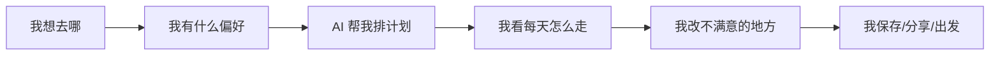

对应到产品结构：

| 用户心智 | 产品模块 |
|---|---|
| 我要开始规划 | Home |
| 我告诉你我要什么 | Travel Planner |
| 你给我一份计划 | Trip Overview |
| 我看每天安排 | Day Detail |
| 我确认路线是否顺 | Map |
| 我确认预算是否可控 | Budget |
| 我带走或分享计划 | Export / Share |
| 我之后再看 | History |

---

# 2. Navigation

## 2.1 导航原则

| 原则 | 说明 |
|---|---|
| 创建流程单向推进 | 从输入到生成应减少分叉，避免用户还没拿到计划就迷失 |
| 编辑流程允许自由切换 | 拿到计划后，用户需要在 Day、Map、Budget 之间反复比较 |
| AI 不作为主导航 | AI 是上下文能力，不是一个独立页面 |
| 移动端优先 | 目标用户大概率在手机上规划和旅行中查看 |
| 退出必须可恢复 | 规划过程可以中断，系统应保存草稿 |

## 2.2 顶部导航

适用页面：Home、Planner、Trip Detail、History、Profile、Settings。

```text
+------------------------------------------------+
| AI Travel Planner          History   Profile   |
+------------------------------------------------+
```

| 导航项 | 作用 | 显示规则 |
|---|---|---|
| Logo / Product Name | 返回 Home | 全局显示 |
| History | 查看历史计划 | 登录或有本地计划时显示 |
| Profile | 账户和偏好 | MVP 可弱化 |
| Save 状态 | 显示计划是否已保存 | Trip Detail 显示 |

## 2.3 底部导航

适用页面：Trip Detail，尤其是移动端。

```text
+------------------------------------+
| Overview | Day | Map | Budget | AI |
+------------------------------------+
```

| Tab | 用户问题 | 页面 |
|---|---|---|
| Overview | 这趟旅行整体怎么样？ | Trip Overview |
| Day | 每天具体怎么走？ | Day Detail |
| Map | 路线顺不顺？ | Map |
| Budget | 钱够不够？ | Budget |
| AI | 我想改一下 | AI Edit Panel |

## 2.4 侧边栏

桌面端 Trip Detail 可使用轻量侧边栏，提高多日计划切换效率。

```text
+----------------+-----------------------------+
| Trip Days      | Main Content                 |
| Day 1          |                             |
| Day 2          |                             |
| Day 3          |                             |
| Budget         |                             |
| Map            |                             |
+----------------+-----------------------------+
```

MVP 移动端不使用侧边栏。

## 2.5 页面跳转关系

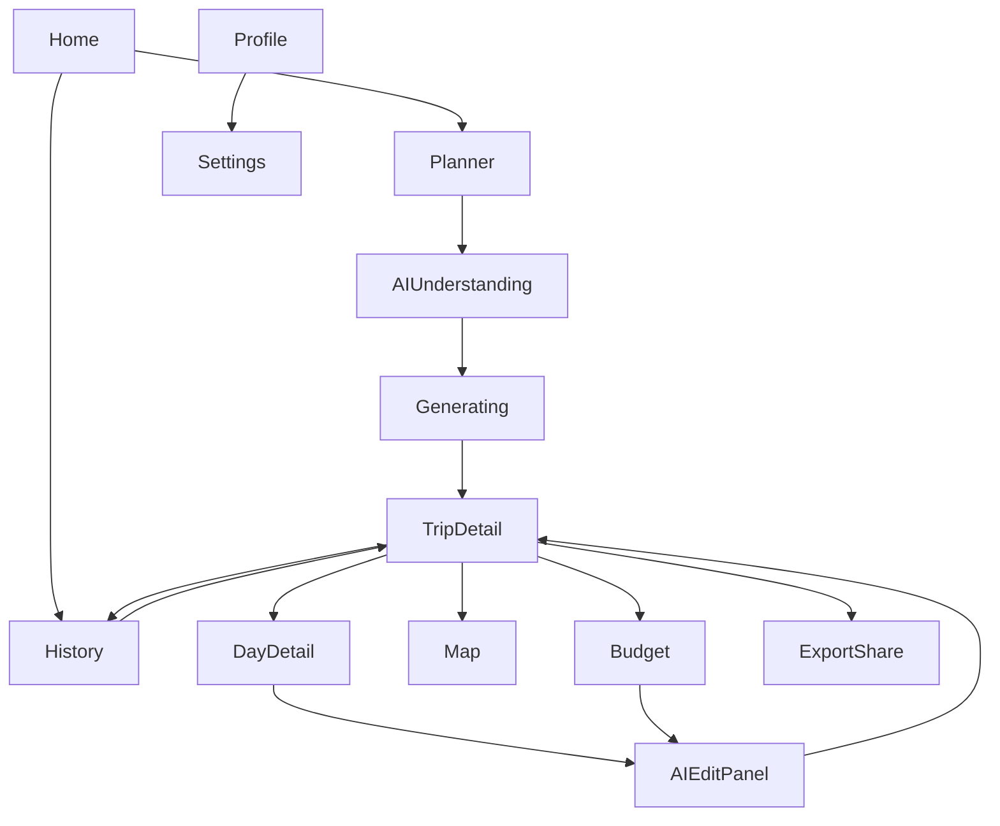

## 2.6 返回逻辑

| 当前页面 | 返回到 | 逻辑 |
|---|---|---|
| Planner Step 2+ | 上一步输入 | 保留已填内容 |
| Generating | Planner Review | 允许取消生成，保留需求 |
| Trip Overview | Home 或 History | 如果从历史进入则回 History |
| Day Detail | Trip Overview | 保留当前 dayIndex |
| Map | Trip Overview 或 Day Detail | 从哪里进入回哪里 |
| Budget | Trip Overview | 保留预算调整草稿 |
| Export | Trip Detail | 不丢失计划 |

## 2.7 退出逻辑

| 场景 | 处理 |
|---|---|
| 输入未完成退出 | 保存本地草稿 |
| AI 生成中退出 | 提示“生成会停止，需求已保存” |
| 计划已生成退出 | 自动保存到 History |
| 修改未应用退出 | 提示保存或放弃修改 |
| 分享页退出 | 返回上一页，不改变原计划 |

---

# 3. User Task Flow

## 3.1 完成一次旅行规划的任务拆解

| Task | 用户目标 | 用户操作 | 系统反馈 | AI 行为 |
|---|---|---|---|---|
| 1. 开始规划 | 确认产品能帮自己快速规划 | 点击 Start Planning | 进入需求输入页 | 无 |
| 2. 输入基本需求 | 告诉产品去哪、几天、预算 | 填目的地、日期、预算、节奏 | 实时校验必填字段 | 解析自然语言补充 |
| 3. 输入兴趣偏好 | 让计划更像自己 | 选择兴趣，填写补充要求 | 展示偏好摘要 | 将模糊需求转成标签 |
| 4. 确认生成 | 确认 AI 理解正确 | 点击 Generate | 显示生成进度 | 生成 Preference JSON |
| 5. 等待计划 | 知道系统正在做什么 | 查看 AI Thinking 状态 | 分阶段反馈 | 生成 TravelPlan JSON |
| 6. 查看总览 | 判断整体是否合适 | 浏览摘要、预算、风险 | 展示 Overview | 解释规划逻辑 |
| 7. 查看某一天 | 确认当天是否可执行 | 打开 Day Detail | 展示 Timeline | 解释活动安排原因 |
| 8. 查看地图 | 判断路线是否顺 | 切换 Map | 展示地点顺序 | 不计算路线，只解释逻辑 |
| 9. 查看预算 | 判断是否超支 | 切换 Budget | 展示分类预算 | 给出优化建议 |
| 10. 修改计划 | 调整不满意的部分 | 替换/删除/自然语言修改 | 显示局部更新中 | 局部重排 |
| 11. 确认修改 | 接受或撤销 AI 修改 | 点击 Apply / Undo | 更新计划或回滚 | 解释变化 |
| 12. 导出分享 | 带走或发给同行人 | 点击 Export / Share | 生成 PDF/链接/文本 | 生成简洁摘要 |
| 13. 回看计划 | 出发前继续查看 | 进入 History | 展示保存计划 | 可继续编辑 |

## 3.2 Task Flow 图

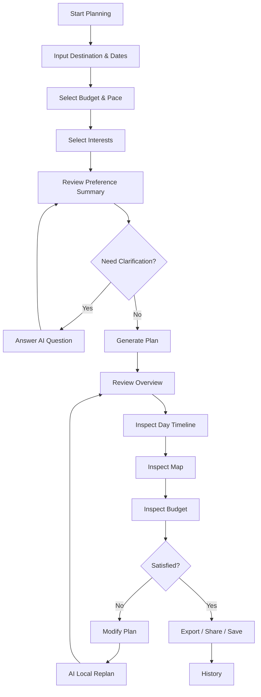

---

# 4. User Flow

## 4.1 首次使用

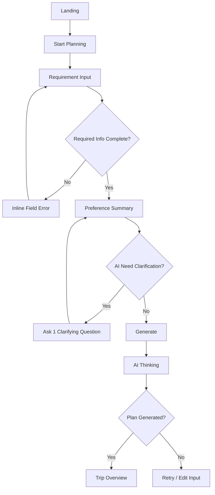

## 4.2 再次使用

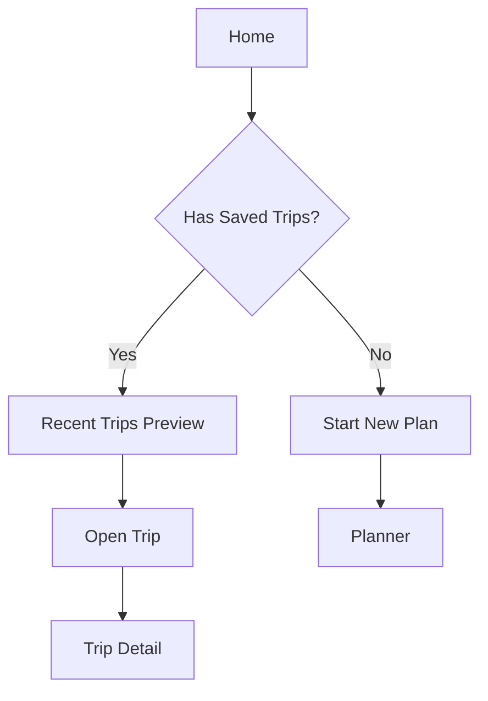

## 4.3 修改旅行

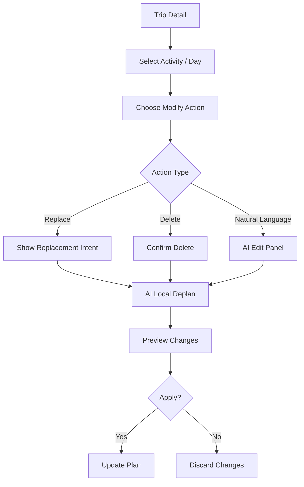

## 4.4 删除旅行

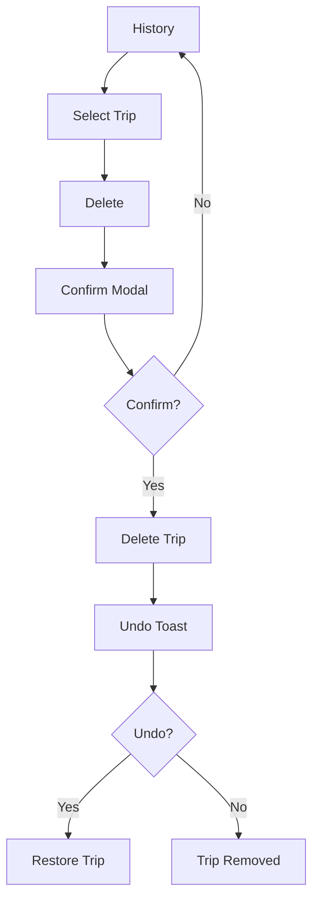

## 4.5 重新生成

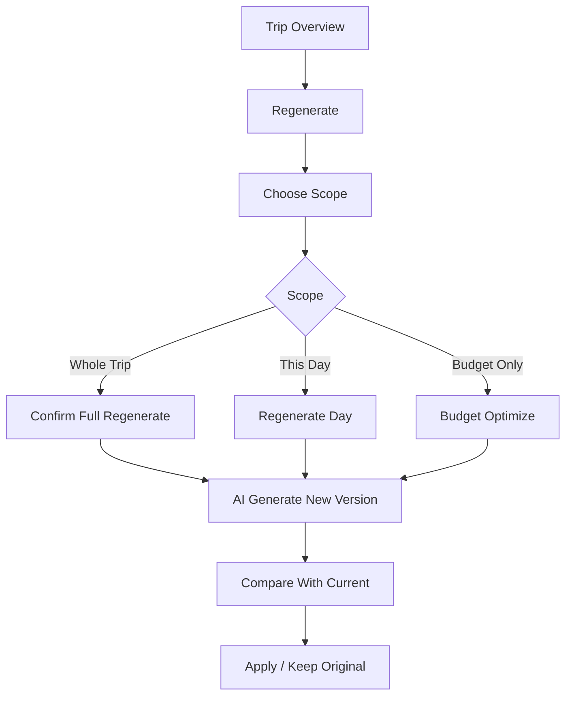

## 4.6 导出 PDF

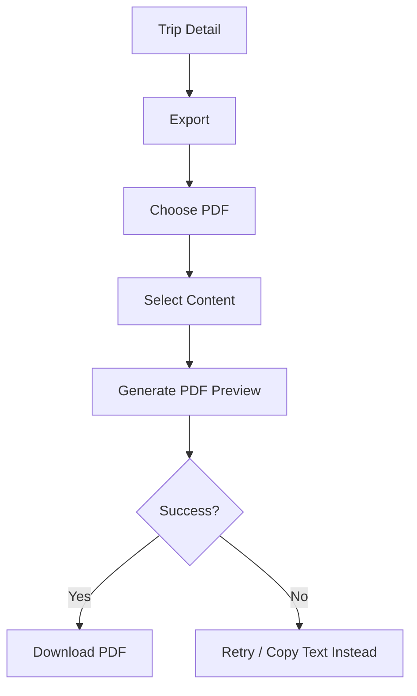

## 4.7 分享

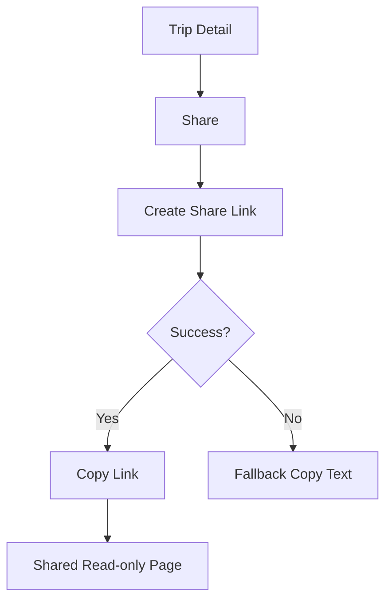

## 4.8 历史查看

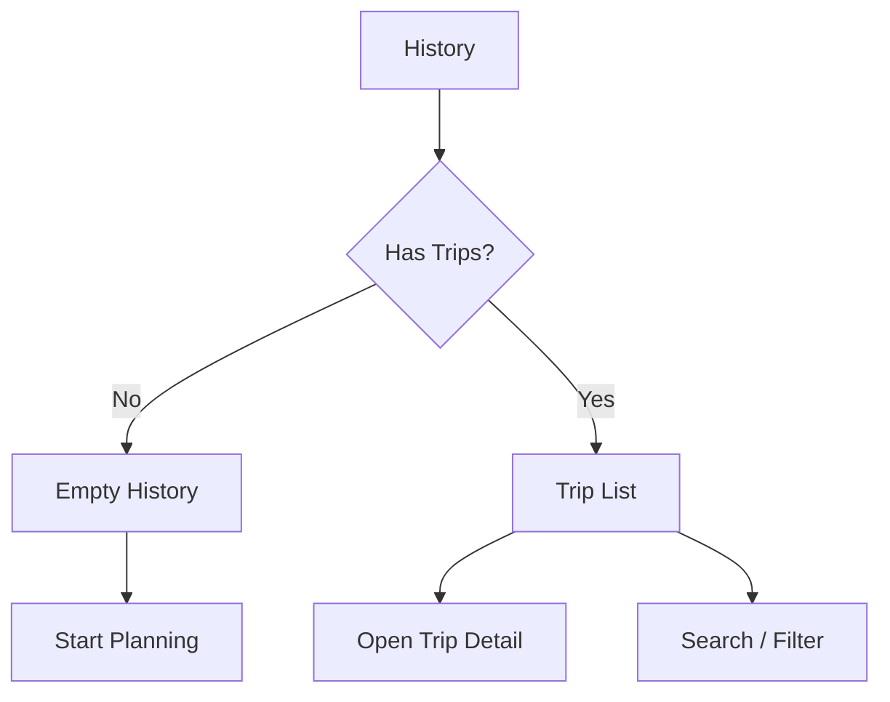

## 4.9 错误恢复

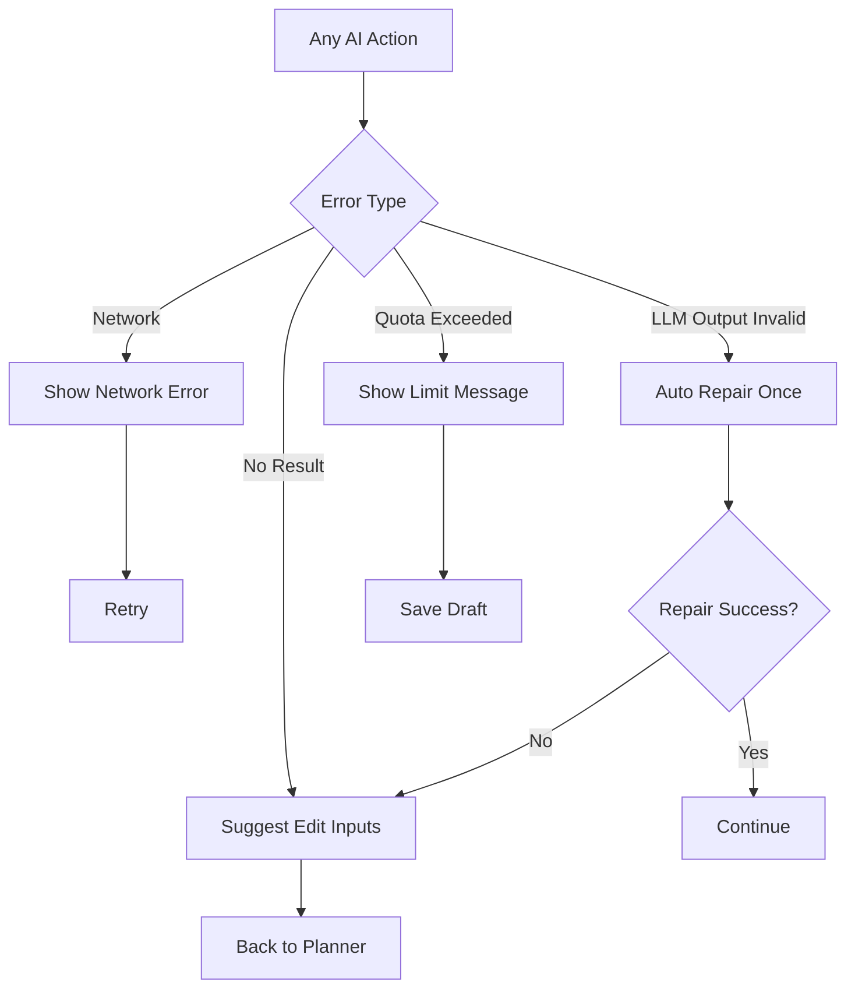

---

# 5. 页面清单 Screen Inventory

| 页面 | 页面目标 | 主要组件 | 主要 CTA | 进入方式 | 退出方式 |
|---|---|---|---|---|---|
| Landing / Home | 让用户开始规划 | 产品定位、示例、CTA、最近计划 | Start Planning | 直接访问、Logo | Planner、History |
| Planner Input | 收集旅行需求 | 表单、兴趣 chips、自然语言输入 | Continue / Generate | Home | Preference Summary、Home |
| Preference Summary | 确认 AI 理解 | 偏好摘要、缺失项、追问 | Generate Plan | Planner Input | AI Thinking、返回编辑 |
| AI Thinking | 降低等待焦虑 | 进度步骤、可取消入口 | Cancel | Generate | Trip Overview、Retry |
| Trip Overview | 总体判断计划 | 摘要、Day cards、预算、风险 | Export / View Day | AI Thinking、History | Day、Map、Budget、Home |
| Day Detail | 查看和编辑某天 | Timeline、Activity cards、quick actions | Modify / Replace | Overview | Overview、AI Edit |
| Activity Detail | 查看单个活动 | 地点、原因、预算、tips、warnings | Replace / Lock | Day Detail | Day Detail |
| Map | 判断路线 | Map、pins、route order、external link | Open in Maps | Overview、Day | Previous Page |
| Budget | 判断预算 | 总预算、每日预算、分类、优化建议 | Optimize Budget | Overview | Overview、AI Edit |
| AI Edit Panel | 自然语言修改 | 输入框、quick actions、preview | Apply Changes | Day、Budget、Overview | Previous Page |
| Export / Share | 带走计划 | PDF、Copy、Share Link、preview | Export / Copy Link | Overview | Overview |
| History | 管理历史计划 | trip list、search、filters、delete | Open Trip | Home、Top Nav | Trip Detail、Home |
| Profile | 用户信息 | basic info、preferences | Save | Top Nav | Home |
| Settings | 偏好设置 | language、currency、privacy | Save | Profile | Profile |
| 404 | 链接无效恢复 | 错误说明、返回入口 | Go Home | 无效链接 | Home |
| Loading | 通用加载 | skeleton 或 spinner | 无 | 任意页面 | 目标页面 |
| Empty | 空内容引导 | 说明、主 CTA | Start / Add | History、Budget 等 | 对应创建流程 |
| Error | 错误恢复 | 错误说明、重试、返回 | Retry | 任意失败 | 原页面 |
| Quota Exceeded | 限额说明 | 限额原因、保存草稿 | Save Draft | AI 调用失败 | Home / History |

---

# 6. ASCII Wireframe

## 6.1 Landing / Home

```text
+--------------------------------------------------+
| AI Travel Planner                   History  Me   |
+--------------------------------------------------+
|                                                  |
| Plan your first city trip in 5 minutes           |
| Executable itinerary. Editable days. Budget aware|
|                                                  |
| +----------------------------------------------+ |
| | Where are you going?  Tokyo, Seoul, Paris... | |
| +----------------------------------------------+ |
|                                                  |
| [ Start Planning ]                              |
|                                                  |
| Recent Trips                                    |
| +----------------+ +----------------+           |
| | Tokyo 4 days   | | Seoul 3 days   |           |
| | Continue       | | Continue       |           |
| +----------------+ +----------------+           |
+--------------------------------------------------+
```

## 6.2 Planner Input

```text
+--------------------------------------------------+
| < Back                          Step 1 of 2       |
+--------------------------------------------------+
| Tell us about your trip                          |
|                                                  |
| Destination                                      |
| +----------------------------------------------+ |
| | Tokyo                                        | |
| +----------------------------------------------+ |
|                                                  |
| Dates                                            |
| +----------------+  +----------------+           |
| | Start Date     |  | End Date       |           |
| +----------------+  +----------------+           |
|                                                  |
| Pace                                             |
| [ Relaxed ] [ Balanced ] [ Packed ]              |
|                                                  |
| Budget                                           |
| [ Low ] [ Medium ] [ High ]                      |
|                                                  |
| Interests                                        |
| [ Food ] [ Shopping ] [ Culture ] [ Local ]      |
| [ Nature ] [ Nightlife ] [ Museums ]             |
|                                                  |
| Anything else?                                   |
| +----------------------------------------------+ |
| | I want local cafes and not too much walking. | |
| +----------------------------------------------+ |
|                                                  |
|                         [ Continue ]             |
+--------------------------------------------------+
```

## 6.3 Preference Summary

```text
+--------------------------------------------------+
| < Edit                         Ready to generate  |
+--------------------------------------------------+
| AI understood your trip as:                       |
|                                                  |
| Destination: Tokyo                                |
| Duration: 4 days                                  |
| Pace: Balanced                                    |
| Budget: Medium                                    |
| Interests: Food, Shopping, Culture, Local areas   |
| Avoid: Too many transfers, overpacked days        |
|                                                  |
| AI question                                      |
| +----------------------------------------------+ |
| | Do you already know your hotel area?         | |
| | [ Shinjuku ] [ Shibuya ] [ Not sure ]        | |
| +----------------------------------------------+ |
|                                                  |
| [ Generate Plan ]                                |
+--------------------------------------------------+
```

## 6.4 AI Thinking

```text
+--------------------------------------------------+
| Creating your travel plan...             Cancel  |
+--------------------------------------------------+
|                                                  |
| [✓] Understanding your preferences               |
| [●] Grouping places into realistic days           |
| [ ] Checking budget and pacing                    |
| [ ] Preparing editable itinerary                  |
|                                                  |
| This usually takes less than a minute.            |
|                                                  |
| +----------------------------------------------+ |
| | Skeleton day card                             | |
| +----------------------------------------------+ |
| +----------------------------------------------+ |
| | Skeleton map / budget preview                | |
| +----------------------------------------------+ |
+--------------------------------------------------+
```

## 6.5 Trip Overview

```text
+--------------------------------------------------+
| < Home       Tokyo 4-Day Plan          Share Export|
+--------------------------------------------------+
| Summary                                           |
| Balanced food, shopping, culture, and local areas |
|                                                  |
| Budget: ¥45,000 - ¥62,000     Pace: Balanced     |
| Warnings: 2 items need verification               |
|                                                  |
| +---------------- Day 1 -----------------------+ |
| | Shinjuku + Harajuku                           | |
| | 5 activities | ¥10,000-¥14,000 | View         | |
| +----------------------------------------------+ |
| +---------------- Day 2 -----------------------+ |
| | Asakusa + Ueno                                | |
| | 4 activities | ¥8,000-¥12,000  | View         | |
| +----------------------------------------------+ |
|                                                  |
| [ Overview ] [ Day ] [ Map ] [ Budget ] [ AI ]   |
+--------------------------------------------------+
```

## 6.6 Day Detail

```text
+--------------------------------------------------+
| < Overview              Day 2: Asakusa + Ueno     |
+--------------------------------------------------+
| Theme: Culture, street food, relaxed walking      |
|                                                  |
| 09:30  +---------------------------------------+ |
|        | Senso-ji Temple                       | |
|        | 90 min | Free | Why here?             | |
|        | [ Replace ] [ Lock ] [ Delete ]       | |
|        +---------------------------------------+ |
|                                                  |
| 11:30  +---------------------------------------+ |
|        | Nakamise Street                       | |
|        | 60 min | ¥1,000-¥2,000                | |
|        | [ Replace ] [ Lock ] [ Delete ]       | |
|        +---------------------------------------+ |
|                                                  |
| 14:00  +---------------------------------------+ |
|        | Ueno Park / Museum                    | |
|        | 120 min | Check opening hours         | |
|        | [ Replace ] [ Lock ] [ Delete ]       | |
|        +---------------------------------------+ |
|                                                  |
| [ Make this day easier ] [ Add activity ]        |
+--------------------------------------------------+
```

## 6.7 Activity Detail

```text
+--------------------------------------------------+
| < Day 2                         Activity Detail   |
+--------------------------------------------------+
| Senso-ji Temple                                  |
| Type: Culture / Classic                          |
| Suggested time: 09:30                            |
| Duration: 90 min                                 |
| Budget: Free                                     |
|                                                  |
| Why recommended                                  |
| - Classic first-time Tokyo experience             |
| - Fits cultural interest                          |
| - Works well before Nakamise Street               |
|                                                  |
| Warnings                                         |
| - Opening details should be verified              |
|                                                  |
| [ Replace ] [ Lock ] [ Open in Maps ]            |
+--------------------------------------------------+
```

## 6.8 Map

```text
+--------------------------------------------------+
| < Trip                       Map: Day 2           |
+--------------------------------------------------+
| +----------------------------------------------+ |
| |                                              | |
| |                Map Area                      | |
| |        Pins: 1 -> 2 -> 3 -> 4                | |
| |                                              | |
| +----------------------------------------------+ |
|                                                  |
| Route Order                                      |
| 1. Senso-ji Temple                               |
| 2. Nakamise Street                               |
| 3. Lunch nearby                                  |
| 4. Ueno Park / Museum                            |
|                                                  |
| [ Open in Google Maps ]                          |
+--------------------------------------------------+
```

## 6.9 Budget

```text
+--------------------------------------------------+
| < Trip                         Budget            |
+--------------------------------------------------+
| Total Estimate                                  |
| ¥45,000 - ¥62,000                               |
|                                                  |
| Daily Breakdown                                  |
| Day 1  ¥10,000 - ¥14,000                         |
| Day 2  ¥8,000  - ¥12,000                         |
| Day 3  ¥12,000 - ¥18,000                         |
| Day 4  ¥15,000 - ¥18,000                         |
|                                                  |
| Categories                                       |
| Food        ¥18,000                              |
| Transport   ¥8,000                               |
| Tickets     ¥12,000                              |
| Shopping    Flexible                             |
|                                                  |
| [ Optimize for lower budget ]                    |
+--------------------------------------------------+
```

## 6.10 AI Edit Panel

```text
+--------------------------------------------------+
| < Back                         AI Edit           |
+--------------------------------------------------+
| What would you like to change?                   |
|                                                  |
| Quick actions                                    |
| [ Make Day 2 easier ] [ Lower budget ]           |
| [ More local spots ] [ Rainy day version ]       |
|                                                  |
| +----------------------------------------------+ |
| | Replace the museum with something cheaper... | |
| +----------------------------------------------+ |
|                                                  |
| [ Preview Changes ]                              |
|                                                  |
| Proposed change                                  |
| - Replace Ueno Museum with Yanaka neighborhood   |
| - Saves about ¥1,500-¥2,500                      |
| - Keeps the day in the same area                 |
|                                                  |
| [ Apply ] [ Keep Original ]                      |
+--------------------------------------------------+
```

## 6.11 Export / Share

```text
+--------------------------------------------------+
| < Trip                         Export / Share    |
+--------------------------------------------------+
| Choose format                                    |
| [ PDF ] [ Copy Text ] [ Share Link ]             |
|                                                  |
| Include                                          |
| [x] Daily timeline                               |
| [x] Budget                                       |
| [x] Map links                                    |
| [ ] AI explanations                              |
|                                                  |
| Preview                                          |
| +----------------------------------------------+ |
| | Tokyo 4-Day Plan                             | |
| | Day 1: Shinjuku + Harajuku                   | |
| +----------------------------------------------+ |
|                                                  |
| [ Export PDF ] [ Copy Link ]                     |
+--------------------------------------------------+
```

## 6.12 History

```text
+--------------------------------------------------+
| AI Travel Planner                   New Trip      |
+--------------------------------------------------+
| History                                           |
| +----------------------------------------------+ |
| | Search trips                                  | |
| +----------------------------------------------+ |
|                                                  |
| +----------------------------------------------+ |
| | Tokyo 4-Day Plan                             | |
| | Updated yesterday | Open | Delete            | |
| +----------------------------------------------+ |
| +----------------------------------------------+ |
| | Seoul 3-Day Plan                             | |
| | Draft | Open | Delete                       | |
| +----------------------------------------------+ |
+--------------------------------------------------+
```

## 6.13 Empty History

```text
+--------------------------------------------------+
| History                              New Trip     |
+--------------------------------------------------+
|                                                  |
| You do not have any saved trips yet.             |
| Create your first AI travel plan in 5 minutes.   |
|                                                  |
| [ Start Planning ]                               |
|                                                  |
+--------------------------------------------------+
```

## 6.14 Error

```text
+--------------------------------------------------+
| Something went wrong                             |
+--------------------------------------------------+
| We could not generate your plan this time.       |
| Your inputs are saved.                           |
|                                                  |
| What you can do:                                 |
| - Retry generation                               |
| - Edit your trip requirements                    |
| - Save draft and come back later                 |
|                                                  |
| [ Retry ] [ Edit Inputs ] [ Save Draft ]         |
+--------------------------------------------------+
```

## 6.15 Quota Exceeded

```text
+--------------------------------------------------+
| AI limit reached                                 |
+--------------------------------------------------+
| You have reached the planning limit for now.     |
| Your current trip draft has been saved.          |
|                                                  |
| [ View Draft ] [ Back to Home ]                  |
+--------------------------------------------------+
```

---

# 7. AI UX

## 7.1 AI 应该什么时候说话？

AI 只在用户需要理解、决策或恢复时说话。

| 场景 | AI 是否说话 | 原因 |
|---|---|---|
| 用户首次进入首页 | 不需要 | 首页应快速行动，不解释过多 |
| 用户输入模糊偏好 | 需要 | 帮用户把模糊需求变成结构化偏好 |
| 生成完成后 | 需要 | 解释计划逻辑，建立信任 |
| 用户查看活动详情 | 轻量 | 解释为什么推荐这个活动 |
| 用户修改计划 | 需要 | 确认修改意图，解释变化 |
| 用户只是在浏览地图 | 不需要 | 地图是视觉判断，不应打扰 |
| 出现风险 | 需要 | 用户需要知道影响和解决方案 |
| 失败时 | 需要 | 给出可恢复路径 |

## 7.2 AI 什么时候不要说话？

| 场景 | 不说话原因 |
|---|---|
| 用户正在填写简单字段 | 避免干扰输入 |
| 页面跳转或普通加载 | 系统状态足够 |
| 用户浏览 Timeline | 用户主要任务是扫描，不是对话 |
| 用户已明确点击导出 | 直接执行，不再解释 |
| 操作成功且结果明显 | 用 toast 足够 |

## 7.3 什么时候追问？

追问必须少、准、必要。

| 场景 | 是否追问 | 设计规则 |
|---|---|---|
| 缺目的地 | 必须 | 无目的地无法生成 |
| 缺旅行天数 | 必须 | 无天数无法排程 |
| 兴趣为空 | 可追问 | 也可提供默认 balanced |
| 预算为空 | 不强制 | 默认 medium |
| 偏好冲突 | 必须 | 例如“轻松”又“尽量多打卡” |
| 酒店区域未知 | 不强制 | 可用“不确定”继续生成 |

## 7.4 什么时候直接生成？

当以下信息齐全时直接生成：

- destination
- date 或 trip duration
- pace
- budget level
- 至少 1 个 interest 或自然语言偏好

设计原因：产品目标是 5 分钟内完成计划，不能让用户陷入长问卷。

## 7.5 什么时候解释原因？

| 决策点 | 解释内容 |
|---|---|
| 首次生成 | 每天主题、路线逻辑、预算逻辑 |
| 替换活动 | 为什么替换，牺牲了什么，保留了什么 |
| 预算优化 | 节省在哪里，体验变化是什么 |
| 风险提示 | 风险来源、影响、建议动作 |
| 低置信度推荐 | 哪些信息需要用户验证 |

## 7.6 什么时候推荐？

AI 推荐应在用户有明确上下文时出现。

| 场景 | 推荐类型 |
|---|---|
| 生成行程 | 推荐活动和每日主题 |
| 删除活动后 | 推荐补充空档 |
| 预算过高 | 推荐低成本替代 |
| 天气变化 | 推荐室内替代 |
| 用户说“更本地” | 推荐本地街区或餐厅 |

## 7.7 什么时候等待？

| 场景 | 等待原因 | UX 处理 |
|---|---|---|
| 用户正在输入 | 不抢占 | 只做轻量校验 |
| AI 置信度低但不影响生成 | 不追问 | 生成后标记 warning |
| 用户查看修改预览 | 等用户确认 | 不自动 apply |
| 删除旅行 | 等确认 | 防止误删 |

## 7.8 什么时候确认？

| 操作 | 是否确认 | 原因 |
|---|---|---|
| 删除旅行 | 是 | 破坏性操作 |
| 整体重新生成 | 是 | 会覆盖大量内容 |
| 应用局部修改 | 是，使用 Preview | 让用户保留控制感 |
| 导出 PDF | 不需要 | 非破坏性 |
| 替换单个活动 | 需要预览，不一定弹窗 | 影响当天路线 |

## 7.9 什么时候重新规划？

| 触发 | 范围 |
|---|---|
| 修改目的地 | 整体重规划 |
| 修改日期 | 整体重规划 |
| 修改预算档位 | 预算优化或局部替换 |
| 删除活动 | 当天局部重排 |
| 锁定活动后修改节奏 | 保留锁定点，重排其他活动 |
| 天气变化 | 当天 Plan B |

## 7.10 什么时候主动提醒？

主动提醒必须和执行风险相关。

| 提醒 | 触发 |
|---|---|
| 计划过满 | 单日活动数量或时长过高 |
| 预算过高 | 超出用户预算档位 |
| 需要预约 | 活动类型为热门景点或餐厅 |
| 需要验证 | 低置信度地点或营业信息 |
| 天气影响 | 用户查看旅行中当天计划时 |

## 7.11 什么时候展示 Thinking？

AI Thinking 应用于 AI 正在进行多步骤推理且用户需要等待的场景：

- 首次生成计划
- 整体重新生成
- 局部重排
- 预算优化
- 天气重规划

不应用于普通页面加载。

## 7.12 什么时候允许用户打断？

| 场景 | 是否允许打断 | 处理 |
|---|---|---|
| 首次生成 | 允许 | 停止生成，回到需求摘要 |
| 局部修改 | 允许 | 保留原计划 |
| 导出 PDF | 允许 | 取消导出 |
| 保存计划 | 不建议 | 保存应快速完成 |

## 7.13 什么时候显示 Loading、Skeleton、Streaming？

| 状态 | 使用场景 | 用户感受目标 |
|---|---|---|
| Loading | 短操作，如保存、删除 | 告诉用户操作处理中 |
| Skeleton | 页面数据加载，如 History、Trip Detail | 保持布局稳定 |
| AI Thinking | AI 多步骤生成 | 让等待可理解 |
| Streaming | 生成解释或摘要 | 让用户看到进展 |

---

# 8. State Design

## 8.1 Empty State

| 场景 | 用户看到什么 | 系统做什么 | AI 做什么 |
|---|---|---|---|
| 无历史计划 | “你还没有保存的旅行计划” + Start Planning | 展示创建入口 | 不介入 |
| 某天无活动 | “这一天还没有安排” + Add Activity | 保留 day container | 推荐补充活动 |
| 无预算数据 | “预算暂不可用” + Estimate Budget | 展示估算入口 | 可生成预算建议 |

## 8.2 Loading State

| 场景 | 用户看到什么 | 系统做什么 | AI 做什么 |
|---|---|---|---|
| 页面加载 | Skeleton | 拉取数据 | 不介入 |
| 保存计划 | Saving toast | 写入本地或云端 | 不介入 |
| 删除计划 | Deleting | 删除或软删除 | 不介入 |

## 8.3 AI Thinking

| 场景 | 用户看到什么 | 系统做什么 | AI 做什么 |
|---|---|---|---|
| 生成计划 | 分步骤进度 | 管理请求和状态 | 理解偏好、生成计划、解释 |
| 局部重排 | “正在重排 Day 2” | 锁定当前版本 | 生成 patch |
| 预算优化 | “正在寻找更省钱方案” | 保留原预算 | 生成建议 |

## 8.4 Streaming

| 场景 | 用户看到什么 | 系统做什么 | AI 做什么 |
|---|---|---|---|
| 生成解释 | 逐步出现的解释文本 | 渲染已返回内容 | 输出用户可读解释 |
| 分享摘要 | 逐步生成简洁摘要 | 提供取消 | 生成导出文案 |

## 8.5 Network Error

| 用户看到什么 | 系统做什么 | AI 做什么 |
|---|---|---|
| “网络连接不稳定，你的输入已保存” | 保存草稿，提供 Retry | 不继续生成 |

## 8.6 LLM Error

| 用户看到什么 | 系统做什么 | AI 做什么 |
|---|---|---|
| “AI 这次没有生成可用计划” | 自动 repair 一次，失败后展示重试 | repair JSON 或重新生成 |

## 8.7 Retry

| 用户看到什么 | 系统做什么 | AI 做什么 |
|---|---|---|
| Retry 按钮和上次失败原因 | 复用已保存输入 | 使用相同上下文重试 |

## 8.8 Quota Exceeded

| 用户看到什么 | 系统做什么 | AI 做什么 |
|---|---|---|
| “今天的 AI 生成次数已用完，草稿已保存” | 保存草稿和当前计划 | 不再调用 |

## 8.9 No Result

| 用户看到什么 | 系统做什么 | AI 做什么 |
|---|---|---|
| “没有找到足够匹配的结果” | 建议放宽条件 | 解释哪些条件太严格 |

---

# 9. Design Principles

| 原则 | 解释 |
|---|---|
| 1. Less Chat, More Action | 用户目标是完成旅行计划，不是和 AI 长聊 |
| 2. Editable First | AI 输出必须可改，不能是一次性答案 |
| 3. Human in the Loop | 重要修改需要用户确认 |
| 4. Explain Recommendations | 推荐必须说明原因，建立信任 |
| 5. Preserve User Control | 用户锁定的活动 AI 不能移动 |
| 6. Progressive Disclosure | 先给可用计划，再展示细节和风险 |
| 7. Fast First Draft | 首版计划要快，后续再精修 |
| 8. Structured Over Text | 行程是结构化对象，不是攻略文章 |
| 9. Contextual AI | AI 出现在具体任务上下文里 |
| 10. Recoverable Failure | AI 失败不能让用户丢失输入 |
| 11. Show Uncertainty | 不确定信息要显式标记 |
| 12. Do Not Over-Ask | 追问最多 1-2 个关键问题 |
| 13. Local Replan Before Full Replan | 优先局部修改，减少用户成本 |
| 14. Trust Comes From Constraints | 地图、预算、时间约束比华丽文案更重要 |
| 15. Mobile Execution Ready | 计划不仅用于规划，也要能在旅行中查看 |
| 16. Make AI Interruptible | 长时间 AI 操作必须允许取消 |
| 17. Keep Original Version | 修改前保留原计划，支持撤销 |
| 18. Warn Before Risk | 对闭馆、预约、超预算等风险提前提醒 |

---

# 10. Interaction Specification

## 10.1 Generate

| 项目 | 说明 |
|---|---|
| 点击后发生什么 | 进入 AI Thinking，开始生成计划 |
| AI 做什么 | 理解需求，生成 Preference 和 TravelPlan |
| 系统做什么 | 校验必填、创建 plan draft、校验 JSON |
| 成功 | 跳转 Trip Overview |
| 失败 | 自动重试一次，仍失败则展示 Error Recovery |

## 10.2 Modify

| 项目 | 说明 |
|---|---|
| 点击后发生什么 | 打开 AI Edit Panel 或 quick action |
| AI 做什么 | 理解修改意图，生成局部 patch |
| 系统做什么 | 保护 locked activities，生成预览 |
| 成功 | 用户点击 Apply 后更新计划 |
| 失败 | 保留原计划，提示换一种描述 |

## 10.3 Delete

| 项目 | 说明 |
|---|---|
| 点击后发生什么 | 显示确认或直接软删除活动 |
| AI 做什么 | 删除活动后可建议补充或重排 |
| 系统做什么 | 软删除、保留 undo 状态 |
| 成功 | Timeline 更新，显示 Undo toast |
| 失败 | 提示删除失败，保持原状态 |

## 10.4 Undo

| 项目 | 说明 |
|---|---|
| 点击后发生什么 | 恢复上一个版本 |
| AI 做什么 | 不介入 |
| 系统做什么 | 从 version history 恢复 |
| 成功 | 显示“已恢复” |
| 失败 | 提示无法恢复 |

## 10.5 Retry

| 项目 | 说明 |
|---|---|
| 点击后发生什么 | 使用同一输入重新执行失败动作 |
| AI 做什么 | 重试生成或修改 |
| 系统做什么 | 复用上下文，记录 retry count |
| 成功 | 回到正常流程 |
| 失败 | 给出编辑输入或保存草稿选项 |

## 10.6 Export

| 项目 | 说明 |
|---|---|
| 点击后发生什么 | 打开 Export / Share 页面 |
| AI 做什么 | 可生成简洁版摘要 |
| 系统做什么 | 生成 PDF、文本或链接 |
| 成功 | 下载或复制成功 |
| 失败 | 提供 Copy Text fallback |

## 10.7 Bookmark

| 项目 | 说明 |
|---|---|
| 点击后发生什么 | 保存活动或地点到计划收藏 |
| AI 做什么 | 后续可根据收藏优化计划 |
| 系统做什么 | 更新 savedPlaces |
| 成功 | Bookmark 状态切换 |
| 失败 | 提示保存失败，允许重试 |

## 10.8 Share

| 项目 | 说明 |
|---|---|
| 点击后发生什么 | 创建只读分享链接 |
| AI 做什么 | 可生成分享摘要 |
| 系统做什么 | 创建 share token 和权限 |
| 成功 | 复制链接，显示分享成功 |
| 失败 | 提供复制文本替代 |

---

# 11. UX Checklist

## 11.1 IA Checklist

- [ ] 用户能从 Home 一步进入 Planner。
- [ ] Trip Detail 中 Overview、Day、Map、Budget 可互相切换。
- [ ] AI 不作为独立主页面，而是嵌入具体任务。
- [ ] History 可恢复用户未完成和已完成计划。
- [ ] 所有退出路径都不丢失已输入内容。

## 11.2 AI UX Checklist

- [ ] AI 追问不超过 2 个问题。
- [ ] 生成计划时展示 AI Thinking。
- [ ] 修改计划时先 Preview 再 Apply。
- [ ] AI 不确定时展示 confidence 或 warning。
- [ ] AI 失败时提供 Retry、Edit Inputs、Save Draft。
- [ ] 长 AI 操作允许取消。

## 11.3 Interaction Checklist

- [ ] Generate 成功后进入 Trip Overview。
- [ ] Delete 有 undo。
- [ ] Full Regenerate 需要确认。
- [ ] Locked activity 不会被 AI 修改。
- [ ] Export 失败时可复制文本。
- [ ] Share 生成只读链接。

---

# 12. 最终设计判断

AI Travel Planner 的 UX 不应该把 AI 放在一个聊天窗口里，而应该把 AI 嵌入旅行规划的关键决策点：

- 输入时帮助理解偏好。
- 生成时给出结构化行程。
- 查看时解释原因和风险。
- 修改时做局部重排。
- 失败时提供可恢复路径。

最终体验目标：

> 用户感觉自己不是在“问 AI 要攻略”，而是在使用一个能理解自己、能解释原因、能随时修改的旅行规划工作台。
