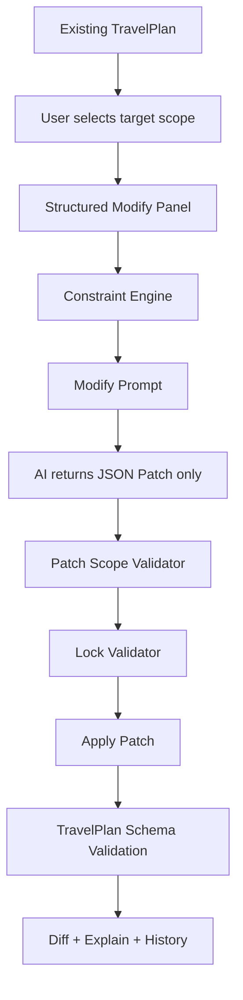
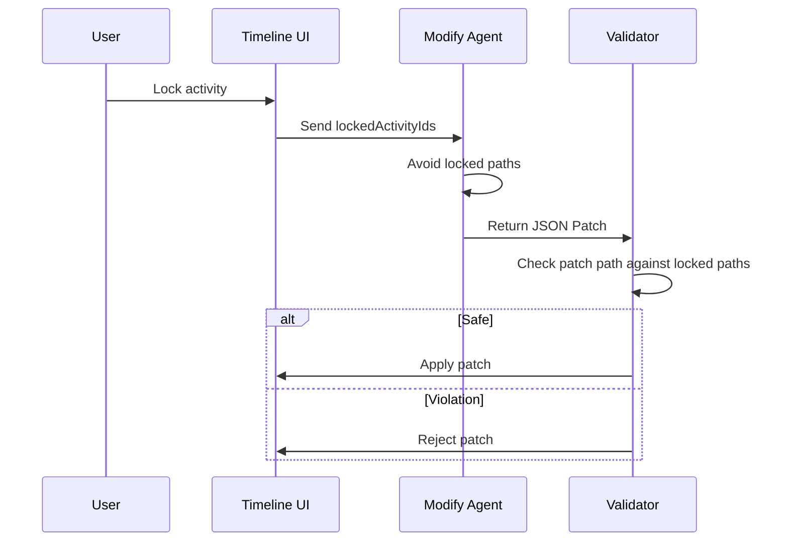

# AI Travel Planner Partial Replanning Design

## 1. Goal

Partial Replanning turns AI Travel Planner from a one-shot generator into a human-in-the-loop planning system. The user can modify one day or one activity while the rest of the trip remains stable.



## 2. Replanning Entrances

| Entry | Target | Expected Patch |
| --- | --- | --- |
| Modify Day | One `DayPlan` | Replace day summary, activities, budget, or route fields inside the target day. |
| Replace Activity | One `Activity` | `replace /days/{i}/activities/{j}` |
| Delete Activity | One `Activity` | `remove /days/{i}/activities/{j}` |
| Insert Activity | One day and position | `add /days/{i}/activities/{j}` |
| Change Budget | One day budget | `replace /days/{i}/dailyBudget` and minimal activity budget edits. |
| Change Pace | One day | Adjust activity count, duration, and rest blocks. |
| Avoid Crowds | One day/activity | Replace crowded blocks or shift timing. |
| More Food | One day/activity | Add or replace with restaurant/cafe activity. |
| More Shopping | One day/activity | Add optional shopping window. |
| More Museums | One day/activity | Replace with culture-heavy alternative. |
| Rain Plan | One day/activity | Replace outdoor blocks with indoor backups. |
| Family Friendly | One day/activity | Reduce late-night, long walking, and high-friction transfers. |
| Accessibility | One day/activity | Reduce walking and add rest/transit-friendly alternatives. |

## 3. Modify UX

The product does not use chat for modification. The panel asks for structured inputs:

- What should change?
- Why should it change?
- Budget cap
- Custom requirement
- Locked and favorite preservation

The user clicks `Generate minimal patch`, not “send message”. This sets the expectation that AI is changing a controlled scope.

## 4. Prompt Strategy

Input:

```json
{
  "originalPlanContext": {},
  "request": {},
  "targetDay": {},
  "nonTargetDaysMustRemainUnchanged": [],
  "constraintSignals": [],
  "patchRules": []
}
```

Output:

```json
{
  "patches": [
    {
      "op": "replace",
      "path": "/days/2/activities/1",
      "value": {},
      "reason": "Rain plan requested, so replace the outdoor activity."
    }
  ],
  "explanation": {
    "summary": "Changed only Day 3.",
    "changed": ["Replaced outdoor shopping with indoor museum."],
    "preserved": ["Day 1, Day 2, Day 4 and locked items are unchanged."],
    "constraintChecks": ["Weather risk reduced.", "Budget remains in range."],
    "riskNotes": ["Verify opening hours."]
  },
  "metadata": {
    "targetDayId": "day_3",
    "changedActivityIds": ["activity_3_2"],
    "preservedDayIds": ["day_1", "day_2", "day_4"],
    "lockedActivityIds": ["activity_1_1"],
    "promptVersion": "modify-v1"
  }
}
```

Why JSON Patch:

- Smaller output than full JSON.
- Easier to validate scope.
- Easy to show Diff.
- Enables Undo/Redo by storing before/after patches.
- Prevents accidental full-trip regeneration.

## 5. Diff Strategy

The system compares before and after plans by activity ID.

| Status | Meaning | UI Treatment |
| --- | --- | --- |
| Added | New activity ID appears after patch | Green highlight |
| Modified | Same activity ID, changed fields | Yellow highlight |
| Removed | Activity ID no longer exists | Shown in summary/history |
| Unchanged | Same data before and after | Neutral/grey |

## 6. Undo / Redo / History

Each successful replan creates a `ReplanHistoryEntry`:

- request
- before plan
- after plan
- patch response
- diff
- timestamp

Undo restores `before`. Redo restores `after`. This matters because AI changes are probabilistic; users need reversible control.

## 7. AI Explain UX

Every modification explains:

- what changed
- what stayed unchanged
- why the change satisfies constraints
- what still needs verification

This is more trustworthy than a silent regeneration because the user can inspect the exact reasoning and affected scope.

## 8. Trust Design

Trust strategies:

- Show Diff after every modification.
- Show preserved day count.
- Use JSON Patch instead of full regeneration.
- Validate patch scope before applying.
- Preserve locked and favorite activities.
- Highlight changed blocks.
- Keep Undo/Redo visible.
- Explain constraint checks.
- Keep warnings for unverifiable facts.
- Reject root-level patches.
- Reject patches outside target day.
- Reject patches that break `TravelPlan` schema.
- Store history.
- Keep original user input intact.
- Show prompt version and metadata for future observability.

## 9. Lock Mechanism



Locked items are treated as hard constraints. Favorite items are also protected when `keepFavorites` is enabled.

## 10. Constraint Engine

| Constraint | How It Influences AI |
| --- | --- |
| Budget | Lower paid activities, reduce shopping buffer, preserve free alternatives. |
| Time | Reduce activity count, shorten durations, avoid far transfers. |
| Distance | Keep replacements in the same area. |
| Weather | Prefer indoor backups and add verification notes. |
| Interest | Rank replacement options by requested preference. |
| Opening Hours | Add verification notes until live data is connected. |
| Transport | Avoid complex transfers when changing pace/accessibility. |

## 11. AI Memory

Memory is session-scoped in MVP:

- locked activity IDs
- favorite activity IDs
- previous patch history
- latest user reasons
- active constraints

Long-term memory can later store stable preferences, such as “prefers cafes”, “low walking”, or “avoids shopping”.

## 12. Testing Checklist

- Modify one day only.
- Replace activity.
- Delete activity.
- Insert activity.
- Change budget.
- Change pace.
- Avoid crowds.
- More food.
- More shopping.
- More museums.
- Rain plan.
- Family friendly.
- Accessibility.
- Lock activity.
- Favorite activity preservation.
- Reject root patch.
- Reject non-target day patch.
- Reject invalid JSON.
- Reject schema-invalid patch.
- Apply add patch.
- Apply remove patch.
- Apply replace patch.
- Apply move patch.
- Generate diff for added item.
- Generate diff for modified item.
- Generate diff for removed item.
- Preserve non-target days.
- Undo.
- Redo.
- Build Modify Prompt.
- Constraint signal: weather.
- Constraint signal: accessibility.
- Constraint signal: budget.

## 13. Why This Beats ChatGPT

ChatGPT usually asks the user to trust a rewritten itinerary. Partial Replanning shows exactly what changed, preserves what the user already accepted, protects locked choices, validates structure, and makes every AI change reversible.

The product experience is not “talk to AI”. It is “control AI safely”.
