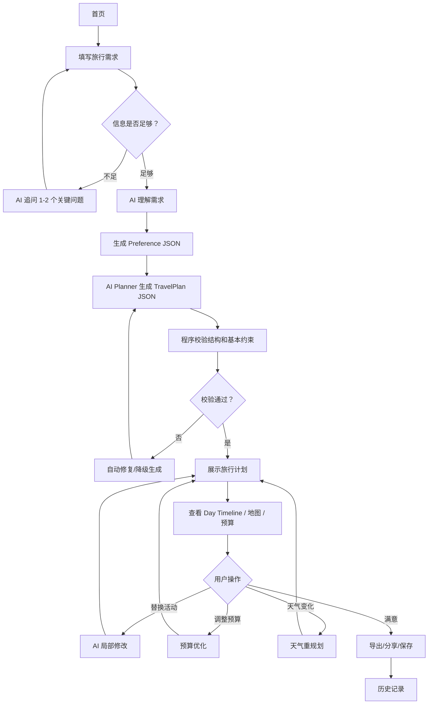
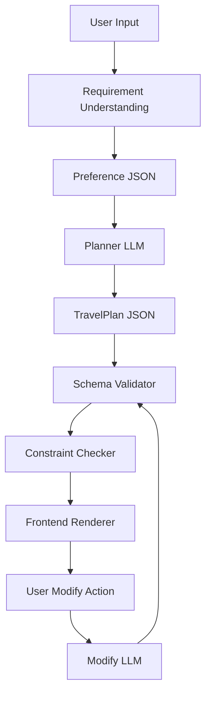
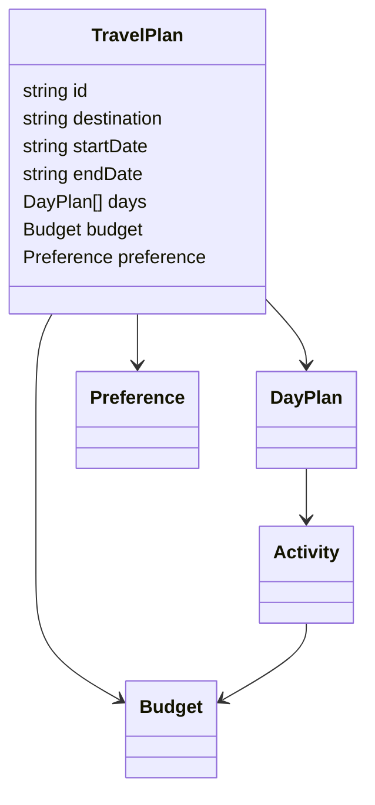

# AI Travel Planner PRD

> 文档类型：Product Requirement Document  
> 产品名称：AI Travel Planner  
> 一句话定位：帮助第一次自由行用户，在 5 分钟内生成一份可执行、可修改、预算可控的旅行计划。  
> 当前阶段：MVP PRD  
> 目标读者：产品、设计、前端、后端、AI 工程、数据分析

---

## 0. PRD 摘要

AI Travel Planner 不是旅行攻略生成器，也不是一个通用聊天机器人。它的核心任务是帮助第一次去陌生城市的自由行用户完成旅行决策：去哪、什么时候去、怎么走、花多少钱、如果计划变化怎么办。

MVP 聚焦一个高频、边界清晰、AI 价值明确的场景：

> 22-35 岁年轻用户，第一次去陌生城市，规划 2-5 天城市自由行。

核心体验闭环：


---

# 1. 产品概述 Product Overview

## 1.1 产品背景

自由行用户的旅行规划方式正在发生变化。过去用户依赖攻略网站和 OTA，现在用户会同时使用 ChatGPT、小红书、Google Maps、Tripadvisor、Booking、Excel 或 Notion。

问题不再是“信息不够”，而是：

- 信息太多，用户不知道怎么筛选。
- 灵感很多，用户不知道怎么组织成路线。
- AI 能生成攻略，但用户不知道是否真实可执行。
- 地图能导航，但不能自动生成完整多日计划。
- OTA 能预订，但不擅长中立地帮助用户决定怎么玩。

AI Travel Planner 的机会是把分散的信息、偏好和现实约束整合成一个可执行的旅行决策系统。

## 1.2 行业现状

| 产品类型 | 代表产品 | 已解决的问题 | 未解决的问题 |
|---|---|---|---|
| 通用 AI 助手 | ChatGPT | 快速生成行程初稿、解释旅行信息 | 不绑定地图、预算、营业时间，难编辑 |
| AI 旅行产品 | Mindtrip、GuideGeek | 旅行垂直生成、灵感转计划 | 执行可信度和深度编辑仍需验证 |
| 旅行规划工具 | Wanderlog、Tripsy | 行程组织、协作、收藏、预算 | 研究和决策仍靠用户手动完成 |
| 地图产品 | Google Maps | 导航、地点、评论、营业时间 | 收藏地点不会自动变成多日行程 |
| 内容社区 | 小红书、Tripadvisor | 灵感、评论、避坑、社交证明 | 信息过载，难验证，难排路线 |
| OTA | Booking、Expedia、Airbnb | 预订、价格、交易、售后 | 规划目标容易被交易转化影响 |

## 1.3 用户痛点

| 痛点 | 用户表现 | 产品机会 |
|---|---|---|
| 攻略信息过载 | 收藏几十篇内容后更焦虑 | AI 提取地点、去重、排序 |
| 路线不确定 | 不知道哪些地点适合放同一天 | 地图约束下的自动排程 |
| AI 结果不可信 | ChatGPT 输出看起来合理但无法验证 | 结构化计划 + 校验 + 解释 |
| 预算不透明 | 到旅行中才发现超支 | 每日预算估算和替代方案 |
| 修改成本高 | 改一个餐厅要重排整天 | 局部修改与局部重排 |
| 突发情况影响计划 | 下雨、闭馆、排队、疲惫 | 动态 Plan B |

## 1.4 为什么需要 AI

旅行规划存在大量软约束和模糊表达，例如：

- “不要太累”
- “想要本地一点”
- “希望拍照好看”
- “预算别太高”
- “第二天轻松一点”

这些需求很难用纯规则表单表达。AI 的价值在于理解自然语言、推断偏好、生成候选方案、解释取舍，并在用户修改时保持上下文一致。

## 1.5 为什么不是普通旅游 App

普通旅游 App 主要解决“找信息”和“订产品”，而 AI Travel Planner 解决“做决策”。

| 普通旅游 App | AI Travel Planner |
|---|---|
| 用户搜索地点 | AI 根据偏好推荐并排序 |
| 用户收藏地点 | AI 将地点组织成行程 |
| 用户自己查路线 | 系统校验路线可行性 |
| 用户自己改计划 | AI 局部重排 |
| 以信息和交易为中心 | 以旅行决策为中心 |

## 1.6 为什么不是 ChatGPT

ChatGPT 的优势是生成和解释，但旅行计划需要产品化工作台。

| ChatGPT 的问题 | 产品解法 |
|---|---|
| 输出是文本，不是结构化行程 | 生成 TravelPlan JSON 并前端渲染 |
| 不天然绑定地图和营业时间 | 程序校验距离、时间、状态 |
| 修改依赖反复追问 | 支持卡片级编辑和局部重排 |
| 无预算和路线状态 | 页面展示预算、路线、风险 |
| 难分享和执行 | 支持导出、分享和历史记录 |

## 1.7 一句话产品定位

> AI Travel Planner 是一个 AI 驱动、地图约束、预算可控、可编辑的城市自由行决策工具。

## 1.8 Vision

成为年轻自由行用户第一次去陌生城市时最信任的 AI 旅行规划助手。

## 1.9 Mission

把混乱的旅行信息转化为可信、可改、可执行的个性化行程。

## 1.10 商业价值

| 价值方向 | 说明 |
|---|---|
| 用户价值 | 节省规划时间，降低旅行出错风险，提高旅行体验确定性 |
| 产品价值 | 建立高意图旅行场景入口，沉淀偏好、行程和地点数据 |
| 商业化潜力 | 后续可接入活动预订、酒店推荐、旅行保险、会员订阅 |
| AI 价值 | 形成垂直场景下的 AI 决策闭环，而不是一次性内容生成 |

---

# 2. 产品目标 Goals

## 2.1 Business Goal

| 目标 | 说明 | MVP 衡量方式 |
|---|---|---|
| 建立旅行规划高意图入口 | 用户在规划旅行时主动使用产品 | 访问到生成完成转化率 |
| 验证 AI itinerary 工作台价值 | 用户愿意编辑、保存、导出 AI 计划 | 编辑率、导出率、分享率 |
| 沉淀可复用旅行偏好 | 为后续个性化和商业化打基础 | 登录用户计划保存数 |
| 降低未来获客难度 | 高质量行程适合分享传播 | 分享链接打开率 |

## 2.2 User Goal

| 用户目标 | 产品承诺 |
|---|---|
| 5 分钟内拿到第一版可用行程 | 简短输入 + AI 自动生成 |
| 不用在多个 App 来回切换 | 行程、地图、预算、解释集中展示 |
| 行程符合个人节奏 | 偏好和旅行风格影响规划 |
| 能轻松修改 | 支持替换、删除、锁定、局部重排 |
| 出发前更安心 | 风险提示、预算提示、备选方案 |

## 2.3 AI Goal

| AI 目标 | 说明 |
|---|---|
| 从自然语言中理解旅行偏好 | 将模糊需求转成结构化 Preference |
| 生成可渲染、可校验的 JSON | 输出稳定结构，不输出散文式攻略 |
| 支持局部修改 | 改一个活动时不重写整个计划 |
| 解释推荐逻辑 | 说明推荐原因、取舍和不确定性 |
| 与程序校验协同 | AI 不单独决定事实，事实交给系统校验 |

## 2.4 Success Metrics

| 指标 | 定义 | MVP 目标 |
|---|---|---:|
| Time to First Plan | 从进入需求页到首份行程生成完成 | < 5 分钟 |
| Plan Completion Rate | 提交需求后成功生成行程的比例 | > 70% |
| Plan Edit Rate | 生成后发生至少一次编辑的比例 | > 40% |
| Export Rate | 生成后导出或分享的比例 | > 25% |
| Regenerate Rate | 用户整体重生成的比例 | < 30% |
| Local Modify Success Rate | 局部修改后用户接受的比例 | > 60% |
| AI Error Report Rate | 用户标记 AI 错误的比例 | < 8% |
| Day Plan Confidence Score | 用户对每日计划可执行性的评分 | > 4/5 |
| D1 Retention | 次日回访查看或编辑计划 | > 20% |
| Saved Plan Rate | 生成后保存到历史记录的比例 | > 35% |

---

# 3. MVP 范围

## 3.1 MVP 原则

MVP 只服务一个明确场景：

> 用户已确定目的地和旅行日期，需要快速生成 2-5 天城市自由行计划。

不做泛目的地发现，不做机酒搜索，不做复杂多人协作，不做全自动预订 Agent。

## 3.2 MoSCoW

| 优先级 | 功能 | 为什么做 | 为什么现在做 |
|---|---|---|---|
| Must Have | 旅行需求输入 | 获取目的地、日期、预算、兴趣、节奏等核心约束 | 没有输入就没有个性化 |
| Must Have | AI 结构化行程生成 | 核心价值是快速从需求到计划 | MVP 的主体验 |
| Must Have | Day Timeline | 用户需要按天执行 | 行程必须可读、可改 |
| Must Have | 活动卡片编辑 | AI 初稿不可能完全正确 | 用户需要掌控感 |
| Must Have | 局部重新规划 | 改一个点不应重做全部 | AI-native 的关键体验 |
| Must Have | 预算估算 | 预算是强约束 | 提升决策信心 |
| Must Have | 导出和分享 | 完成规划闭环 | 验证执行意图 |
| Must Have | 历史记录 | 用户需要回看计划 | 支撑留存 |
| Should Have | 地图预览 | 路线可视化增强可信度 | 可先用静态地图/嵌入地图 |
| Should Have | 推荐解释 | 降低 AI 黑箱感 | 提升信任 |
| Should Have | 风险提示 | 闭馆、过密、超预算提示 | 提高可执行性 |
| Could Have | 天气重规划 | 旅行中价值高 | MVP 可做轻量入口 |
| Could Have | 小红书/截图导入 | 强真实工作流 | 技术复杂，后置 |
| Could Have | 多人协作 | 群体旅行痛点强 | 增加权限和冲突复杂度 |
| Won't Have | 机票搜索 | 非核心差异化 | OTA/Google Flights 已成熟 |
| Won't Have | 酒店交易 | 容易让推荐失去中立性 | MVP 先验证规划价值 |
| Won't Have | 自动预订 | 支付、责任、客服复杂 | 不适合早期 |
| Won't Have | 社交内容流 | 会让产品偏离规划完成 | 不做另一个小红书 |

---

# 4. 用户流程 User Flow

## 4.1 主流程



## 4.2 流程步骤说明

| 步骤 | 用户目标 | 系统行为 | AI 行为 | 异常情况 |
|---|---|---|---|---|
| 首页 | 快速理解产品能做什么 | 展示价值主张和开始入口 | 无 | 页面加载失败显示重试 |
| 填写需求 | 用最少输入表达旅行需求 | 收集目的地、日期、预算、兴趣 | 可辅助解析自然语言 | 信息不足时追问 |
| AI 理解需求 | 不需要自己整理偏好 | 将输入转成结构化字段 | 抽取 Preference JSON | 低置信度字段标记 |
| 生成计划 | 获得第一版行程 | 请求 AI Planner | 输出 TravelPlan JSON | 失败后重试或降级模板 |
| 计划校验 | 确认计划可执行 | 校验 JSON、时间、预算、活动数 | 修复不合理安排 | 校验失败提示用户 |
| 查看计划 | 理解每天安排 | 渲染时间线、预算、地图 | 解释推荐理由 | 地图不可用时隐藏地图 |
| 修改计划 | 改成更适合自己 | 获取修改对象和约束 | 局部重排 | 修改失败保留旧版本 |
| 导出分享 | 带走计划 | 生成分享链接或文本导出 | 生成简洁版摘要 | 分享失败支持复制文本 |

---

# 5. 功能需求

## 5.1 首页

| 项目 | 内容 |
|---|---|
| 功能介绍 | 产品入口，帮助用户理解“5 分钟生成可执行旅行计划” |
| 为什么存在 | 用户需要确认这不是普通攻略或聊天机器人 |
| 用户价值 | 快速建立预期并开始规划 |
| AI 作用 | 首页不直接使用 AI |
| 异常处理 | 加载失败时展示重试按钮 |
| 边界情况 | 移动端首屏必须能看到开始按钮 |
| 验收标准 | 用户能在 1 次点击内进入需求输入页 |

### 首页核心组件

- 产品标题
- 一句话定位
- 示例输入
- Start Planning CTA
- 最近计划入口

## 5.2 旅行需求输入

| 项目 | 内容 |
|---|---|
| 功能介绍 | 收集生成计划所需的硬约束和软偏好 |
| 为什么存在 | AI 需要约束才能生成个性化计划 |
| 用户价值 | 用较短时间表达复杂需求 |
| AI 作用 | 解析自然语言补充偏好标签 |
| 异常处理 | 缺少目的地、日期时阻止提交 |
| 边界情况 | 日期超过 14 天提示 MVP 暂不支持 |
| 验收标准 | 用户可在 2 分钟内完成输入 |

### 输入字段

| 字段 | 类型 | 必填 | 说明 |
|---|---|---:|---|
| destination | string | 是 | 目的地城市 |
| startDate | date | 是 | 出发日期 |
| endDate | date | 是 | 结束日期 |
| travelPace | enum | 是 | relaxed / balanced / packed |
| budgetLevel | enum | 是 | low / medium / high |
| interests | multi-select | 是 | food、culture、shopping、nature、nightlife 等 |
| hotelArea | string | 否 | 住宿区域 |
| constraints | text | 否 | 饮食、无障碍、同行人等 |
| freeText | text | 否 | 用户自然语言补充 |

## 5.3 AI Planner

| 项目 | 内容 |
|---|---|
| 功能介绍 | 根据 Preference 生成结构化 TravelPlan |
| 为什么存在 | 核心体验是从需求到可执行行程 |
| 用户价值 | 节省大量攻略整理和路线安排时间 |
| AI 作用 | 生成多日计划、活动排序、推荐解释 |
| 异常处理 | AI 输出不合法时自动重试一次 |
| 边界情况 | 缺少城市数据时给出通用计划并提示置信度低 |
| 验收标准 | 输出必须符合 JSON Schema，前端可直接渲染 |

## 5.4 旅行计划总览

| 项目 | 内容 |
|---|---|
| 功能介绍 | 展示整趟旅行摘要、天数、预算、主要区域 |
| 为什么存在 | 用户需要先判断整体是否符合预期 |
| 用户价值 | 快速建立全局认知 |
| AI 作用 | 生成计划摘要和推荐逻辑 |
| 异常处理 | 缺少预算时展示区间估算 |
| 边界情况 | 活动过多时提示行程偏紧 |
| 验收标准 | 用户能看到总预算、每日主题、关键提醒 |

## 5.5 Day Timeline

| 项目 | 内容 |
|---|---|
| 功能介绍 | 按天展示上午、下午、晚上活动 |
| 为什么存在 | 旅行执行以天为单位 |
| 用户价值 | 清楚知道每天去哪、何时去、停留多久 |
| AI 作用 | 解释每个活动为什么放在这个时间 |
| 异常处理 | 时间冲突时高亮提示 |
| 边界情况 | 用户删除活动后当天出现空档，推荐补充 |
| 验收标准 | 每个 Activity 包含时间、地点、预算、理由、操作按钮 |

## 5.6 地图

| 项目 | 内容 |
|---|---|
| 功能介绍 | 展示每天地点分布和路线顺序 |
| 为什么存在 | 地理可行性是旅行计划可信的关键 |
| 用户价值 | 判断是否绕路、是否跨区过多 |
| AI 作用 | AI 不计算真实距离，只解释路线逻辑 |
| 异常处理 | 地图 API 不可用时展示地点列表和外部地图链接 |
| 边界情况 | 地点无法定位时提示用户确认 |
| 验收标准 | 用户能从每日计划跳转查看当天地图 |

## 5.7 预算

| 项目 | 内容 |
|---|---|
| 功能介绍 | 展示每日和总预算估算 |
| 为什么存在 | 预算是自由行用户的重要约束 |
| 用户价值 | 规划阶段预判花费 |
| AI 作用 | 提供节省建议和替代方案 |
| 异常处理 | 价格不确定时展示范围和低置信度 |
| 边界情况 | 用户切换预算档位后触发预算优化 |
| 验收标准 | 每日展示 food、transport、ticket、shopping buffer |

## 5.8 重新规划

| 项目 | 内容 |
|---|---|
| 功能介绍 | 支持整体重生成和局部重排 |
| 为什么存在 | 用户修改是旅行规划的常态 |
| 用户价值 | 不需要从头开始 |
| AI 作用 | 理解修改意图并更新受影响部分 |
| 异常处理 | 修改失败时保留旧计划 |
| 边界情况 | 用户锁定的活动不能被 AI 移动 |
| 验收标准 | 用户能替换单个活动、调整某天节奏、降低预算 |

## 5.9 导出

| 项目 | 内容 |
|---|---|
| 功能介绍 | 支持保存、复制、分享链接、导出文本 |
| 为什么存在 | 用户最终需要执行计划 |
| 用户价值 | 可发送给同行人或复制到备忘录 |
| AI 作用 | 生成适合分享的简洁版行程 |
| 异常处理 | 分享链接生成失败时支持复制 Markdown |
| 边界情况 | 未登录用户导出前提示保存 |
| 验收标准 | 用户一键获得可分享版本 |

## 5.10 历史记录

| 项目 | 内容 |
|---|---|
| 功能介绍 | 保存用户生成过的旅行计划 |
| 为什么存在 | 旅行计划不是一次性查看 |
| 用户价值 | 可持续编辑和出发前回看 |
| AI 作用 | 后续可基于历史学习偏好 |
| 异常处理 | 保存失败时本地缓存 |
| 边界情况 | 未登录时保存到本地浏览器 |
| 验收标准 | 用户能查看、继续编辑、删除历史计划 |

## 5.11 个人中心

MVP 只做轻量账户能力：

| 功能 | MVP 处理 |
|---|---|
| 登录 | 可选，支持邮箱或第三方登录 |
| 偏好 | 暂只记录最近一次偏好 |
| 历史计划 | 登录后云端保存 |
| 订阅 | MVP 不做 |

---

# 6. AI 能力设计

## 6.1 总体架构



产品原则：

- LLM 负责理解、生成、解释、取舍。
- 程序负责结构校验、状态管理、地图距离、时间冲突、预算计算。
- 不让 LLM 单独决定事实。

## 6.2 AI 能力一：需求理解

| 项目 | 内容 |
|---|---|
| 输入 | 表单字段 + 用户自然语言 |
| 输出 | Preference JSON |
| LLM 做什么 | 理解模糊偏好、补全标签、判断缺失信息 |
| 程序做什么 | 校验必填字段、日期合法性、预算档位 |
| 为什么不用纯规则 | 用户表达有大量模糊语义，如“别太累”“小众一点” |
| 失败处理 | 低置信度时追问最多 2 个问题 |

### Preference JSON 示例

```json
{
  "destination": "Tokyo",
  "days": 4,
  "pace": "balanced",
  "budgetLevel": "medium",
  "interests": ["food", "shopping", "culture", "local_neighborhood"],
  "avoid": ["too_many_transfers", "overpacked_schedule"],
  "hotelArea": "Shinjuku",
  "confidence": 0.86,
  "missingFields": []
}
```

## 6.3 AI 能力二：旅行规划

| 项目 | 内容 |
|---|---|
| 输入 | Preference JSON、约束、可用地点候选 |
| 输出 | TravelPlan JSON |
| LLM 做什么 | 设计每日主题、活动顺序、推荐理由、备选方案 |
| 程序做什么 | JSON 校验、时间冲突检测、预算汇总、地图跳转 |
| 为什么不用纯规则 | 旅行体验需要平衡兴趣、节奏、经典/小众比例 |
| 失败处理 | 输出不合法时使用 repair prompt；仍失败则降级模板 |

## 6.4 AI 能力三：局部修改

| 项目 | 内容 |
|---|---|
| 输入 | 当前 TravelPlan、被修改对象、用户指令 |
| 输出 | Updated TravelPlan Patch |
| LLM 做什么 | 理解“更便宜”“室内”“轻松一点”等修改意图 |
| 程序做什么 | 应用 patch、保护 locked activities、版本回滚 |
| 为什么不用纯规则 | 修改意图经常是语义化的，无法穷举 |
| 失败处理 | 保留原计划，提示用户换一种指令 |

## 6.5 AI 能力四：预算优化

| 项目 | 内容 |
|---|---|
| 输入 | TravelPlan、预算目标、用户偏好 |
| 输出 | Budget Suggestion 或 Updated Plan |
| LLM 做什么 | 提出省钱策略、替换高成本活动 |
| 程序做什么 | 计算预算区间、展示差异、校验总额 |
| 为什么不用纯规则 | 省钱不是简单删减，需要理解体验优先级 |
| 失败处理 | 只给建议，不自动改计划 |

## 6.6 AI 能力五：天气重规划

| 项目 | 内容 |
|---|---|
| 输入 | 当前日程、天气状态、当前位置、时间 |
| 输出 | Weather-adjusted DayPlan |
| LLM 做什么 | 将户外活动替换为室内活动，保持用户兴趣 |
| 程序做什么 | 获取天气、当前时间、活动状态 |
| 为什么不用纯规则 | 雨天替换需要理解活动体验和用户偏好 |
| 失败处理 | 给出 2-3 个备选活动，不覆盖原计划 |

## 6.7 AI 能力六：兴趣推荐

| 项目 | 内容 |
|---|---|
| 输入 | 用户兴趣、目的地、已选地点、预算 |
| 输出 | 推荐活动列表 |
| LLM 做什么 | 解释匹配原因、控制经典/本地比例 |
| 程序做什么 | 地点检索、去重、排序、过滤关闭地点 |
| 为什么不用纯规则 | “适合我”需要语义判断和取舍解释 |
| 失败处理 | 展示低置信度，并要求用户确认 |

---

# 7. Prompt Strategy

## 7.1 System Prompt

```text
You are an AI travel planning assistant embedded in a structured itinerary product.
Your goal is to help first-time independent travelers create executable, editable, budget-aware city travel plans.
Do not behave like a generic chatbot.
Always output valid JSON when asked.
Never invent exact facts such as real-time opening hours, ticket prices, or transit duration.
When uncertain, mark confidence and explain what should be verified.
Prioritize realistic pacing, geographic clustering, user preferences, and editable structure.
```

设计原因：

- 明确 AI 是产品内助手，不是聊天机器人。
- 约束输出格式。
- 防止编造实时事实。
- 强调可执行和可编辑。

## 7.2 Planner Prompt

```text
Given the user's Preference JSON, generate a TravelPlan JSON.
The plan must be realistic for a first-time independent traveler.
Group nearby activities into the same day where possible.
Respect pace, budget level, interests, avoid list, and hotel area.
Each activity must include name, type, suggested time, duration, budget estimate, reason, and confidence.
Include warnings for uncertain assumptions.
Return JSON only.
```

## 7.3 Modify Prompt

```text
Given the current TravelPlan JSON and a user modification request, update only the affected day or activity.
Do not change locked activities.
Preserve the original plan structure.
Return a JSON Patch-style response with changed fields and a short explanation.
If the request is ambiguous, ask one clarifying question instead of rewriting the plan.
```

## 7.4 Budget Prompt

```text
Analyze the TravelPlan budget.
Identify high-cost activities and suggest lower-cost alternatives that preserve the user's interests.
Return budget summary, risk level, suggested changes, and expected savings range.
Do not invent exact prices.
Use ranges and confidence scores.
```

## 7.5 Weather Prompt

```text
Given a DayPlan, weather condition, current time, and user preferences, suggest a weather-adjusted plan.
Keep important locked activities.
Replace outdoor activities only when necessary.
Prefer nearby indoor alternatives.
Return updated DayPlan JSON and explain what changed.
```

## 7.6 Explain Prompt

```text
Explain why this itinerary was generated for the user.
Focus on preference fit, route logic, pacing, budget, and tradeoffs.
Mention uncertainties and what the user should verify.
Keep the explanation concise and user-facing.
```

---

# 8. 数据结构

## 8.1 核心对象关系



## 8.2 JSON Schema

```json
{
  "TravelPlan": {
    "id": "string",
    "title": "string",
    "destination": "string",
    "startDate": "YYYY-MM-DD",
    "endDate": "YYYY-MM-DD",
    "summary": "string",
    "preference": {
      "pace": "relaxed | balanced | packed",
      "budgetLevel": "low | medium | high",
      "interests": ["string"],
      "avoid": ["string"],
      "hotelArea": "string",
      "travelerType": "solo | couple | friends | family"
    },
    "days": [
      {
        "dayIndex": 1,
        "date": "YYYY-MM-DD",
        "theme": "string",
        "areaFocus": ["string"],
        "activities": [
          {
            "id": "string",
            "name": "string",
            "type": "attraction | restaurant | cafe | shopping | nature | transport | free_time",
            "startTime": "HH:mm",
            "durationMinutes": 90,
            "location": {
              "name": "string",
              "address": "string",
              "lat": 0,
              "lng": 0,
              "placeId": "string"
            },
            "budget": {
              "currency": "string",
              "min": 0,
              "max": 0,
              "category": "food | ticket | transport | shopping | other"
            },
            "reason": "string",
            "tips": ["string"],
            "confidence": 0.85,
            "locked": false,
            "warnings": ["string"]
          }
        ],
        "dailyBudget": {
          "currency": "string",
          "min": 0,
          "max": 0,
          "breakdown": {
            "food": 0,
            "transport": 0,
            "ticket": 0,
            "shoppingBuffer": 0
          }
        },
        "warnings": ["string"]
      }
    ],
    "totalBudget": {
      "currency": "string",
      "min": 0,
      "max": 0
    },
    "createdAt": "ISO-8601",
    "updatedAt": "ISO-8601",
    "version": 1
  }
}
```

## 8.3 设计原则

| 原则 | 说明 |
|---|---|
| LLM 易输出 | 字段明确，避免深层复杂嵌套 |
| 前端易渲染 | DayPlan 和 Activity 可直接映射 UI |
| 易局部更新 | 每个 Activity 有 id，支持 patch |
| 易校验 | 时间、预算、confidence、warnings 结构化 |
| 易降级 | 地图字段缺失时仍可展示文本计划 |

---

# 9. 页面设计

| 页面 | 页面目标 | 核心组件 | 交互逻辑 | 加载状态 | 空状态 | 错误状态 | AI Thinking 状态 |
|---|---|---|---|---|---|---|---|
| 首页 | 让用户开始规划 | 标题、定位、示例、CTA、最近计划 | 点击开始进入输入页 | 骨架屏 | 无历史时隐藏最近计划 | CTA 重试 | 不需要 |
| 需求输入页 | 收集规划约束 | 目的地、日期、预算、兴趣、节奏、补充文本 | 表单提交后进入生成 | 按钮 loading | 空表单引导 | 缺必填项提示 | “正在理解你的旅行偏好” |
| 生成中页 | 降低等待焦虑 | 步骤进度、AI 状态文案 | 完成后跳转计划页 | 阶段式 loading | 不适用 | 失败重试 | 展示理解、规划、校验三阶段 |
| 计划总览页 | 判断整体是否满意 | 摘要、天数、预算、风险、导出 | 点击某天进入详情 | 卡片骨架 | 无计划时返回输入 | 加载失败重试 | “正在检查行程可执行性” |
| Day Timeline | 编辑每天安排 | 时间线、活动卡片、替换、锁定 | 卡片级编辑 | 局部 loading | 当天无活动提示添加 | 修改失败回滚 | “正在重排 Day 2” |
| 地图页 | 查看路线分布 | 地图、地点 pin、路线顺序 | 点击 pin 定位活动 | 地图 loading | 无坐标时展示列表 | API 失败降级 | 不需要 |
| 预算页 | 理解花费 | 总预算、每日预算、分类预算 | 调整预算档位 | 预算计算 loading | 无预算显示估算入口 | 估算失败展示未知 | “正在寻找更省钱方案” |
| 历史记录页 | 回看计划 | 计划列表、搜索、删除 | 点击继续编辑 | 列表 loading | 空历史引导创建 | 加载失败 | 不需要 |
| 分享页 | 让同行人查看 | 只读 itinerary、复制按钮 | 复制或打开地图 | 页面 loading | 链接无效提示 | 链接过期 | 不需要 |

---

# 10. AI UX

## 10.1 AI 为什么这样交互

AI Travel Planner 的 AI 交互不是聊天优先，而是工作台优先。

原因：

- 用户目标是完成计划，不是持续聊天。
- 旅行计划需要可视化、可编辑、可校验。
- 聊天适合表达修改意图，但不适合作为唯一界面。

## 10.2 为什么不用聊天

| 聊天问题 | 产品解法 |
|---|---|
| 信息线性，难比较 | 用卡片和时间线展示 |
| 修改不精确 | 支持点击具体活动修改 |
| 难看预算和地图 | 独立预算与地图模块 |
| 容易反复生成 | 支持局部修改 |

## 10.3 什么时候需要追问

最多追问 1-2 个关键问题，避免破坏 5 分钟目标。

| 场景 | 是否追问 | 示例 |
|---|---|---|
| 缺少目的地 | 必须 | “你想去哪个城市？” |
| 缺少日期 | 必须 | “你计划玩几天？” |
| 兴趣为空 | 建议 | “你更偏美食、购物还是文化？” |
| 预算模糊 | 不强制 | 默认 medium |
| 偏好冲突 | 追问 | “你希望轻松一点，还是尽量多打卡？” |

## 10.4 什么时候自动生成

当目的地、天数、节奏、预算、兴趣基本完整时，自动生成第一版。不要要求用户把所有细节填完。

## 10.5 什么时候重新规划

| 用户行为 | 处理方式 |
|---|---|
| 修改目的地或日期 | 整体重生成 |
| 删除一个活动 | 局部重排当天 |
| 替换一个活动 | 只替换该活动并校验后续 |
| 调整预算 | 预算优化，不强制重排 |
| 天气变化 | 生成当天 Plan B |

## 10.6 什么时候解释原因

AI 解释应出现在决策点，而不是每处都解释。

| 场景 | 解释内容 |
|---|---|
| 首次生成后 | 为什么这样安排行程 |
| 替换活动后 | 为什么替换成这个 |
| 风险提示时 | 风险原因和影响 |
| 预算优化时 | 节省了什么，牺牲了什么 |

## 10.7 如果 AI 不确定怎么办

- 标记 confidence。
- 显示 warnings。
- 提醒用户验证。
- 提供备选方案。
- 不把不确定事实写成确定结论。

## 10.8 如果 AI 幻觉怎么办

| 风险 | 防护 |
|---|---|
| 编造地点 | 地点必须经过 place lookup 或标记未验证 |
| 编造营业时间 | 不允许 AI 输出确定营业时间 |
| 编造价格 | 只输出区间和置信度 |
| 输出 JSON 错误 | Schema 校验 + repair prompt |
| 推荐不合理 | 用户反馈入口 + 重新生成 |

---

# 11. 指标设计

## 11.1 北极星指标

> Weekly Executable Plans：每周生成并被保存、编辑或导出的可执行旅行计划数。

原因：

- 只生成不代表有价值。
- 保存、编辑、导出代表用户真的进入规划和执行链路。
- 与产品核心定位一致：帮助用户完成旅行决策。

## 11.2 指标体系

| 类型 | 指标 | 说明 |
|---|---|---|
| Activation | First Plan Completion Rate | 用户是否完成首份计划 |
| Activation | Time to First Plan | 是否达成 5 分钟目标 |
| Engagement | Plan Edit Rate | 是否把计划当工作台 |
| Engagement | Activity Replace Rate | AI 修改能力是否被使用 |
| Engagement | Map View Rate | 用户是否验证路线 |
| Engagement | Budget View Rate | 预算是否有价值 |
| Retention | D1 Plan Return Rate | 次日是否回来查看 |
| Retention | Pre-trip Return Rate | 出发前是否多次回看 |
| AI Quality | AI JSON Valid Rate | 输出结构稳定性 |
| AI Quality | Modify Acceptance Rate | 修改结果是否有用 |
| AI Quality | AI Error Report Rate | 幻觉和错误频率 |

## 11.3 埋点设计

| Event | 触发时机 | 关键属性 | 为什么需要 |
|---|---|---|---|
| home_view | 进入首页 | source、device | 了解入口流量 |
| start_planning_click | 点击开始 | source | 衡量首页转化 |
| requirement_form_view | 进入输入页 | device | 分析输入漏斗 |
| destination_input | 输入目的地 | destination | 分析热门目的地 |
| date_selected | 选择日期 | days | 判断 MVP 天数覆盖 |
| interest_selected | 选择兴趣 | interests | 分析偏好分布 |
| pace_selected | 选择节奏 | pace | 分析旅行风格 |
| budget_selected | 选择预算 | budgetLevel | 预算需求验证 |
| free_text_added | 输入补充需求 | textLength | 判断自然语言使用程度 |
| requirement_submit | 提交需求 | completionTime | 输入完成效率 |
| ai_understanding_start | AI 理解开始 | planId | AI 漏斗 |
| ai_understanding_success | AI 理解成功 | confidence | 偏好解析质量 |
| ai_planning_start | 规划开始 | destination、days | 生成性能 |
| ai_planning_success | 规划成功 | latency、jsonValid | 生成质量 |
| ai_planning_fail | 规划失败 | errorType | 错误定位 |
| plan_view | 查看计划 | planId、days | 核心页面访问 |
| day_view | 查看某天 | dayIndex | 分析用户关注天数 |
| map_view | 查看地图 | dayIndex | 路线验证需求 |
| budget_view | 查看预算 | planId | 预算价值 |
| activity_replace_click | 点击替换活动 | activityType | 修改需求 |
| activity_lock_toggle | 锁定活动 | activityId | 用户控制感 |
| modify_submit | 提交修改 | modifyType | AI 编辑入口 |
| modify_success | 修改成功 | latency、accepted | 修改质量 |
| regenerate_click | 整体重生成 | reason | 初稿质量信号 |
| export_click | 点击导出 | exportType | 执行意图 |
| share_link_created | 创建分享链接 | planId | 传播潜力 |
| plan_saved | 保存计划 | loginStatus | 留存资产 |
| ai_error_report | 举报 AI 错误 | errorType | 幻觉治理 |

---

# 12. Roadmap

## 12.1 MVP

目标：验证 AI 结构化行程工作台是否能解决第一次自由行规划问题。

| 功能 | 说明 |
|---|---|
| 需求输入 | 目的地、日期、预算、兴趣、节奏 |
| AI Planner | 生成 TravelPlan JSON |
| Day Timeline | 按天展示和编辑 |
| 预算估算 | 每日和总预算 |
| 局部修改 | 替换活动、调整节奏 |
| 导出分享 | 文本导出和分享链接 |
| 历史记录 | 保存和继续编辑 |

## 12.2 V1：地图可信度增强

目标：让用户更相信计划可执行。

| 功能 | 为什么做 |
|---|---|
| 地图路线可视化 | 地理可行性是核心信任来源 |
| 地点验证 | 降低 AI 编造地点风险 |
| 营业时间风险提示 | 提升出发前确定性 |
| 外部地图导出 | 连接用户真实执行工具 |

## 12.3 V2：多人协作和灵感导入

目标：覆盖真实旅行规划工作流。

| 功能 | 为什么做 |
|---|---|
| 多人偏好收集 | 朋友/情侣旅行决策成本高 |
| 投票和冲突协调 | AI 可提供折中方案 |
| 截图/链接导入 | 小红书和社媒是核心灵感来源 |
| 收藏地点优化 | 将已有灵感转为行程 |

## 12.4 V3：旅行中 Agent

目标：从出发前规划延伸到旅行中陪伴。

| 功能 | 为什么做 |
|---|---|
| 天气重规划 | 旅行中高频突发 |
| 当前位置重排 | 根据现实状态调整计划 |
| 餐厅实时替换 | 用餐是高频临时决策 |
| 行程提醒 | 提升执行体验 |

## 12.5 V4：商业化和 MCP/Booking 能力

目标：在不破坏中立规划的前提下接入交易和服务。

| 功能 | 为什么做 |
|---|---|
| 活动和门票跳转 | 高意图商业化 |
| 酒店区域推荐 | 不直接做 OTA，但提供决策辅助 |
| MCP 工具调用 | 接入天气、地图、票务、日历 |
| 会员订阅 | 高阶用户为多次规划和高级 Agent 付费 |

---

# 13. 开发验收 Checklist

## 13.1 产品验收

- [ ] 用户能在 5 分钟内生成第一份旅行计划。
- [ ] 计划必须按天展示。
- [ ] 每个活动都可编辑、替换、删除、锁定。
- [ ] 预算必须展示每日和总额区间。
- [ ] AI 输出必须可解释。
- [ ] 用户能保存、导出或分享计划。

## 13.2 AI 验收

- [ ] AI 输出符合 TravelPlan JSON Schema。
- [ ] JSON valid rate 大于 95%。
- [ ] AI 不输出确定性的实时营业时间。
- [ ] AI 不编造精确价格。
- [ ] 局部修改不影响 locked activities。
- [ ] 失败时能降级和重试。

## 13.3 体验验收

- [ ] 移动端可完整使用主流程。
- [ ] 加载状态明确展示 AI 正在做什么。
- [ ] 错误状态可恢复。
- [ ] 空状态有明确下一步。
- [ ] 用户可以看懂 AI 为什么这样安排。

---

# 14. 最终产品判断

AI Travel Planner 的 MVP 不应追求覆盖所有旅行场景，而应把一个场景做到可信：

> 第一次去陌生城市的年轻自由行用户，能在 5 分钟内获得一份可执行、可修改、预算可控的行程。

如果用户生成后愿意编辑、保存、导出，并在出发前回来查看，说明产品真正解决了旅行决策问题。

一句话总结：

> AI Travel Planner 不是生成攻略，而是帮助用户把旅行意图变成可执行决策。
