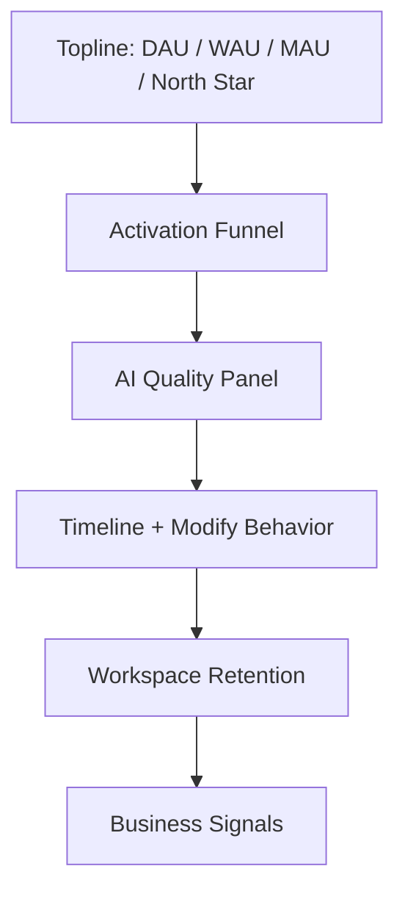

# AI Travel Planner Product Validation Plan

## 1. Success Metrics

### Metric Strategy

AI Travel Planner 的验证目标不是证明用户喜欢“AI 生成内容”，而是证明 AI 是否真正降低旅行决策成本，并产出用户愿意保存、修改、复用的可执行计划。

| Metric Category | Metric | Definition | Why It Matters |
| --- | --- | --- | --- |
| North Star | Executable Trip Plan Rate | `generated_success + saved/exported/reopened` trips divided by activated users | 衡量产品是否真正产出可执行旅行资产，而不是一次性 AI 玩具。 |
| Activation | First Plan Generated Rate | 新用户首次访问后成功生成行程的比例 | 判断 Planner 输入是否足够低门槛。 |
| Activation | Time to First Plan | 从进入 Planner 到看到 Timeline 的中位时间 | 核心定位是 5 分钟内完成计划。 |
| Activation | Planner Completion Rate | 开始填写 Planner 后点击 Generate 的比例 | 衡量结构化输入是否过长或过难。 |
| Retention | D7 Saved Trip Return Rate | 保存行程用户 7 天内重新打开 Workspace 的比例 | 验证行程是否有持续价值。 |
| Retention | Trip Reopen Rate | 已保存行程被再次打开的比例 | 衡量 Workspace 是否成为真实工作台。 |
| Engagement | Partial Replanning Rate | 有多少行程发生至少一次局部修改 | 判断 AI 是否进入真实决策过程。 |
| Engagement | Timeline Interaction Depth | 每个行程的展开、解释、收藏、地图点击、预算查看次数 | 衡量用户是否认真消费 AI 输出。 |
| AI Quality | Accepted Plan Rate | 用户生成后没有立即重试或大幅修改，并保存/导出的比例 | 衡量首次生成质量。 |
| AI Quality | Modification Success Rate | 局部重规划后用户保留修改结果的比例 | 衡量 Human-in-the-loop 能力。 |
| AI Quality | Constraint Compliance Rate | 预算、天数、兴趣、锁定项等约束被满足的比例 | 验证 AI 是否可靠。 |
| Business | Account Creation After Plan | 生成行程后注册/登录保存的比例 | 衡量从体验到账户价值的转化。 |
| Business | Export / Share Intent | 点击导出或分享的比例 | 用户愿意带走结果，说明计划有现实价值。 |

## 2. Event Tracking

### Tracking Principles

- 事件必须围绕用户决策链路，而不是只记录页面访问。
- AI 相关事件必须同时记录输入、输出质量、延迟、失败类型和用户后续行为。
- 修改、撤销、锁定、恢复版本等行为是衡量用户信任 AI 的关键。

| # | Event Name | Trigger | Properties | Business Value |
| --- | --- | --- | --- | --- |
| 1 | `page_viewed` | 用户访问页面 | `path`, `referrer`, `device`, `session_id` | 基础流量分析 |
| 2 | `planner_viewed` | Planner 页面曝光 | `user_id`, `is_returning` | 规划入口访问 |
| 3 | `destination_entered` | 输入目的地 | `destination`, `input_method` | 判断目的地需求分布 |
| 4 | `days_selected` | 选择天数 | `days` | 旅行时长偏好 |
| 5 | `budget_entered` | 输入预算 | `budget`, `currency` | 预算分层 |
| 6 | `currency_selected` | 选择币种 | `currency` | 国际化需求 |
| 7 | `travel_style_selected` | 选择旅行风格 | `style` | 个性化偏好 |
| 8 | `companion_selected` | 选择同行人 | `companion_type` | 场景分层 |
| 9 | `interest_selected` | 选择兴趣标签 | `interest`, `interest_count` | 推荐质量输入 |
| 10 | `food_preference_selected` | 选择饮食偏好 | `preference` | 餐厅推荐输入 |
| 11 | `transportation_selected` | 选择交通方式 | `transportation` | 路线规划输入 |
| 12 | `pace_selected` | 选择节奏 | `pace` | Timeline 密度输入 |
| 13 | `special_requirement_entered` | 填写特殊要求 | `text_length`, `requirement_type` | 长尾约束识别 |
| 14 | `must_visit_added` | 添加必去地点 | `place_count` | 锁定/优先级信号 |
| 15 | `avoid_place_added` | 添加不想去地点 | `place_count` | 负向偏好信号 |
| 16 | `smart_suggestion_clicked` | 点击智能建议 | `suggestion_type`, `value` | 降低输入成本 |
| 17 | `template_selected` | 选择旅行模板 | `template_id`, `destination` | 模板价值验证 |
| 18 | `ai_tip_shown` | AI Tip 展示 | `tip_type`, `severity` | 输入质量干预 |
| 19 | `ai_tip_clicked` | 点击 AI Tip | `tip_type` | 引导是否有效 |
| 20 | `planner_validation_failed` | 表单校验失败 | `field`, `reason` | 发现输入障碍 |
| 21 | `generate_clicked` | 点击 Generate | `completed_fields`, `interest_count` | 核心意图 |
| 22 | `generate_started` | AI 生成开始 | `prompt_version`, `model` | AI 漏斗起点 |
| 23 | `generate_succeeded` | AI 生成成功 | `latency_ms`, `token_count`, `retry_count` | 生成质量与成本 |
| 24 | `generate_failed` | AI 生成失败 | `error_type`, `retryable` | 可靠性分析 |
| 25 | `generate_retried` | 用户重新生成 | `previous_error`, `reason` | 失败恢复 |
| 26 | `timeline_viewed` | Timeline 展示 | `trip_id`, `days`, `activity_count` | 计划消费起点 |
| 27 | `day_expanded` | 展开某天 | `day_index` | 内容关注度 |
| 28 | `day_collapsed` | 收起某天 | `day_index` | 交互行为 |
| 29 | `activity_viewed` | 活动卡曝光 | `activity_id`, `category` | 活动级分析 |
| 30 | `activity_explain_opened` | 打开推荐解释 | `activity_id`, `category` | 信任需求 |
| 31 | `activity_map_clicked` | 点击地图 | `activity_id`, `place_name` | 执行意图 |
| 32 | `activity_favorited` | 收藏活动 | `activity_id`, `category` | 偏好学习 |
| 33 | `activity_unfavorited` | 取消收藏 | `activity_id` | 偏好修正 |
| 34 | `activity_locked` | 锁定活动 | `activity_id`, `day_index` | 用户控制感 |
| 35 | `activity_unlocked` | 取消锁定 | `activity_id` | 控制变化 |
| 36 | `activity_deleted` | 删除活动 | `activity_id`, `reason` | 推荐不匹配信号 |
| 37 | `modify_panel_opened` | 打开修改面板 | `scope`, `day_index`, `activity_id` | 修改需求 |
| 38 | `modify_reason_selected` | 选择修改原因 | `reason` | 痛点分类 |
| 39 | `partial_replan_clicked` | 点击局部重规划 | `scope`, `reason`, `locked_count` | AI 修改意图 |
| 40 | `partial_replan_succeeded` | 局部重规划成功 | `patch_count`, `latency_ms`, `changed_scope` | 核心 AI 能力 |
| 41 | `partial_replan_failed` | 局部重规划失败 | `error_type`, `scope` | 修改可靠性 |
| 42 | `diff_viewed` | 查看修改差异 | `added`, `removed`, `updated` | 信任验证 |
| 43 | `diff_accepted` | 接受修改结果 | `patch_count` | 修改质量 |
| 44 | `diff_rejected` | 放弃修改结果 | `reason` | AI 失败信号 |
| 45 | `undo_clicked` | 点击撤销 | `action_type` | 可逆性需求 |
| 46 | `redo_clicked` | 点击重做 | `action_type` | 探索行为 |
| 47 | `budget_card_viewed` | 查看预算卡 | `total_budget`, `remaining_budget` | 预算关注度 |
| 48 | `budget_modified` | 修改预算 | `old_budget`, `new_budget` | 约束变化 |
| 49 | `map_preview_viewed` | 地图预览曝光 | `day_index` | 路线信任 |
| 50 | `notes_viewed` | 查看备注 | `trip_id` | 执行细节关注 |
| 51 | `trip_saved` | 保存行程 | `trip_id`, `save_type` | 核心转化 |
| 52 | `autosave_succeeded` | 自动保存成功 | `trip_id`, `changed_fields` | 可靠性 |
| 53 | `autosave_failed` | 自动保存失败 | `trip_id`, `error_type` | 数据风险 |
| 54 | `workspace_viewed` | 打开 My Trips | `trip_count` | 留存入口 |
| 55 | `workspace_search_used` | 使用搜索 | `query_length`, `result_count` | 管理需求 |
| 56 | `workspace_filter_used` | 使用筛选 | `filter_type` | 组织需求 |
| 57 | `trip_reopened` | 重新打开行程 | `trip_id`, `days_since_last_open` | 留存价值 |
| 58 | `trip_duplicated` | 复制行程 | `trip_id` | 模板价值 |
| 59 | `trip_deleted` | 删除行程 | `trip_id`, `reason` | 流失信号 |
| 60 | `version_saved` | 保存版本 | `version_id`, `change_summary` | 历史价值 |
| 61 | `version_restored` | 恢复版本 | `version_id` | 信任和纠错 |
| 62 | `version_compared` | 比较版本 | `from_version`, `to_version` | AI 可审计性 |
| 63 | `login_started` | 开始登录 | `provider` | 账户转化 |
| 64 | `login_succeeded` | 登录成功 | `provider` | 保存闭环 |
| 65 | `login_failed` | 登录失败 | `provider`, `error_type` | 注册摩擦 |
| 66 | `logout_clicked` | 退出登录 | `user_id` | 账户行为 |
| 67 | `export_clicked` | 点击导出 | `format`, `trip_id` | 外部使用意图 |
| 68 | `share_clicked` | 点击分享 | `channel`, `trip_id` | 增长入口 |
| 69 | `quota_exceeded` | 达到额度限制 | `quota_type`, `plan_type` | 商业化触点 |
| 70 | `feedback_submitted` | 提交反馈 | `rating`, `topic`, `text_length` | 定性质量信号 |

## 3. PM Dashboard

| Dashboard Section | Metrics | Decision It Supports |
| --- | --- | --- |
| Acquisition | Visits, source, device, new users | 哪些渠道带来高意图用户 |
| Activation | Planner completion, generate success, time to first plan | 输入链路是否足够顺 |
| Planning Funnel | Planner viewed -> Generate clicked -> Timeline viewed -> Saved/Exported | 哪一步掉队 |
| AI Quality | Accepted plan rate, retry rate, repair rate, schema failure rate, hallucination reports | AI 是否可靠 |
| Modification | Modify rate, diff accepted rate, undo rate, locked activity count | 局部重规划是否创造价值 |
| Workspace | Save rate, reopen rate, version restore rate | 用户是否把它当作真实工具 |
| Retention | D1/D7/D30 return, saved trip reopen cohort | 是否有持续使用动力 |
| Business | Login conversion, export/share rate, quota exceeded, willingness-to-pay survey | 商业化机会 |

### Dashboard Layout

## 4. AI Evaluation

| Metric | Definition | Automated Evaluation Method | Product Interpretation |
| --- | --- | --- | --- |
| Route Reasonableness Score | 同一天地点顺序是否地理合理 | 计算相邻活动距离、交通时间、回头路比例 | 分数低说明 AI 推荐像攻略，不像行程 |
| Budget Accuracy Score | 估算预算是否接近用户约束 | 总预算与用户预算差值、分类预算偏差 | 预算失准会直接降低信任 |
| Interest Match Score | 活动是否匹配用户兴趣 | 活动标签与用户兴趣标签相似度 | 衡量个性化 |
| Pace Fit Score | 活动密度是否符合节奏 | 活动数、总耗时、休息间隔 | 避免行程过满 |
| Constraint Compliance Rate | 是否满足必去、不去、交通、语言、无障碍等约束 | 结构化约束检查 | AI 产品基本可靠性 |
| Repetition Rate | 是否出现重复地点/同质活动 | Place ID 和 category 去重 | 防止低质量填充 |
| Opening Hours Risk | 是否安排在不可访问时间 | 接入营业时间后自动检查 | V1 关键质量指标 |
| Weather Compatibility | 天气与活动类型是否冲突 | 雨天户外活动比例 | 用于天气重规划 |
| Explain Usefulness Score | 推荐解释是否具体、可判断 | LLM-as-judge + 用户评分 | Trust UX 指标 |
| Modification Success Rate | 修改后用户接受结果的比例 | Diff accepted / partial replan success | 验证局部重规划 |
| Minimal Change Score | 修改是否只影响目标范围 | Patch scope 检查 | Human-in-the-loop 核心 |
| Hallucination Risk Score | 是否出现不存在地点或无依据声明 | Place verification + source availability | 安全和信任 |

## 5. User Interview

### Research Plan

| Segment | Count | Why |
| --- | --- | --- |
| First-time independent travelers | 4 | 核心目标用户 |
| Experienced travelers who dislike planning | 3 | 验证效率价值 |
| Couple/friend group planners | 2 | 验证协作和决策冲突 |
| Budget-sensitive travelers | 1 | 验证预算能力 |

### Interview Script

**Opening**

- 感谢参与，说明这不是测试用户能力，而是测试产品。
- 询问最近一次自由行经历：目的地、同行人、天数、预算、准备时间。
- 让用户回忆旅行前最痛苦的 3 个步骤。

**Context Questions**

- 你通常从哪里开始做攻略？
- 你会用 ChatGPT 或其他 AI 工具规划旅行吗？为什么？
- 你如何判断一个行程“靠谱”？
- 你什么时候会放弃继续规划？

**Observation Tasks**

- 请你用产品规划一次 4 天东京旅行。
- 请说出你看到 Timeline 后第一反应。
- 请修改第三天，让它更适合雨天。
- 请锁定一个你一定要去的地点，再重新规划当天。
- 请保存行程，并尝试在 Workspace 找回它。

**Follow-up Questions**

- 哪一步让你最有信心？
- 哪一步让你最不放心？
- 你觉得 AI 有没有“乱改”？
- 如果这是你真实旅行，你还需要去哪里补充信息？
- 你愿意为哪些能力付费？

**Closing**

- 让用户用一句话描述这个产品。
- 询问是否愿意下次旅行继续使用。
- 收集 NPS、可用性评分、AI 信任评分。

### Analysis Framework

| Observation | Interpretation | Product Action |
| --- | --- | --- |
| 用户生成后马上重试 | 首次质量不稳定或预期不清 | 加强 AI Tip、输入确认、质量评估 |
| 用户频繁打开 Explain | 信任需求高 | 提升解释质量和来源提示 |
| 用户使用锁定 | 不希望 AI 破坏个人偏好 | 强化 lock/favorite 机制 |
| 用户导出或分享 | 计划具备外部执行价值 | 优先做 PDF/share |

## 6. Usability Test

| Task | Expected Result | Success Criteria |
| --- | --- | --- |
| 第一次规划东京 4 天旅行 | 用户能完成 Planner 并看到 Timeline | 5 分钟内生成，且无帮助完成 |
| 将预算从 8000 降到 5000 元 | 用户能通过局部修改调整预算 | 成功触发预算相关 partial replan |
| 把第三天改成雨天方案 | 只修改 Day 3，其它天保持不变 | 用户能看懂 diff 并接受 |
| 锁定一个必去景点后重新规划 | AI 不修改锁定项 | 锁定项保持，用户信任评分提升 |
| 保存行程并从 Workspace 找回 | 用户能重新打开并继续编辑 | 任务成功率 > 90% |

## 7. A/B Tests

| Experiment | Hypothesis | Primary Metric | Expected Result |
| --- | --- | --- | --- |
| Structured Form vs Chat Input | 结构化输入比聊天更适合新手 | Planner completion, first plan success | 结构化输入胜出 |
| Short Form vs Detailed Form | 较短表单提升转化，但可能降低质量 | Generate click, accepted plan rate | 找到最佳字段数量 |
| AI Tips On vs Off | 生成前提示能提升输出质量 | Accepted plan rate, retry rate | Tips 降低重试 |
| Timeline First vs Summary First | 直接 Timeline 更贴近执行 | Timeline interaction depth | Timeline First 胜出 |
| Explain Collapsed vs Visible | 默认折叠减少噪音 | Explain open rate, trust rating | 折叠更清爽 |
| Modify Panel vs Chat Modify | 结构化修改减少误操作 | Modification success rate | Panel 胜出 |
| Diff Highlight vs No Diff | Diff 提高信任 | Diff accepted, undo rate | Highlight 胜出 |
| Save Prompt Early vs After Generate | 生成后提示保存更自然 | Login conversion | After Generate 胜出 |
| Workspace Dense Cards vs Visual Cards | 视觉卡片更适合旅行回忆 | Reopen rate | 需要测试 |
| Version History Visible vs Hidden | 可见历史增强安全感 | Restore rate, trust rating | Visible 提高信任 |

## 8. Product Risks

| Risk | Type | Likelihood | Impact | Mitigation |
| --- | --- | --- | --- | --- |
| AI 编造地点或营业信息 | AI Risk | Medium | High | Place verification, source, confidence, hallucination reporting |
| 用户过度相信 AI | User Risk | Medium | High | Explain uncertainty, disclaimer, external map links |
| 路线不合理 | Product Risk | Medium | High | Map routing, distance checks, route score |
| 表单太长导致流失 | UX Risk | High | Medium | Smart defaults, templates, progressive disclosure |
| 局部修改影响非目标天数 | AI Risk | Medium | High | JSON Patch scope validation, lock, diff |
| 保存失败导致数据丢失 | Technical Risk | Low | High | Auto-save retry, local fallback, visible status |
| 登录阻碍保存 | Growth Risk | Medium | Medium | Anonymous draft, save after value moment |
| 隐私信息泄露 | Privacy Risk | Low | High | Data minimization, secret handling, RLS |
| AI 成本过高 | Business Risk | Medium | Medium | Prompt compression, caching, model routing |
| 产品价值不够高频 | Business Risk | High | Medium | Workspace, templates, sharing, post-trip reuse |

## 9. Roadmap Based on Validation

| Stage | Trigger | Focus | Why |
| --- | --- | --- | --- |
| V1 | MVP 证明用户愿意生成、保存、修改 | Map routing, opening hours, weather, export, quality dashboard | 提高可执行性和信任 |
| V2 | D7 reopen 和 share/export 表现好 | Collaboration, share link, comments, group preference voting | 旅行计划常常是多人决策 |
| V3 | 用户开始要求真实执行 | Tool calling, MCP, calendar, booking handoff, live replanning | 从 planning tool 进入 execution agent |

## 10. Product Case Study Summary

| Question | Answer |
| --- | --- |
| 为什么做 | 旅行规划痛点不是缺信息，而是缺少把信息组织成可执行计划的能力。 |
| 怎么设计 | 用结构化输入降低 prompt 门槛，用 Timeline 表达执行计划，用 partial replanning 支持真实修改。 |
| 验证什么 | 用户是否能在 5 分钟内得到可保存、可修改、愿意继续使用的计划。 |
| 失败可能 | AI 生成不可信、表单太重、地图/营业时间缺失导致执行性不足。 |
| 下一步 | 用真实路线、天气、地点数据提高可靠性，并验证分享、导出、协作的增长价值。 |
