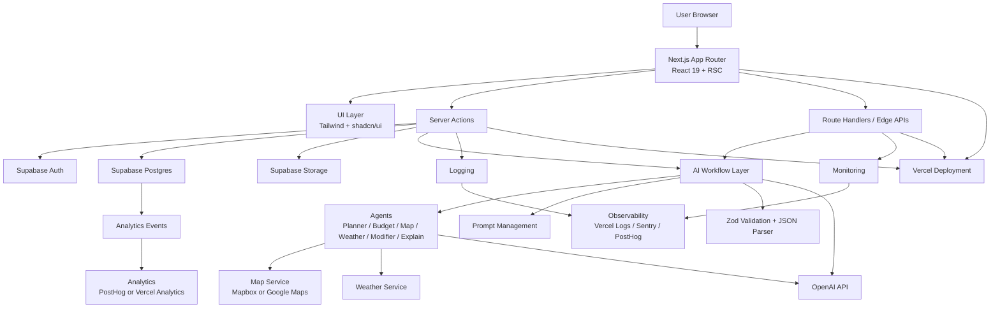
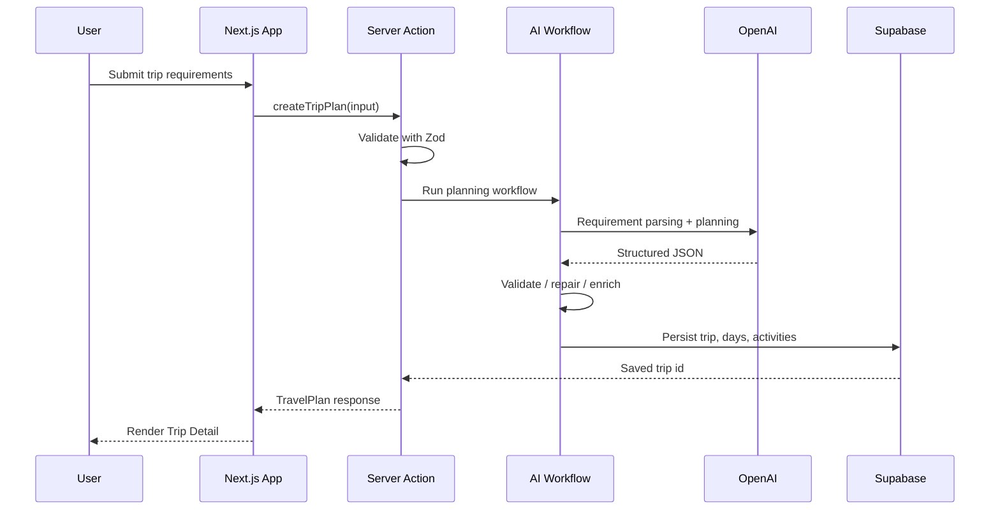
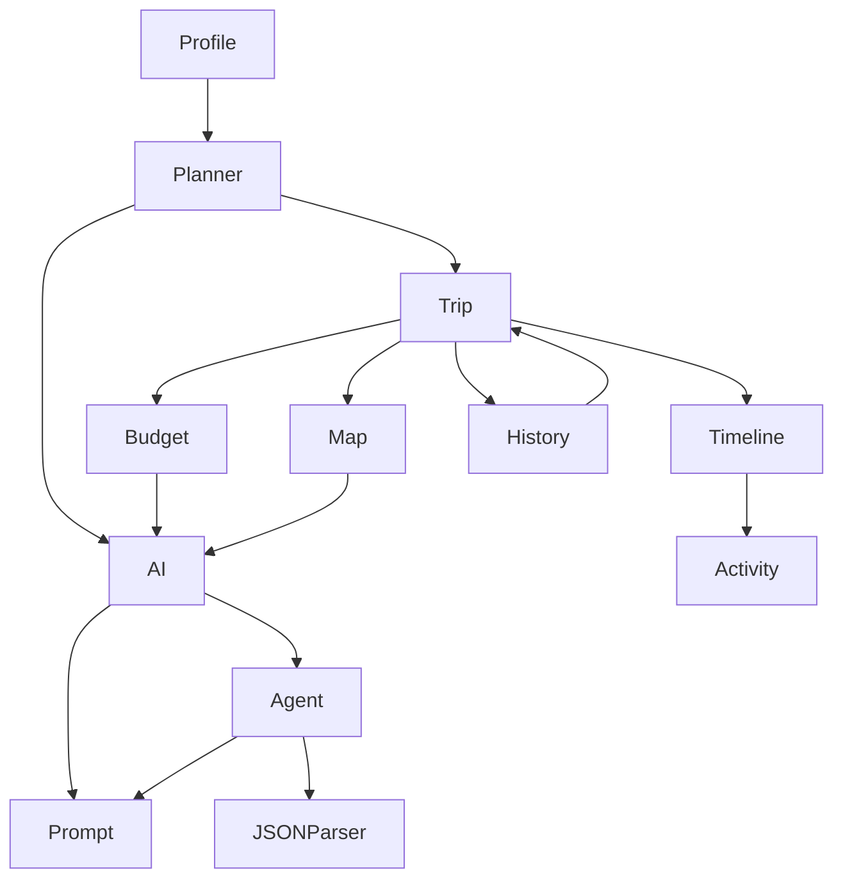
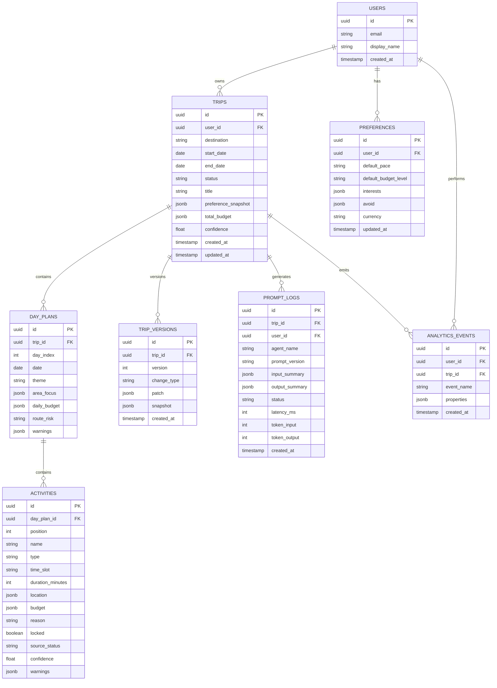
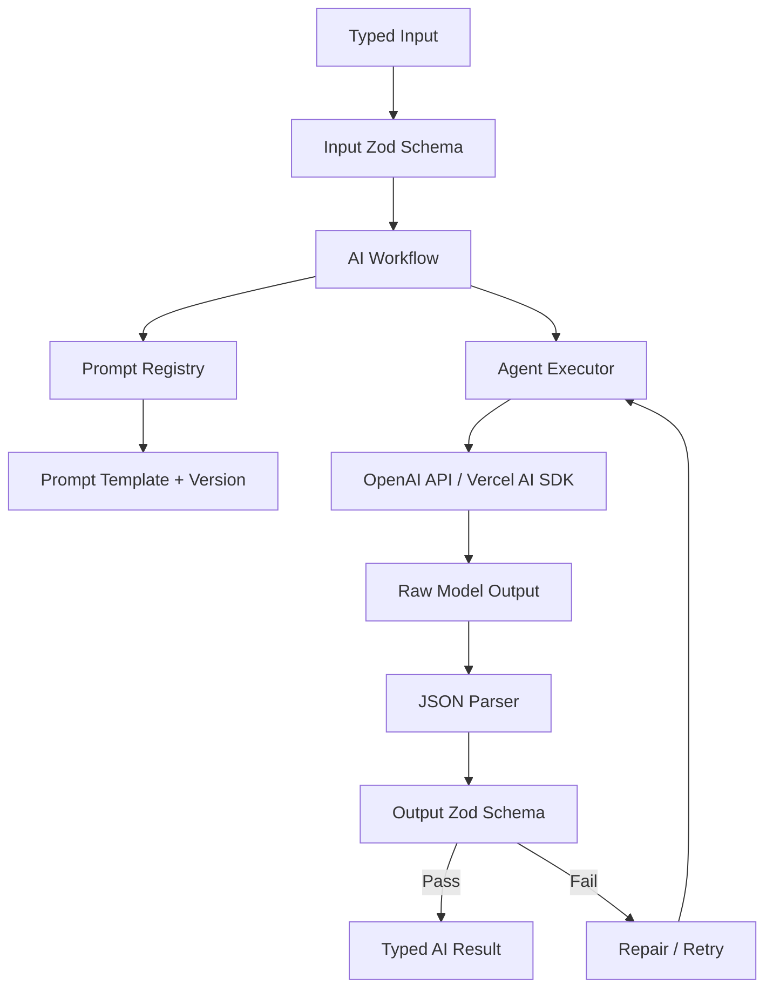
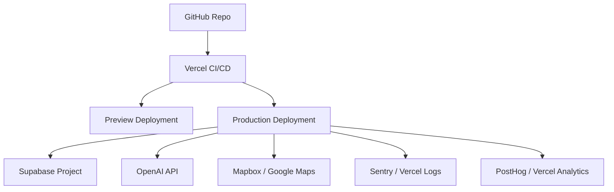
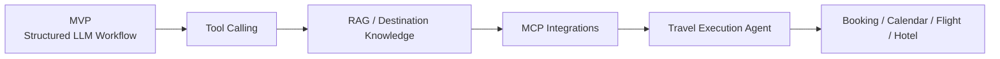
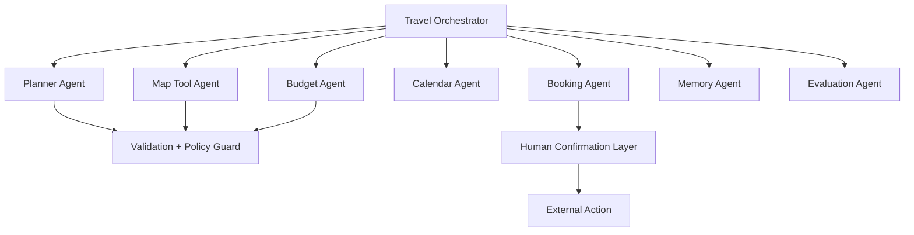

# AI Travel Planner Technical Architecture Document

> 文档类型：Technical Architecture Document  
> 产品名称：AI Travel Planner  
> 技术方向：AI First、Server First、Type Safe、Scalable、Production Ready  
> 推荐技术栈：Next.js 15、React 19、TypeScript、Tailwind CSS、shadcn/ui、Supabase、OpenAI API、Vercel、Mapbox/Google Maps、React Query、Zustand、Zod、Server Actions、Edge Runtime、Vercel AI SDK  
> 非本阶段范围：具体代码实现、页面组件开发、视觉设计

---

## 0. Executive Summary

AI Travel Planner 是一个 AI Native 旅行规划产品。它的技术架构不应被设计成传统 CRUD App + 一个 Chat API，而应被设计成：

> 一个以结构化 AI Workflow 为核心、以 Server Actions 为主要业务入口、以 Supabase 为数据和权限基础、以 OpenAI API 为智能层、以 Zod/TypeScript 保证端到端类型安全的 AI Product System。

架构目标：

- AI First：AI planning、modification、explanation 是核心业务能力。
- Server First：敏感逻辑、AI 调用、API Key、数据写入在服务端完成。
- Type Safe：Zod schema、TypeScript types、structured output 一致。
- Easy to Scale：模块化 agents、workflows、services，后续可接 MCP / Tool Calling。
- Production Ready：鉴权、限流、日志、监控、失败恢复、prompt versioning 必须提前设计。

---

# 1. Architecture Overview

## 1.1 Overall System Architecture



## 1.2 Runtime Strategy

| Layer | Runtime | Why |
|---|---|---|
| Marketing/Home | Static / ISR | 内容稳定，加载快 |
| Planner Form | Server Components + Client islands | 表单交互局部客户端化 |
| Trip Detail | Server Components + React Query | 首屏读服务端数据，交互读写客户端缓存 |
| AI Generate | Server Action or Route Handler | 需要安全调用 OpenAI，支持 streaming |
| AI Streaming | Edge Runtime where possible | 降低首 token 延迟 |
| DB Writes | Node.js runtime | Supabase server client、事务、复杂写入更稳 |
| Map Preview | Client + server token proxy | 地图交互在客户端，密钥在服务端 |

## 1.3 High-level Request Flow



---

# 2. Project Structure

## 2.1 Directory Tree

```text
ai-travel-planner/
├── app/
│   ├── (marketing)/
│   │   └── page.tsx
│   ├── (app)/
│   │   ├── planner/
│   │   ├── trips/
│   │   │   └── [tripId]/
│   │   ├── history/
│   │   ├── profile/
│   │   └── settings/
│   ├── api/
│   │   ├── ai/
│   │   ├── maps/
│   │   ├── webhooks/
│   │   └── health/
│   ├── layout.tsx
│   └── error.tsx
│
├── components/
│   ├── ui/
│   ├── layout/
│   ├── feedback/
│   └── shared/
│
├── features/
│   ├── planner/
│   ├── trip/
│   ├── timeline/
│   ├── budget/
│   ├── map/
│   ├── history/
│   ├── profile/
│   └── ai/
│
├── actions/
│   ├── planner.actions.ts
│   ├── trip.actions.ts
│   ├── budget.actions.ts
│   ├── history.actions.ts
│   └── profile.actions.ts
│
├── agents/
│   ├── planner-agent/
│   ├── budget-agent/
│   ├── map-agent/
│   ├── weather-agent/
│   ├── restaurant-agent/
│   ├── modifier-agent/
│   └── explain-agent/
│
├── workflows/
│   ├── generate-trip.workflow.ts
│   ├── modify-trip.workflow.ts
│   ├── optimize-budget.workflow.ts
│   ├── weather-replan.workflow.ts
│   └── explain-plan.workflow.ts
│
├── prompts/
│   ├── versions/
│   ├── templates/
│   ├── registry.ts
│   └── prompt-types.ts
│
├── schemas/
│   ├── preference.schema.ts
│   ├── travel-plan.schema.ts
│   ├── activity.schema.ts
│   ├── budget.schema.ts
│   ├── patch.schema.ts
│   └── api.schema.ts
│
├── services/
│   ├── openai/
│   ├── supabase/
│   ├── mapbox/
│   ├── weather/
│   ├── analytics/
│   ├── logging/
│   └── rate-limit/
│
├── lib/
│   ├── auth/
│   ├── errors/
│   ├── result/
│   ├── dates/
│   ├── currency/
│   ├── ids/
│   └── env/
│
├── hooks/
│   ├── use-trip.ts
│   ├── use-trip-mutations.ts
│   ├── use-ai-status.ts
│   └── use-map.ts
│
├── store/
│   ├── planner.store.ts
│   ├── ai-panel.store.ts
│   └── ui.store.ts
│
├── types/
│   ├── trip.ts
│   ├── ai.ts
│   ├── api.ts
│   └── database.ts
│
├── config/
│   ├── app.config.ts
│   ├── ai.config.ts
│   ├── routes.config.ts
│   └── analytics.config.ts
│
├── utils/
│   ├── format.ts
│   ├── assert.ts
│   ├── guards.ts
│   └── telemetry.ts
│
├── supabase/
│   ├── migrations/
│   ├── seed/
│   └── policies/
│
├── public/
├── tests/
│   ├── unit/
│   ├── integration/
│   └── e2e/
└── docs/
```

## 2.2 为什么这样拆？

| 目录 | 作用 | 为什么适合 AI 项目 |
|---|---|---|
| `features/` | 按业务域组织 UI + client logic | AI 产品复杂度高，按页面拆会混乱 |
| `agents/` | 单个 AI Agent 封装 | 支持 prompt、schema、retry、evaluation 分离 |
| `workflows/` | 多 Agent 编排 | AI Native 产品核心在 workflow，而不是单 API |
| `prompts/` | prompt 模板和版本 | Prompt 是产品逻辑，需要版本管理 |
| `schemas/` | Zod schema | LLM 输出、API 输入、DB 写入统一校验 |
| `actions/` | Server Actions | Server First，保护密钥和业务逻辑 |
| `services/` | 外部服务适配 | OpenAI、Mapbox、Weather、Analytics 解耦 |
| `store/` | 轻量客户端状态 | 只放 UI 和临时编辑状态，不放核心 server data |
| `supabase/` | migrations 和 policies | 数据模型和 RLS 可审计 |

---

# 3. Module Design

## 3.1 Module Dependency Map



## 3.2 Module Table

| Module | 职责 | 输入 | 输出 | 依赖 |
|---|---|---|---|---|
| Planner | 收集旅行需求，触发生成 | Preference input | Trip draft / TravelPlan | AI、Trip、Schemas |
| Timeline | 展示和管理 DayPlan/Activity | TravelPlan days | Timeline state/actions | Trip、AI Modifier |
| Budget | 展示预算，触发优化 | TravelPlan budget | BudgetAnalysis / patch | AI、Schemas |
| History | 保存和查看旅行计划 | userId | Trip list | Supabase、Auth |
| Profile | 用户偏好和账户 | user session | preferences | Auth、Supabase |
| Map | 地点展示和路线风险 | activities / locations | map context | Map service |
| AI | AI workflow 入口 | task input | structured output | Agents、Prompts、OpenAI |
| Prompt | prompt 模板和版本 | prompt variables | prompt payload | AI config |
| Agent | 单一 AI 任务执行 | typed input | typed JSON | OpenAI、Zod |
| JSON Parser | 校验和修复 LLM 输出 | raw output | typed object / error | Zod、Retry |

## 3.3 Data Contract Principle

所有模块之间传递数据必须满足：

- UI 不直接消费 raw LLM output。
- Agent 输出必须先过 Zod。
- Server Action 返回统一 Result shape。
- DB 写入只接受已验证对象。
- Client mutation 后必须更新 React Query cache。

---

# 4. Database Design

## 4.1 ER Diagram



## 4.2 表设计说明

| 表 | 为什么需要 |
|---|---|
| `users` | Supabase Auth 用户扩展信息 |
| `preferences` | 存长期偏好，用于后续个性化 |
| `trips` | 旅行计划主表，保存核心状态和快照 |
| `day_plans` | 多日行程结构化，支持局部读取和修改 |
| `activities` | 最小可编辑单元，支持锁定、替换、删除 |
| `trip_versions` | 支持 undo、版本对比、AI 修改回滚 |
| `prompt_logs` | AI 质量追踪、调试、成本和版本评估 |
| `analytics_events` | 产品漏斗和 AI 质量分析 |

## 4.3 Supabase RLS 原则

| 数据 | RLS 规则 |
|---|---|
| trips | 用户只能读写自己的 trip |
| day_plans | 通过 trip ownership 校验 |
| activities | 通过 day_plan -> trip ownership 校验 |
| preferences | 用户只能读写自己的 preference |
| prompt_logs | 默认用户不可读，仅服务端写入 |
| analytics_events | 服务端写入，用户不可直接访问 |

---

# 5. API Design

## 5.1 API Strategy

优先使用 Server Actions 处理产品核心交互；Route Handlers 用于 streaming、webhook、health check、地图 token proxy 等场景。

| 类型 | 使用场景 |
|---|---|
| Server Actions | 创建计划、修改计划、保存、删除、预算优化 |
| Route Handlers | AI streaming、webhooks、health、public share |
| Supabase Client | 只读 public/share 数据或用户 session 辅助 |

## 5.2 Server Actions

### createTripPlan

| 项目 | 内容 |
|---|---|
| Request | destination、dates、pace、budgetLevel、interests、constraints |
| Response | TravelPlan、tripId |
| Error | validation_error、ai_generation_failed、rate_limited |
| Validation | Zod PreferenceInputSchema |
| Authentication | anonymous allowed with local draft; authenticated persists |
| Rate Limit | per user/IP daily generation limit |
| Why | 核心 AI 生成入口，必须在服务端保护 OpenAI key |

### modifyTripPlan

| 项目 | 内容 |
|---|---|
| Request | tripId、scope、instruction、targetActivityId/dayIndex |
| Response | PlanPatch、updated TravelPlan |
| Error | unauthorized、scope_conflict、ai_modify_failed |
| Validation | Zod ModifyInputSchema |
| Authentication | required for persisted trip; draft uses session token |
| Rate Limit | per trip per minute |
| Why | 局部修改需要读取计划、锁定活动和版本历史 |

### optimizeBudget

| 项目 | 内容 |
|---|---|
| Request | tripId、targetBudgetLevel |
| Response | BudgetAnalysis、optional PlanPatch |
| Error | budget_unavailable、ai_budget_failed |
| Validation | Zod BudgetOptimizeSchema |
| Authentication | trip owner |
| Rate Limit | per trip |
| Why | 预算优化是 AI + 计算混合任务 |

### saveTrip

| 项目 | 内容 |
|---|---|
| Request | tripId or TravelPlan draft |
| Response | saved tripId |
| Error | unauthorized、save_failed |
| Validation | TravelPlanSchema |
| Authentication | login required for cloud save |
| Rate Limit | normal mutation limit |
| Why | 保存用户资产 |

### deleteTrip

| 项目 | 内容 |
|---|---|
| Request | tripId |
| Response | success |
| Error | unauthorized、not_found |
| Validation | UUID |
| Authentication | trip owner |
| Rate Limit | low concern |
| Why | 历史管理 |

### exportTrip

| 项目 | 内容 |
|---|---|
| Request | tripId、format、includeOptions |
| Response | exportUrl or text |
| Error | export_failed |
| Validation | ExportSchema |
| Authentication | owner or share permission |
| Rate Limit | per trip |
| Why | 执行和分享闭环 |

## 5.3 Route Handlers

| Endpoint | Method | Purpose | Auth |
|---|---|---|---|
| `/api/ai/stream-plan` | POST | AI streaming generation | session/IP |
| `/api/maps/token` | GET | 地图 token proxy | session |
| `/api/share/[shareId]` | GET | 读取只读分享计划 | share token |
| `/api/health` | GET | health check | none |
| `/api/webhooks/supabase` | POST | 后续 webhook | secret |

## 5.4 Unified Error Shape

```text
{
  ok: false,
  error: {
    code: "validation_error | unauthorized | rate_limited | ai_failed | not_found",
    message: "User-facing message",
    retryable: true,
    details: {}
  }
}
```

---

# 6. AI Layer

## 6.1 AI Layer Architecture



## 6.2 Prompt Management

| 概念 | 设计 |
|---|---|
| Prompt Registry | 所有 prompt 通过 registry 引用，不在业务逻辑中散落 |
| Prompt Version | 每个 prompt 有版本，例如 `planner.v1` |
| Prompt Template | 模板变量明确，如 preference、candidateContext |
| Prompt Metadata | agentName、model、temperature、schema、updatedAt |
| Rollback | 可回退到上一版本 prompt |

## 6.3 JSON Validation

| 阶段 | 校验 |
|---|---|
| 输入 | Zod 校验用户输入 |
| LLM 输出 | parse JSON -> Zod schema |
| DB 写入 | schema transform 后写入 |
| Client 接收 | TypeScript type from schema |

## 6.4 Retry Strategy

| 失败 | Retry |
|---|---|
| JSON parse fail | repair prompt once |
| schema missing required field | repair prompt once |
| model timeout | retry with shorter context |
| unsafe output | block and return safe error |
| repeated failure | fallback deterministic template |

## 6.5 Streaming Strategy

| 场景 | Streaming |
|---|---|
| 首次生成 | 可 streaming AI status，不 streaming 未校验 JSON 到 UI |
| Explain | 可 streaming 文案 |
| Export summary | 可 streaming |
| Structured JSON | 不直接 streaming 到最终 UI，必须完整校验后提交 |

## 6.6 Context + Memory

| 类型 | 存储 | 用途 |
|---|---|---|
| Session Context | Server action scope / temporary cache | 当前生成过程 |
| Trip Context | Supabase | 计划继续编辑 |
| User Memory | preferences table | 默认偏好 |
| Prompt Logs | prompt_logs | 调试和评估 |
| Tool Context | short cache | 地图/天气结果短期复用 |

---

# 7. State Management

## 7.1 State Ownership

| 数据 | 放哪里 | 原因 |
|---|---|---|
| Auth session | Supabase Auth / server | 安全和 RLS |
| Trip list | Server state + React Query | 可缓存、可刷新 |
| TravelPlan | Supabase + React Query | 核心 server data |
| Planner form draft | React state / local storage | 未提交临时输入 |
| AI panel open/close | Zustand | 跨组件 UI 状态 |
| Selected day/activity | URL params or Zustand | 可分享/可恢复 |
| Map viewport | React state | 纯 UI 临时状态 |
| AI generation status | React Query mutation state / stream state | 与请求生命周期绑定 |
| User preferences | Supabase | 长期保存 |
| Undo stack | trip_versions + local optimistic state | 可靠回滚 |

## 7.2 URL State

| State | Example | Why |
|---|---|---|
| tripId | `/trips/[tripId]` | 资源定位 |
| dayIndex | `?day=2` | 可分享某一天 |
| activeTab | `?tab=budget` | 刷新后保留视图 |
| shareId | `/share/[shareId]` | 只读分享 |

## 7.3 Zustand 使用边界

Zustand 只用于 UI 状态，不作为 server data source。

适合：

- AI Edit Panel 打开状态
- 当前选中的 activity
- 未提交的 quick action
- toast/overlay 状态

不适合：

- TravelPlan 主数据
- 用户权限
- 历史列表
- 预算计算结果

---

# 8. Security

## 8.1 Authentication

| 能力 | 设计 |
|---|---|
| 登录 | Supabase Auth |
| 匿名体验 | 允许生成 draft，但云端保存需登录 |
| Session | Server Components 和 Server Actions 使用 server client |
| OAuth | 后续可接 Google |

## 8.2 Authorization

| 资源 | 规则 |
|---|---|
| Trip | 只能 owner 读写 |
| DayPlan/Activity | 通过 trip ownership |
| Prompt Logs | 用户不可读，服务端可写 |
| Share Link | 只读 token，不能修改 |

## 8.3 Prompt Injection

| 风险 | 防护 |
|---|---|
| 用户输入包含“忽略系统指令” | 输入作为 data，不拼成 instruction |
| 外部内容导入 | 标记 untrusted context |
| LLM 请求泄露 prompt | 明确禁止输出系统 prompt |
| Tool response 恶意文本 | tool result 只抽取结构化字段 |

## 8.4 Web Security

| 风险 | 防护 |
|---|---|
| XSS | React escaping、禁止直接渲染 raw HTML、sanitize markdown export |
| CSRF | Server Actions + same-site cookies；关键 mutation 校验 session |
| API Key 泄露 | OpenAI/Mapbox secret 只在服务端 |
| Secrets | Vercel env vars + local `.env` 不提交 |
| Rate abuse | per user/IP rate limit |
| Data leakage | RLS + server-side ownership checks |

## 8.5 Rate Limit

| 行为 | 策略 |
|---|---|
| generate trip | 每用户/每 IP 每日限制 |
| modify trip | 每 trip 每分钟限制 |
| explain | 轻量限制 |
| export | 每 trip 限制 |
| share access | 防刷限制 |

---

# 9. Performance

## 9.1 Performance Strategy

| 方向 | 策略 |
|---|---|
| Streaming | AI 状态和解释可 streaming，结构化 JSON 校验后再展示 |
| Caching | React Query 缓存 trip、history；tool context 短缓存 |
| Image | Next Image，地图静态图或 lazy load |
| Map | 地图按需加载，不进入首屏关键路径 |
| Database | trip/day/activity 分表，局部读取 DayPlan |
| Prompt Cache | 对相同 prompt template/version 记录 hash，方便评估和复用 |
| ISR | Home/Marketing 使用 ISR |
| SSR/RSC | Trip 初始数据 server render，减少 client fetch |
| Edge | AI streaming/status、轻量 API 可 Edge |
| Bundle | shadcn 按需引入，地图 SDK 动态加载 |

## 9.2 AI Latency Optimization

| 问题 | 策略 |
|---|---|
| 首次生成慢 | 分阶段状态反馈 |
| prompt 太长 | Context compression |
| repair 增加延迟 | 只 retry 一次 |
| 多 agent 串行慢 | 可并行 Map/Budget/Weather candidate preparation |
| JSON 大 | 按 DayPlan 分块生成的 future option |

## 9.3 Database Optimization

| 策略 | 说明 |
|---|---|
| Indexes | user_id、trip_id、created_at |
| Partial reads | Trip Overview 不必读取所有 activity detail |
| JSONB with caution | 灵活字段用 JSONB，核心筛选字段独立列 |
| Pagination | History 分页 |
| Soft delete | 支持 undo 和恢复 |

---

# 10. Development Strategy

## 10.1 Sprint Plan

### Sprint 1：Foundation

| 项目 | 内容 |
|---|---|
| 开发目标 | Next.js 项目初始化、Supabase、Auth、基础路由、schema |
| 完成标准 | 用户可登录，基础页面路由可访问，DB migration 可运行 |
| 风险 | Supabase RLS 配置错误 |
| 依赖 | Vercel、Supabase 项目、环境变量 |

### Sprint 2：Trip Planner MVP

| 项目 | 内容 |
|---|---|
| 开发目标 | Planner 输入、createTripPlan Server Action、TravelPlan schema |
| 完成标准 | 用户可提交需求并生成 mock/AI 计划 |
| 风险 | AI 输出结构不稳定 |
| 依赖 | OpenAI API、prompt registry、Zod validation |

### Sprint 3：Trip Detail + Timeline

| 项目 | 内容 |
|---|---|
| 开发目标 | Trip Overview、Day Timeline、Activity actions、保存历史 |
| 完成标准 | 可查看、保存、删除、锁定 activity |
| 风险 | server state 和 client optimistic state 冲突 |
| 依赖 | Trip tables、React Query |

### Sprint 4：AI Modify + Budget

| 项目 | 内容 |
|---|---|
| 开发目标 | Trip Modifier Agent、budget analysis、undo/version |
| 完成标准 | 用户可局部修改某天或活动，可预算优化 |
| 风险 | 局部 patch 影响范围失控 |
| 依赖 | trip_versions、patch schema |

### Sprint 5：Map + Export + Production Hardening

| 项目 | 内容 |
|---|---|
| 开发目标 | Map integration、share/export、analytics、logging、rate limit |
| 完成标准 | 完整端到端闭环可上线 demo |
| 风险 | 地图服务成本、分享权限 |
| 依赖 | Mapbox/Google Maps key、analytics setup |

---

# 11. Coding Standards

## 11.1 Naming

| 类型 | 规范 |
|---|---|
| Components | PascalCase, e.g. `TripOverview` |
| Hooks | `useXxx`, e.g. `useTrip` |
| Server Actions | verb + domain, e.g. `createTripPlan` |
| Schemas | `XxxSchema`, e.g. `TravelPlanSchema` |
| Types | `Xxx`, inferred from schema where possible |
| Agents | `xxx-agent`, e.g. `planner-agent` |
| Workflows | `verb-domain.workflow` |

## 11.2 Component Standards

- Server Component by default.
- Client Component only for interaction-heavy islands.
- shadcn/ui primitives used as base.
- Feature components stay inside `features/`.
- Shared generic components stay inside `components/shared`.

## 11.3 Hooks Standards

- Hooks should not call Server Actions directly unless wrapped by mutation hooks.
- Server state hooks use React Query.
- UI state hooks can read Zustand.
- Hooks must not contain prompt logic.

## 11.4 Actions Standards

- Validate input with Zod.
- Check auth/ownership server-side.
- Return unified Result shape.
- Log AI and mutation errors.
- Never expose secret or raw prompt to client.

## 11.5 Prompt Standards

- Every prompt has name, version, owner, schema.
- No prompt hardcoded in UI components.
- Prompt changes require test cases.
- Prompt output must be validated.

## 11.6 JSON Standards

- LLM output JSON must match schema.
- No markdown in structured outputs.
- Required fields must have safe fallback or warning.
- Unknown facts use `sourceStatus: "unverified"` or `confidence`.

## 11.7 Commit Message

Format:

```text
type(scope): summary
```

Examples:

- `feat(planner): add trip requirement flow`
- `feat(ai): add planner agent schema validation`
- `fix(auth): enforce trip ownership in server action`
- `docs(architecture): add technical architecture`

## 11.8 Branch Strategy

| Branch | Purpose |
|---|---|
| `main` | production-ready |
| `dev` | integration |
| `feature/*` | feature development |
| `fix/*` | bug fix |
| `docs/*` | documentation |

## 11.9 Code Review Checklist

- [ ] Input validated with Zod.
- [ ] Auth and ownership checked.
- [ ] No API key exposed.
- [ ] AI output validated.
- [ ] Error state handled.
- [ ] Loading state handled.
- [ ] Analytics event added for key flow.
- [ ] Tests or manual QA notes included.

---

# 12. Deployment

## 12.1 Deployment Architecture



## 12.2 Environment Variables

| Variable | Scope |
|---|---|
| `NEXT_PUBLIC_SUPABASE_URL` | client/server |
| `NEXT_PUBLIC_SUPABASE_ANON_KEY` | client/server |
| `SUPABASE_SERVICE_ROLE_KEY` | server only |
| `OPENAI_API_KEY` | server only |
| `MAPBOX_SECRET_KEY` or `GOOGLE_MAPS_API_KEY` | server only |
| `NEXT_PUBLIC_MAPBOX_TOKEN` | restricted public token if needed |
| `POSTHOG_KEY` | client/server |
| `SENTRY_DSN` | client/server |
| `RATE_LIMIT_SECRET` | server only |

## 12.3 CI/CD

| Step | Check |
|---|---|
| Install | package install |
| Typecheck | TypeScript |
| Lint | ESLint |
| Test | unit/integration |
| Build | Next.js production build |
| Preview | Vercel preview URL |
| Migration | Supabase migration review |

## 12.4 Logging / Monitoring / Analytics

| Tool | Purpose |
|---|---|
| Vercel Logs | runtime errors |
| Sentry | frontend/backend error monitoring |
| PostHog | product analytics |
| Supabase Logs | DB/auth issues |
| Prompt Logs | AI cost, latency, quality |

## 12.5 Production Checklist

- [ ] All secrets stored in Vercel env.
- [ ] Supabase RLS enabled.
- [ ] Rate limit enabled for AI actions.
- [ ] Prompt logs redact sensitive user data.
- [ ] Error boundaries configured.
- [ ] Loading and retry states tested.
- [ ] OpenAI usage budget alert configured.
- [ ] Analytics events verified.
- [ ] Share links are read-only.
- [ ] Sitemap/robots configured if public.

---

# 13. Future Scaling

## 13.1 Scaling Roadmap



## 13.2 RAG

| Upgrade | Architecture Change |
|---|---|
| Destination guides | Add vector store or Supabase pgvector |
| User saved notes | Embed and retrieve user trip notes |
| Community content | Need source attribution and trust scoring |
| Policy | RAG content must be treated as untrusted context |

## 13.3 MCP

| MCP | Use |
|---|---|
| Calendar | Export DayPlan to Google Calendar |
| Email | Parse flight/hotel confirmation |
| Maps | Retrieve saved lists and routes |
| Docs | Generate PDF itinerary |

## 13.4 Tool Calling

| Tool | Impact |
|---|---|
| Place Search | Reduce hallucinated locations |
| Directions | Improve route feasibility |
| Weather | Real weather replanning |
| Budget Lookup | More reliable cost ranges |
| Booking Search | Later monetization |

## 13.5 Booking / Flight / Hotel

| Domain | Upgrade Path | Guardrail |
|---|---|---|
| Booking | Recommendation -> deep link -> assisted booking | User confirmation required |
| Flight | Arrival/departure aware planning | Do not book automatically |
| Hotel | Area recommendation first, inventory later | Avoid biased ranking |
| Calendar | User-approved export | Clear event permissions |
| Google/Apple Maps | Export route | Respect platform limits |

## 13.6 Multi-Agent Future Architecture



---

# 14. Final Architecture Decision

AI Travel Planner should be built as a server-first AI application:

- Next.js App Router for product shell and server rendering.
- Server Actions for business mutations.
- Supabase for auth, data, RLS, storage, and persistence.
- OpenAI + Vercel AI SDK for structured AI workflows.
- Zod as the contract between user input, AI output, DB write, and frontend rendering.
- Agents and workflows as first-class architecture modules.

Final principle:

> Do not build a travel app with an AI feature. Build an AI planning system with a travel product interface.
