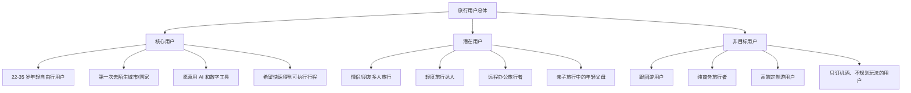
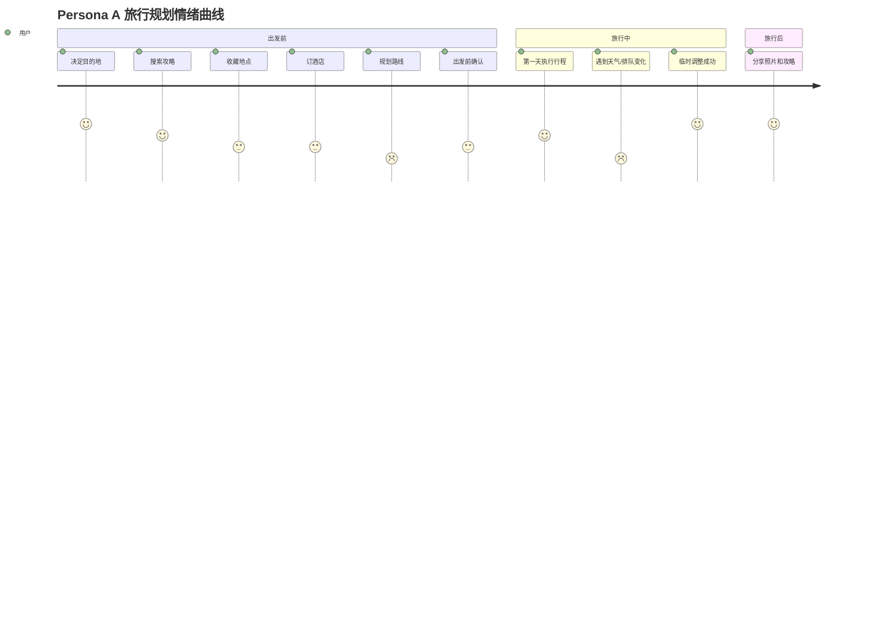

# AI Travel Planner User Research

> 产品阶段：User Research  
> 产品名称：AI Travel Planner  
> 产品定位：AI Native 旅行规划产品，帮助用户快速生成可执行、可修改、个性化的旅行计划  
> 目标用户：22-35 岁、喜欢自由行、第一次去陌生城市或国家、不想花大量时间查攻略的年轻旅行者  
> 核心目标：让用户在 5 分钟内完成一份可以直接出发的旅行计划

---

## 1. 目标用户定义 Target Users

### 1.1 核心用户是谁？

AI Travel Planner 的核心用户不是所有旅行者，而是：

> 第一次前往陌生城市或国家、希望自由行、但缺乏规划经验和时间的年轻旅行者。

| 维度 | 核心用户特征 |
|---|---|
| 年龄 | 22-35 岁 |
| 旅行方式 | 自由行、半自由行 |
| 目的地 | 第一次去的城市或国家 |
| 决策状态 | 已经想去某个目的地，但不知道怎么安排 |
| 信息来源 | 小红书、Google Maps、ChatGPT、Tripadvisor、YouTube、朋友推荐 |
| 核心任务 | 快速生成一份能直接执行的行程 |
| 核心焦虑 | 怕踩坑、怕路线不顺、怕浪费时间、怕行程不适合自己 |

### 1.2 为什么选择他们？

| 原因 | 解释 |
|---|---|
| 高频遇到规划问题 | 第一次去陌生城市时，用户缺少空间感、交通经验和地点优先级判断 |
| 有明确 AI 使用动机 | 他们愿意用 ChatGPT、小红书、地图等工具提高效率 |
| 痛点强烈 | 信息不是不够，而是太多、太乱、难判断 |
| 付费和留存潜力较好 | 旅行决策成本高，用户愿意为节省时间和降低出错风险付费 |
| 适合作为 MVP 切入点 | 需求清晰、边界明确，可先做 2-5 天城市旅行规划 |

### 1.3 为什么不是所有旅行用户？

| 用户类型 | 为什么不是首要目标 |
|---|---|
| 商务旅行者 | 行程通常由会议、航班、酒店决定，探索需求弱 |
| 跟团用户 | 不需要自己规划路线和景点 |
| 高端定制旅行用户 | 更依赖人工旅行顾问和服务保障 |
| 深度旅行达人 | 已有成熟规划方法，对 AI 依赖弱 |
| 本地周末游用户 | 决策成本较低，不需要完整 itinerary |
| 只想订酒店机票的人 | OTA 已经能很好满足交易需求 |

### 1.4 用户分层图

### 1.5 用户分层说明

| 用户层级 | 用户类型 | 是否优先 | 原因 |
|---|---|---:|---|
| 核心用户 | 第一次去陌生城市的年轻自由行用户 | P0 | 痛点最强，AI 价值最明显 |
| 核心用户 | 时间有限但想玩好的上班族 | P0 | 愿意为效率和确定性付费 |
| 潜在用户 | 情侣或朋友旅行 | P1 | 有协作和偏好冲突需求，但复杂度更高 |
| 潜在用户 | 轻度旅行达人 | P1 | 有效率需求，但规划能力较强 |
| 潜在用户 | 留学生或海外短途游用户 | P2 | 场景丰富，但预算敏感 |
| 非目标用户 | 跟团用户 | 不优先 | 不需要自主规划 |
| 非目标用户 | 商务旅行者 | 不优先 | 出行目的不是探索 |
| 非目标用户 | 高端定制用户 | 不优先 | 需要服务交付，不只是软件 |

---

## 2. Persona 用户画像

### Persona A：第一次去日本旅行的互联网女生

| 项目 | 内容 |
|---|---|
| 姓名 | 林可 |
| 年龄 | 26 |
| 职业 | 互联网产品运营 |
| 月收入 | 18,000 RMB |
| 所在城市 | 上海 |
| 旅行经验 | 国内自由行较多，第一次去日本 |
| 预算 | 12,000-18,000 RMB / 7 天 |
| 旅行目的 | 放松、购物、美食、拍照、体验日式街区 |
| 旅行方式 | 和闺蜜自由行 |
| 数字产品习惯 | 高频使用小红书、Google Maps、ChatGPT、飞猪、Notion |
| 常用 App | 小红书、Google Maps、ChatGPT、Instagram、淘宝、飞猪、大众点评 |
| 旅行前行为 | 搜攻略、收藏笔记、查交通卡、列购物清单、问 ChatGPT 行程 |
| 旅行中行为 | 用 Google Maps 导航，临时查餐厅，拍照发朋友圈或小红书 |
| 旅行后行为 | 整理照片，写小红书笔记，复盘哪些地方值得去 |

#### Goals

| 目标 | 说明 |
|---|---|
| 快速知道东京或大阪每天怎么玩 | 不想花 3 个晚上整理攻略 |
| 兼顾经典景点和小众体验 | 不想只去游客打卡点 |
| 行程不要太累 | 希望每天有咖啡、购物和休息时间 |
| 路线要顺 | 不想一天跨很多区域 |
| 花费可控 | 想知道每天大概会花多少钱 |

#### Motivations

| 动机 | 说明 |
|---|---|
| 第一次出国自由行，想减少不确定性 | 担心语言、交通、时间安排出错 |
| 想获得像本地人一样的体验 | 被小红书种草很多咖啡店、杂货店、街区 |
| 想把旅行过得好看且高效 | 旅行也是内容和生活方式表达 |

#### Pain Points

| 痛点 | 说明 |
|---|---|
| 收藏太多但不知道怎么排 | 小红书收藏 80 篇，地点分散 |
| 攻略互相冲突 | 有人说值得去，有人说很商业化 |
| 不知道交通耗时 | 不了解东京地铁和区域距离 |
| ChatGPT 行程不够可信 | 看起来合理，但不知道是否真的顺路 |
| 修改成本高 | 改一个餐厅，整天路线都要重排 |

#### Quotes

> “我不是不会查攻略，是查完更乱了。”

> “ChatGPT 能给我一个大概，但我还是要自己打开地图一个个查。”

> “我希望它直接告诉我：你这几个地方适合放在同一天，别这么排，会累死。”

### Persona B：情侣第一次去欧洲旅行

| 项目 | 内容 |
|---|---|
| 姓名 | 陈宇 |
| 年龄 | 29 |
| 职业 | 金融分析师 |
| 月收入 | 28,000 RMB |
| 旅行经验 | 亚洲自由行较多，第一次欧洲多城市旅行 |
| 预算 | 45,000-60,000 RMB / 12 天，两人 |
| 旅行目的 | 纪念日旅行、城市漫步、博物馆、美食 |
| 旅行方式 | 情侣自由行 |
| 数字产品习惯 | 重度使用 Google Maps、Booking、Tripadvisor、ChatGPT |
| 常用 App | Google Maps、Booking、Airbnb、Tripadvisor、ChatGPT、Klook |
| 旅行前行为 | 比较城市路线、订酒店、查博物馆门票、做 Excel 预算 |
| 旅行中行为 | 根据天气调整行程，临时找餐厅，处理交通延误 |
| 旅行后行为 | 记账、分享照片、保存下次旅行清单 |

#### Goals

| 目标 | 说明 |
|---|---|
| 制定清晰的多城市行程 | 想知道巴黎、罗马、佛罗伦萨如何分配天数 |
| 平衡两个人偏好 | 一个人喜欢艺术，一个人喜欢美食和购物 |
| 控制预算 | 欧洲旅行成本高，需要提前判断 |
| 避免重大失误 | 比如闭馆日、订不到热门门票、酒店区域不方便 |

#### Motivations

| 动机 | 说明 |
|---|---|
| 旅行成本高，希望规划更稳 | 花费大，容错率低 |
| 希望体验有纪念意义 | 不只是打卡，要有节奏和氛围 |
| 想减少争执 | 情侣旅行中偏好冲突容易产生摩擦 |

#### Pain Points

| 痛点 | 说明 |
|---|---|
| 两个人偏好不同 | 很难决定每天安排什么 |
| 跨城市交通复杂 | 火车、飞机、酒店 check-in 时间互相影响 |
| 热门景点需要预约 | 忘记预约会影响整天安排 |
| 预算容易失控 | 酒店、门票、餐饮、交通叠加后超预期 |
| 天气影响大 | 下雨会影响步行和户外景点 |

#### Quotes

> “我最怕的是钱花了很多，但因为没规划好，体验很一般。”

> “我们不是没想法，是两个人想法太多，很难排出一个都满意的版本。”

> “我希望 AI 能像一个旅行顾问，告诉我这个安排哪里有风险。”

### Persona C：大学毕业旅行小队

| 项目 | 内容 |
|---|---|
| 姓名 | 王一宁 |
| 年龄 | 22 |
| 职业 | 应届毕业生 |
| 月收入 | 暂无 / 实习收入 4,000 RMB |
| 旅行经验 | 国内穷游、短途游，有一次东南亚自由行经验 |
| 预算 | 5,000-8,000 RMB / 6 天 |
| 旅行目的 | 毕业纪念、拍照、夜生活、美食、性价比 |
| 旅行方式 | 4 人朋友小团 |
| 数字产品习惯 | 高频使用小红书、抖音、飞猪、Google Maps、Notion |
| 常用 App | 小红书、抖音、携程、飞猪、Google Maps、支付宝 |
| 旅行前行为 | 群聊讨论、互相发攻略、收藏短视频、比价酒店 |
| 旅行中行为 | 临时改计划，找便宜餐厅，拍照打卡，分摊费用 |
| 旅行后行为 | 发社交媒体，整理花费，推荐给朋友 |

#### Goals

| 目标 | 说明 |
|---|---|
| 玩得丰富但不能太贵 | 想要高性价比 |
| 多人都满意 | 每个人都有想去的地方 |
| 行程灵活 | 年轻人更容易临时改变计划 |
| 拍照和体验都要有 | 既要内容感，也要真实体验 |

#### Motivations

| 动机 | 说明 |
|---|---|
| 毕业旅行有纪念意义 | 想留下高质量共同回忆 |
| 预算敏感 | 需要控制住宿、交通、餐饮成本 |
| 社交驱动强 | 旅行体验也会被社交分享影响 |

#### Pain Points

| 痛点 | 说明 |
|---|---|
| 群聊信息混乱 | 每个人发链接，最后没人整理 |
| 决策效率低 | 谁都想去，但没人愿意做总规划 |
| 预算不一致 | 有人想省钱，有人愿意花 |
| 临时改动频繁 | 睡晚、天气、排队都会打乱计划 |
| 分工不清 | 酒店、路线、门票、餐厅没人统一负责 |

#### Quotes

> “我们群里发了一堆攻略，但最后谁也不知道到底去哪。”

> “希望 AI 能把大家想去的地方自动排好，还告诉我们哪些不顺路。”

> “预算真的很重要，最好直接告诉我们这天大概要花多少钱。”

---

## 3. 用户旅程 User Journey

选择 Persona A：林可，26 岁，第一次去日本旅行的互联网女生。

### Journey Map

| 阶段 | 用户行为 | 用户目标 | 使用工具 | 情绪变化 | 存在问题 | 产品机会点 |
|---|---|---|---|---|---|---|
| 旅行开始前 | 决定去东京/大阪，和闺蜜确定假期 | 确定目的地和大致天数 | 微信、小红书、飞猪、携程 | 兴奋 | 目的地很多，不知道天数怎么分配 | AI 根据天数、预算、兴趣建议城市组合 |
| 搜索攻略 | 搜小红书、B站、YouTube、Google | 找值得去的景点、餐厅、街区 | 小红书、YouTube、Tripadvisor | 兴奋到信息过载 | 攻略太多，内容冲突，商业化笔记难判断 | AI 总结多来源信息，提取地点、主题和适合人群 |
| 收藏地点 | 收藏咖啡店、买手店、神社、商场、餐厅 | 先把感兴趣的地方存下来 | 小红书收藏、Google Maps Lists、截图相册 | 有掌控感到混乱 | 收藏分散，地点重复，不知道优先级 | AI 自动识别收藏地点，去重、分类、打标签 |
| 订酒店 | 比较新宿、涩谷、银座等区域 | 找交通方便、价格合适的住宿 | Booking、Airbnb、Google Maps | 焦虑 | 不知道住哪里最适合行程 | AI 根据想去地点推荐住宿区域 |
| 规划路线 | 把地点放进每天行程 | 路线顺、不累、不浪费时间 | Google Maps、ChatGPT、Notion | 焦虑峰值 | 不知道哪些地点适合放同一天；ChatGPT 不保证可行 | AI 按地理位置、营业时间、节奏生成可执行 itinerary |
| 出发前确认 | 查交通卡、门票、营业时间、天气 | 降低出错风险 | Google Maps、官网、天气 App | 紧张 | 门票预约、闭馆日、天气影响容易漏掉 | AI 行前检查清单与风险提醒 |
| 旅行中 | 按地图导航，临时找餐厅或改计划 | 顺利执行当天计划 | Google Maps、翻译、Instagram、小红书 | 开心到疲惫或焦虑 | 下雨、排队、迟到、太累导致行程失效 | AI 实时重排剩余行程 |
| 旅行结束 | 整理照片、评价地点、写笔记 | 复盘和分享 | 小红书、相册、微信 | 满足 | 行程经验没有沉淀，下次仍要重来 | AI 生成旅行回顾，学习偏好 |

### 情绪曲线

关键洞察：

> 用户的焦虑峰值不在“找不到信息”，而在“信息太多后不知道如何做决策和排序”。

---

## 4. 用户痛点分析

| 痛点 | 为什么会发生 | 当前解决方案 | 为什么仍未解决 | AI 是否可解决 | AI 应如何解决 |
|---|---|---|---|---|---|
| 1. 不知道路线怎么安排 | 用户缺少目的地空间感 | Google Maps 手动查 | 每个点都要查，无法自动形成多日计划 | 可以 | 地点聚类、路线优化、时间线生成 |
| 2. 收藏地点太多 | 社区内容种草容易 | 小红书收藏、截图、地图收藏 | 收藏不是决策，越存越乱 | 可以 | 自动去重、分类、优先级排序 |
| 3. 攻略信息冲突 | 不同用户偏好、时间、预算不同 | 多看几篇攻略 | 用户难判断哪篇适合自己 | 可以 | 根据用户偏好解释推荐适配度 |
| 4. ChatGPT 行程不可执行 | 生成文本不绑定地图和实时数据 | 再去 Maps 验证 | 验证成本高 | 可以 | AI 生成后由地图和规则系统校验 |
| 5. 不知道每天安排多少合适 | 不了解体力和交通成本 | 参考他人攻略 | 他人节奏不一定适合自己 | 可以 | 建立 relaxed、balanced、packed 节奏模型 |
| 6. 预算容易超支 | 门票、交通、餐饮叠加不透明 | Excel 或记账 App | 规划阶段缺少预算预估 | 可以 | 按天估算成本并提醒超预算 |
| 7. 酒店区域难选 | 不知道住哪里方便 | 看攻略推荐区域 | 推荐泛化，未结合个人行程 | 可以 | 根据用户地点分布推荐住宿区域 |
| 8. 景点营业时间变化 | 不同日期、节假日、闭馆日不同 | 手动查官网 | 容易遗漏 | 部分可以 | 结构化检查营业时间与闭馆风险 |
| 9. 热门景点需要预约 | 用户不熟悉预约规则 | 看攻略提醒 | 信息分散，容易错过 | 可以 | 行前风险清单和预约提醒 |
| 10. 天气打乱计划 | 户外景点受影响 | 临时查天气改行程 | 临时改路线很麻烦 | 可以 | 天气触发自动生成 Plan B |
| 11. 交通复杂 | 不熟悉当地地铁、换乘、票制 | Google Maps | 只解决点到点，不解决整天安排 | 可以 | 将交通复杂度纳入日程排序 |
| 12. 餐厅选择困难 | 选择太多且排队不确定 | Google Reviews、小红书 | 难判断是否适合路线和预算 | 可以 | 推荐路线附近、时间合适的餐厅 |
| 13. 多人偏好冲突 | 同行者兴趣不同 | 群聊讨论 | 信息碎片化，没人做最终决策 | 可以 | 收集偏好，生成折中方案 |
| 14. 临时修改成本高 | 改一个点影响后续路线 | 手动重查地图 | 重排很耗时 | 可以 | 支持局部重排而非全量重做 |
| 15. 不知道哪些是游客陷阱 | 新用户缺少判断经验 | 看评论和笔记 | 评论多且噪音大 | 可以 | 总结负面信号、游客化程度、替代方案 |
| 16. 行程过于模板化 | 大多数攻略面向大众 | 搜更小众内容 | 小众内容可信度不稳定 | 可以 | 控制经典、本地、小众比例 |
| 17. 旅行中疲惫导致计划失效 | 现实体验和计划不一致 | 放弃部分行程 | 不知道删哪个影响最小 | 可以 | 根据当前位置、时间、体力重排 |
| 18. 信息分散在多个工具 | 搜索、收藏、地图、预算各自独立 | 手动复制到 Notion 或表格 | 工具切换成本高 | 可以 | 做统一 itinerary workspace |

---

## 5. 用户需求分析 Kano Model

### 5.1 Kano 分类

| 类型 | 需求 | 用户解释 | 产品含义 |
|---|---|---|---|
| 基本需求 | 行程必须真实可执行 | 不能出现闭馆、绕路、时间不够 | 地图、时间、营业状态校验是底线 |
| 基本需求 | 可以修改行程 | AI 第一次生成不可能完全正确 | 必须支持编辑、替换、删除、锁定 |
| 基本需求 | 信息可信 | 用户不能盲信 AI | 推荐理由、来源、风险提示必需 |
| 基本需求 | 保存和分享 | 用户需要和同行人沟通 | 分享链接是基础闭环 |
| 期望需求 | 5 分钟生成初稿 | 用户使用 AI 的主要动机是省时间 | Onboarding 要短，输出要快 |
| 期望需求 | 根据预算规划 | 预算是旅行决策重要约束 | 每日预算估算和超支提示 |
| 期望需求 | 根据偏好个性化 | 不同用户旅行方式差异很大 | 偏好模型要影响排序和节奏 |
| 期望需求 | 路线顺、不折腾 | 地理合理性决定体验 | 地点聚类和路线优化 |
| 期望需求 | 支持自然语言修改 | 用户不想复杂操作 | 支持“让第二天轻松一点”这类指令 |
| 兴奋需求 | 天气或突发情况重排 | 旅行中变化频繁 | AI 从规划工具变成随身助手 |
| 兴奋需求 | 导入小红书或截图 | 用户灵感来源真实存在 | 多模态输入形成差异化 |
| 兴奋需求 | 多人偏好自动折中 | 群体旅行决策很痛 | 协作场景增强留存 |
| 兴奋需求 | 解释为什么不推荐 | 用户不仅要推荐，也要避坑 | 建立专业感和信任 |
| 兴奋需求 | 学习用户旅行风格 | 下次旅行更准 | 长期留存和账户价值 |

### 5.2 重要程度排序

| 优先级 | 需求 | Kano 类型 | 原因 |
|---:|---|---|---|
| 1 | 可执行行程 | 基本需求 | 不可执行则产品失去信任 |
| 2 | 可编辑 itinerary | 基本需求 | AI 输出必须能被用户掌控 |
| 3 | 路线顺 | 期望需求 | 直接影响旅行体验 |
| 4 | 快速生成 | 期望需求 | 符合 5 分钟完成计划的目标 |
| 5 | 个性化偏好 | 期望需求 | 决定是否比模板攻略更好 |
| 6 | 推荐可信 | 基本需求 | 降低用户对 AI 幻觉的担忧 |
| 7 | 预算估算 | 期望需求 | 强影响决策信心 |
| 8 | 自然语言修改 | 期望需求 | 体现 AI-native 体验 |
| 9 | 天气或突发重排 | 兴奋需求 | 让产品从计划前延伸到旅行中 |
| 10 | 导入收藏或截图 | 兴奋需求 | 解决真实工作流中的信息分散 |
| 11 | 多人协作 | 兴奋需求 | 有价值，但 MVP 复杂度较高 |
| 12 | 长期偏好学习 | 兴奋需求 | 适合后续增强留存 |

---

## 6. Jobs To Be Done JTBD

| Job | 当前用户如何完成 | 当前问题 | AI 可以如何帮助 |
|---|---|---|---|
| 当我第一次去一个城市时，我想快速知道每天应该去哪，从而不用花几个晚上查攻略 | 看小红书、问 ChatGPT、查博客 | 信息多但不成体系 | 生成按天排列的结构化行程 |
| 当我收藏了很多地点时，我想知道哪些适合放在同一天，从而减少绕路 | 手动打开地图查距离 | 耗时且容易漏 | 自动地点聚类和路线排序 |
| 当我预算有限时，我想知道怎么玩性价比最高，从而避免旅行中超支 | 看预算攻略、做 Excel | 预算和路线分离 | 按天估算花费并推荐替代方案 |
| 当我和朋友或伴侣旅行时，我想平衡大家偏好，从而减少争执 | 群聊投票、人工协调 | 决策效率低 | 收集偏好并生成折中方案 |
| 当我不确定住哪里时，我想知道哪个区域最方便，从而减少通勤成本 | 看攻略推荐住宿区 | 不结合个人行程 | 根据地点分布推荐酒店区域 |
| 当我担心踩坑时，我想知道哪些地方不值得去，从而节省时间和钱 | 看差评、论坛 | 信息噪音高 | 总结负面信号和替代地点 |
| 当天气变差时，我想快速调整行程，从而不浪费当天 | 临时搜索室内活动 | 时间压力大 | 自动生成雨天版本 |
| 当我太累或起晚了时，我想删减行程，从而保留最值得去的部分 | 临时放弃 | 不知道删哪个 | 按优先级重排剩余行程 |
| 当我看到小红书种草内容时，我想快速变成地图地点，从而不用手动复制 | 截图、收藏、手动搜索 | 信息断裂 | 从截图或链接提取地点 |
| 当我到达目的地时，我想知道下一步去哪，从而不用边走边查 | Google Maps 点到点导航 | 缺少整体上下文 | 提供当前位置相关的下一步建议 |
| 当我想吃饭时，我想找路线附近合适餐厅，从而不为了吃饭大幅绕路 | Google Maps 搜 nearby | 推荐不考虑整天计划 | 结合路线、预算、口味推荐 |
| 当我旅行结束后，我想复盘哪些体验值得，从而下次规划更准 | 靠记忆或发笔记 | 偏好没有沉淀 | 记录喜欢或跳过的地点，更新偏好模型 |

---

## 7. 用户行为分析

### 7.1 哪些步骤最耗时间？

| 步骤 | 为什么耗时 | AI 介入价值 |
|---|---|---|
| 搜攻略 | 内容量巨大，重复信息多 | 总结、去重、提取地点 |
| 比较地点优先级 | 用户不知道哪些更适合自己 | 个性化排序 |
| 查路线 | 需要反复打开地图验证 | 自动聚类和路线优化 |
| 查营业时间和预约 | 信息分散 | 自动风险检查 |
| 做预算 | 餐饮、门票、交通分散 | 自动估算 |

结论：

> 最耗时的不是“生成行程文本”，而是“验证和整理”。

### 7.2 哪些步骤最容易放弃？

| 步骤 | 放弃原因 | 结果 |
|---|---|---|
| 收藏地点整理 | 收藏太多，越整理越乱 | 最后只去热门景点 |
| 预算规划 | 太麻烦，价格波动 | 旅行中超支 |
| 多人协商 | 群聊混乱，没人拍板 | 行程拖延 |
| 备选方案 | 用户默认不会出问题 | 天气或闭馆时临时崩溃 |
| 详细路线 | 查到一半觉得麻烦 | 行程看起来完整但不可执行 |

### 7.3 哪些步骤最容易焦虑？

| 步骤 | 焦虑来源 |
|---|---|
| 订酒店区域 | 住错地方影响整趟旅行 |
| 热门景点预约 | 错过预约会产生损失 |
| 第一天行程 | 用户对城市最陌生 |
| 跨区域交通 | 怕迟到、迷路、浪费时间 |
| 临时变化 | 下雨、排队、闭馆让计划失控 |

### 7.4 哪些步骤最适合 AI 介入？

| 步骤 | 为什么适合 AI |
|---|---|
| 需求理解 | 用户可以自然语言表达偏好 |
| 灵感整理 | AI 擅长从文本或图片中抽取地点和主题 |
| 个性化推荐 | AI 可结合偏好做解释性排序 |
| 路线初排 | AI 可提出方案，传统地图校验 |
| 行程修改 | 自然语言编辑非常适合 LLM |
| 突发重排 | AI 可根据当前约束生成 Plan B |
| 旅行总结 | AI 可把行为反馈转化为偏好学习 |

---

## 8. AI Opportunity Mapping

核心原则：

> AI 不应该单独决定事实，而应该负责理解、生成、解释和协调；事实校验、地图距离、营业时间、价格等应由结构化数据和传统程序完成。

### 8.1 AI 介入节点总览

### 8.2 Opportunity Mapping 表

| 节点 | AI 为什么有价值 | LLM 负责什么 | 传统程序负责什么 | 应交给 AI 的部分 | 不应交给 AI 的部分 |
|---|---|---|---|---|---|
| 需求理解 | 用户表达通常模糊，例如“不要太累”“想本地一点” | 理解自然语言、追问缺失信息、转换为偏好标签 | 表单状态管理、偏好存储 | 偏好抽取、语义理解 | 不应让 AI 随意改用户硬约束 |
| 兴趣识别 | 用户兴趣不是简单标签，常有隐含偏好 | 从描述、收藏、历史选择中推断兴趣 | 用户画像数据库 | 判断“喜欢街区漫步胜过景点打卡” | 不应过度推断敏感属性 |
| 灵感导入 | 用户资料来自小红书截图、博客、链接 | 提取地点、主题、推荐理由 | OCR、URL 解析、地点匹配 | 从非结构化内容中抽取信息 | 不应直接相信内容真实性 |
| 地点去重 | 同一地点可能有不同语言或别名 | 识别语义相似地点 | 地点 ID、地图 API | 判断“浅草寺”和“Senso-ji”可能相同 | 最终地点 ID 应由地图数据确认 |
| 地点分类 | 用户需要知道餐厅、景点、购物、咖啡、夜景等类型 | 语义分类和标签生成 | 分类体系、筛选器 | 生成用户可理解的标签 | 不应替代官方类别和营业信息 |
| 路线规划 | AI 能理解“这天不要太赶”的软约束 | 生成初步日程和取舍解释 | 地图距离、交通时间、营业时间计算 | 平衡偏好和体验节奏 | 不应凭空估算真实交通时间 |
| 时间安排 | 用户不知道每个地点停留多久 | 根据地点类型估算停留时长 | 时间冲突检测、日历逻辑 | 建议游玩时长和节奏 | 不应忽略预约和营业时间 |
| 预算优化 | 用户想知道钱花在哪里 | 解释预算分布和节省方案 | 价格数据库、汇率、门票价格 | 给出预算策略 | 不应编造精确价格 |
| 推荐解释 | 用户需要信任 AI | 解释为什么推荐、为什么排序 | 数据来源展示 | 用自然语言解释取舍 | 不应隐藏低置信度 |
| 智能替换 | 用户经常只想改一个点 | 理解替换意图，如“更便宜”“室内” | 搜索、筛选、路线重算 | 找出符合语义的替代方案 | 不应在用户未确认时重写整天计划 |
| 风险检查 | 用户容易漏掉闭馆、预约、天气 | 总结风险并给建议 | 营业时间、天气、预约状态检测 | 解释风险影响 | 不应把不确定信息说成确定 |
| 旅行中重排 | 现实变化频繁 | 根据当前位置、时间、疲劳程度生成新计划 | GPS、地图、营业时间、交通 | 动态生成 Plan B | 不应自动取消用户重要计划 |
| 多人偏好协调 | 群体旅行决策成本高 | 总结每个人偏好，提出折中方案 | 投票、权限、版本管理 | 协调冲突并解释方案 | 不应替用户做价值判断 |
| 行后复盘 | 用户偏好可学习 | 总结用户喜欢、跳过、停留时间 | 行为数据记录 | 更新旅行偏好画像 | 不应未经同意使用敏感数据 |

### 8.3 AI Native 产品边界

| 应该 AI 化 | 不应该 AI 化 |
|---|---|
| 理解用户意图 | 真实营业时间 |
| 生成行程草案 | 地图距离计算 |
| 解释推荐理由 | 价格事实 |
| 智能替换活动 | 支付和订单确认 |
| 总结攻略内容 | 法律或签证绝对判断 |
| 根据天气重排 | 未验证的安全信息 |
| 识别偏好冲突 | 自动替用户预订高成本项目 |

产品原则：

> AI 负责理解和决策辅助，系统负责事实和执行校验。

---

## 9. 用户研究结论

### 9.1 用户真正需要的是什么？

用户真正需要的不是更多攻略，而是：

| 用户真正需要 | 解释 |
|---|---|
| 一个可信的起点 | 不想从空白页开始 |
| 一个可执行的计划 | 能知道每天去哪、怎么去、花多久 |
| 一个可修改的工作台 | AI 初稿不完美，但要容易调整 |
| 一个降低焦虑的助手 | 帮用户发现风险、准备备选方案 |
| 一个符合自己的旅行节奏 | 不是复制别人的网红路线 |

### 9.2 用户真正购买的价值是什么？

用户购买的不是 itinerary 本身，而是：

| 价值 | 说明 |
|---|---|
| 时间节省 | 从几晚攻略压缩到几分钟 |
| 决策确定性 | 知道为什么这么安排 |
| 风险降低 | 减少闭馆、绕路、超预算、预约遗漏 |
| 个性化体验 | 行程像自己，而不是模板 |
| 执行信心 | 到了当地可以直接跟着走 |

### 9.3 用户为什么会持续使用？

| 持续使用原因 | 解释 |
|---|---|
| 每次去新城市都会重复遇到规划问题 | 旅行规划不是一次性需求 |
| AI 越了解用户，规划越准 | 偏好学习带来长期价值 |
| 旅行中动态重排提升依赖 | 产品从出发前延伸到旅途中 |
| 收藏和历史行程沉淀 | 用户资产越多，切换成本越高 |
| 多人协作和分享形成网络效应 | 同行人也进入产品流程 |

### 9.4 PM 关键判断

AI Travel Planner 的核心机会不是做旅行版搜索引擎，也不是做旅行版 ChatGPT。

它应该成为：

> 一个能把用户偏好、收藏地点、地图约束和现实变化整合起来的 AI 行程决策系统。

MVP 不需要覆盖所有旅行场景。最应该先做好的是：

> 第一次去陌生城市的 2-5 天自由行规划。

### 一句话总结

**AI Travel Planner 应解决：把混乱旅行信息变成可信、可改、可执行的个性化行程。**
