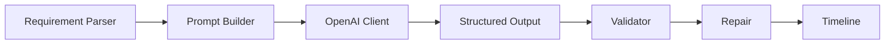

# AI Travel Planner Interview Presentation Outline

## Slide 1: Project Overview

**Title:** AI Travel Planner: From Travel Inspiration to Executable Itinerary

**Main Content**

- AI-native travel planning product for first-time independent travelers.
- Helps users generate, edit, save, and continue a budget-aware trip plan.
- End-to-end portfolio: research, PRD, UX, AI workflow, architecture, MVP, validation.

**Visual Suggestion**

- Product flow diagram: Planner -> AI Engine -> Timeline -> Replanning -> Workspace.

**Talk Track**

我做这个项目不是为了展示一个旅行页面，而是为了展示如何把一个复杂用户决策场景设计成 AI Native 产品。

## Slide 2: Problem

**Title:** Travel Planning Has Too Much Information, But Too Little Decision Support

**Main Content**

- Users switch between ChatGPT, maps, Xiaohongshu, TripAdvisor, OTAs, and spreadsheets.
- Recommendations are easy to find, but hard to organize.
- First-time travelers struggle with route, budget, time, weather, and tradeoffs.

**Visual Suggestion**

- Fragmented tool map.

**Talk Track**

核心洞察是：用户缺的不是攻略，而是把攻略变成可执行计划的能力。

## Slide 3: Target User

**Title:** Focus on First-Time Independent Travelers

**Main Content**

- Age 22-35.
- First time visiting an unfamiliar city/country.
- Wants freedom, but does not want to spend days planning.
- Comfortable with digital tools, but not necessarily good at prompting AI.

**Visual Suggestion**

- Persona card: first-time Tokyo traveler.

**Talk Track**

我没有选择所有旅行用户，而是选择不确定性最高、AI 价值最明显的一群人。

## Slide 4: Research Insights

**Title:** Key User Insights

**Main Content**

| Insight | Product Decision |
| --- | --- |
| Users do not know how to prompt | Structured Planner |
| Users need executable plans | Timeline |
| Users distrust black-box AI | Explain + Diff |
| Users modify only part of a plan | Partial Replanning |
| Users need to continue later | Workspace |

**Visual Suggestion**

- Insight-to-feature mapping.

**Talk Track**

每个核心功能都对应一个研究洞察，而不是为了堆功能。

## Slide 5: Product Solution

**Title:** Less Chat, More Action

**Main Content**

- Guided input instead of blank chat.
- AI-generated structured JSON instead of Markdown.
- Timeline instead of text itinerary.
- Partial replanning instead of full regeneration.
- Workspace instead of one-time output.

**Visual Suggestion**

- Before/after: ChatGPT text vs product workflow.

**Talk Track**

这个产品最重要的选择是不用聊天作为主界面，因为用户想完成任务，而不是持续对话。

## Slide 6: AI Workflow

**Title:** AI as Planning Engine, Not Chatbot

**Main Content**

**Visual Suggestion**

- AI workflow architecture.

**Talk Track**

AI 负责理解、规划和解释；系统负责校验、状态、版本、渲染和安全边界。

## Slide 7: MVP Demo Flow

**Title:** MVP Experience

**Main Content**

1. Fill structured planner.
2. Generate itinerary.
3. View timeline and budget.
4. Open AI explanation.
5. Modify one day.
6. Save and reopen in Workspace.

**Visual Suggestion**

- 4-screen product storyboard.

**Talk Track**

这个 demo 重点展示完整闭环：从输入到生成，从修改到保存。

## Slide 8: Partial Replanning

**Title:** The Most AI-Native Interaction: Modify Without Breaking the Plan

**Main Content**

- Modify Day / Replace Activity / Rain Plan / Change Budget.
- AI returns JSON Patch, not a full regenerated plan.
- Diff shows what changed and what stayed.
- Lock protects must-visit activities.
- Undo/Redo and Version History reduce risk.

**Visual Suggestion**

- Diff view mock: added, updated, unchanged.

**Talk Track**

这是我认为最能体现 AI 产品设计深度的部分，因为真实用户不是只生成一次，而是不断调整。

## Slide 9: Validation Plan

**Title:** How I Would Validate Product-Market Fit Signals

**Main Content**

- North Star: Executable Trip Plan Rate.
- Activation: Time to First Plan, First Plan Generated Rate.
- AI Quality: Accepted Plan Rate, Constraint Compliance.
- Engagement: Partial Replanning Rate.
- Retention: D7 Saved Trip Reopen Rate.

**Visual Suggestion**

- Funnel dashboard.

**Talk Track**

我不会只看生成次数，而会看用户是否保存、修改、复用，因为这才代表它变成真实旅行资产。

## Slide 10: Learnings & Next Steps

**Title:** What I Learned

**Main Content**

- AI products need workflow design, not only prompts.
- Structured input can outperform chat for mainstream users.
- Trust requires explainability, reversibility, and scope control.
- Next: real map routing, weather, opening hours, collaboration, booking handoff.

**Visual Suggestion**

- Roadmap: MVP -> V1 -> V2 -> V3.

**Talk Track**

这个项目让我更清楚地理解，AI PM 的核心能力是把模型能力变成稳定、可信、可衡量的用户体验。
