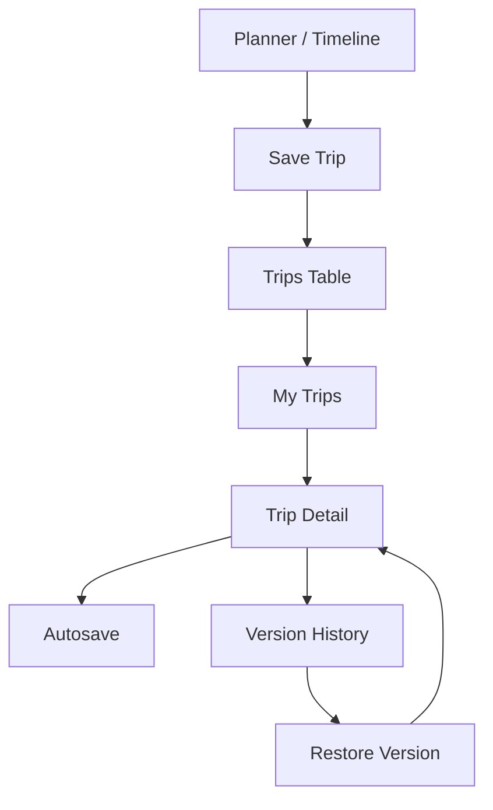
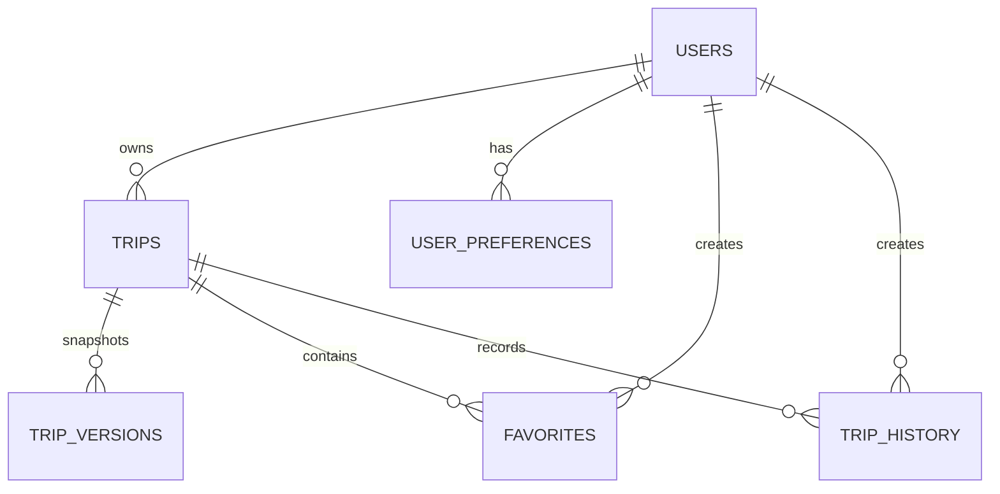

# Persistence Architecture

Sprint 5 turns AI Travel Planner into a persistent workspace.

## Auth

Supabase Auth supports Google Login, GitHub Login, email magic links, and anonymous/local visitor mode for portfolio demos.

OAuth is best for low-friction testing. Email magic link keeps the app usable for users without social login. Anonymous/local mode prevents a blank product when Supabase credentials are unavailable.

## Workspace Flow

## ER Diagram

## Autosave

Autosave runs after user-visible trip state changes.

Saved fields:

- title
- destination
- status
- tags
- favorite state
- updated timestamp
- current `TravelPlan`

Failure design:

- Supabase configured and authenticated: sync to database.
- Supabase unavailable: save to localStorage and show `Saved locally`.
- Supabase error: show `Save failed` and preserve local state.

## Sync Strategy

Across devices, Supabase is the source of truth. Each trip has `updated_at`, and each meaningful edit can create a `trip_versions` snapshot. Conflict handling for later sprints should compare `updated_at` and offer restore/duplicate rather than silently overwriting.

## Performance

- Workspace list is server-loaded and then client-filtered for MVP.
- Future production scaling should add pagination by `updated_at`.
- Trip detail preloads the current plan and versions together.
- Client uses optimistic local updates for favorite/delete/duplicate.
- Autosave is debounced to avoid writing every keystroke.

## Version Control

Each version stores a full `TravelPlan` snapshot because travel plans are structured, user-facing artifacts. Full snapshots make restore reliable and easier to compare than replaying many AI patches.
