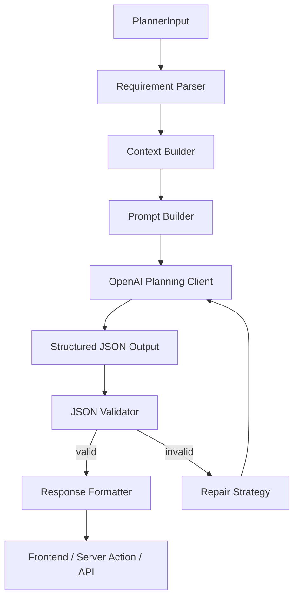

# AI Planning Engine

AI Planning Engine 是 AI Travel Planner 的核心服务层。它不负责页面，也不是聊天机器人；它把结构化旅行需求转成可验证、可修复、可直接渲染的 `TravelPlan` JSON。

## Architecture



## Module Map

| Directory    | Responsibility                                                                                                                      |
| ------------ | ----------------------------------------------------------------------------------------------------------------------------------- |
| `parser/`    | Converts raw planner input into user intent, hard constraints, preferences, and risk signals.                                       |
| `planner/`   | Orchestrates context building, prompt building, model calls, validation, repair, and final result.                                  |
| `prompts/`   | Template system, planner prompt parts, and prompt registry for versioning and A/B tests.                                            |
| `schemas/`   | Zod schemas for all model outputs, including `TravelPlan`, `DayPlan`, `Activity`, `Budget`, `Hotel`, `Restaurant`, and `Transport`. |
| `validator/` | Parses raw model text and returns structured validation errors with field-level fix strategies.                                     |
| `repair/`    | Builds repair prompts and caps automatic retries at two attempts.                                                                   |
| `formatter/` | Formats validated plans for frontend consumption without changing the canonical schema.                                             |
| `client/`    | Wraps OpenAI SDK calls, timeout, retry signals, response formatting, and AI error classification.                                   |
| `types/`     | Shared engine contracts used across modules.                                                                                        |
| `utils/`     | Small deterministic utilities safe for server and edge runtimes.                                                                    |

## Prompt System

Prompts are not raw string concatenation. Each prompt part includes:

- `version`
- `locale`
- `role`
- `style`
- `tone`
- `constraints`
- `variables`
- `template`

The active prompt version is registered in `prompts/registry.ts`.

Current versions:

| Version      | Status       | Purpose                                               |
| ------------ | ------------ | ----------------------------------------------------- |
| `planner-v1` | Active       | MVP itinerary planner optimized for executable JSON.  |
| `planner-v2` | Experimental | Reserved for route-aware planning experiments.        |
| `planner-v3` | Reserved     | Reserved for future tool-calling and agent workflows. |

## Structured Output

The model must return a single JSON object matching `travelPlanSchema`.

Top-level shape:

```json
{
  "id": "trip_tokyo_4d",
  "destination": "Tokyo",
  "durationDays": 4,
  "title": "Tokyo First-Time Food and Culture Plan",
  "summary": "Grouped by neighborhoods for practical transit.",
  "hotelRecommendation": {},
  "days": [],
  "totalBudget": {},
  "metadata": {},
  "explain": {},
  "warnings": [],
  "confidence": 0.78
}
```

No Markdown, prose wrapper, or unstructured explanation is accepted.

## Failure Strategy

| Failure                 | Strategy                                                                          |
| ----------------------- | --------------------------------------------------------------------------------- |
| Invalid JSON            | Run repair prompt, max two retries.                                               |
| Schema validation error | Repair only invalid fields while preserving valid plan decisions.                 |
| Timeout                 | Return retryable error and preserve input.                                        |
| Rate limit              | Return retryable error with wait guidance.                                        |
| Network error           | Return retryable error with preserved input.                                      |
| Prompt injection        | Ignore unsafe instructions and keep product constraints.                          |
| Hallucination risk      | Use `sourceStatus`, `warnings`, and `verificationNeeded` instead of overclaiming. |

## Development Guide

1. Add new AI behavior as a module, not inside the route.
2. Add or update a prompt template in `prompts/`.
3. Register the prompt version in `prompts/registry.ts`.
4. Keep all model output compatible with Zod schemas.
5. Add unit tests before wiring the behavior into UI.
6. Use Server Actions or Edge API routes as thin entry points only.

## Example Usage

```ts
const result = await generateTravelPlan(plannerInput);

if (result.ok) {
  return result.plan;
}

return result.error;
```

## Evaluation Hooks

The engine returns `AIEngineLog` with:

- `requestId`
- `promptVersion`
- `model`
- `latencyMs`
- `inputTokens`
- `outputTokens`
- `estimatedCostUsd`
- `retries`
- `success`
- `errorCode`

These fields are the foundation for future AI quality dashboards and prompt experiments.
